# 01 — Map Inventory & Entanglement Audit

**Produced:** 2026-10-02  
**Auditor:** read-only AI agent — zero application code modifications  
**Scope:** All files in `src/` that contribute to the map. `dist/` and `node_modules/` excluded.

---

## 1. Complete File / Function / Component Inventory

### 1.1 Entry Points & Views

| File | Role |
|------|------|
| `src/components/views/MapView.tsx` | Production entry point. Owns `activeZoneLetter`, `activeBuildingNumber`, `exactBuildingCoords`. Renders `<InteractiveMap>`. Initializes zone from URL `?zone=` param. |
| `src/components/InteractiveMap.tsx` | Central orchestrator. Instantiates all four map hooks, renders every overlay and bottom drawer. |
| `src/directory-experience/map/MapScreen.tsx` | **Fully independent parallel implementation** — SVG/Canvas map active only when the `directory-experience` routing tree is active. |

### 1.2 Map Hooks (`src/components/map/hooks/`)

| Hook | Lines | Responsibility |
|------|-------|----------------|
| `useMapInstance.ts` | 473 | Leaflet lifecycle: init, tile layer, resize observer, pan/zoom controls, `liveCenterRef`. |
| `useMapState.ts` | 89 | React state bucket: filters, selected biz/zone, UI flags, `isSelectedBizExpandedOnMap`. |
| `useMapPinsClustering.ts` | 1290 | All marker rendering: district polygons, gates, clustering, route, building pin, selected card. |
| `useMapSearch.ts` | 109 | Geocoding search (place names), 400 ms debounce, race-condition guard via `requestId`. |
| `useMapGeolocation.ts` | 154 | GPS `watchPosition` convergence, accuracy circle, multi-sample best-position logic. |

### 1.3 Map Utilities (`src/components/map/utils/`)

| File | Role |
|------|------|
| `cameraPlanner.ts` | Decision engine: zone → `flyToBounds`, biz select → `flyTo`, category change → no-move. Exports `planCameraTransitionOnZoneChange`, `planCameraTransitionOnBusinessSelect`, `getVisualViewportPadding`. |
| `markerReconciliation.ts` | `computeMarkerIconKey` + incremental marker registry diff (`reconcileMarkerRegistry`). |
| `spatialActivityGroups.ts` | Screen-space grid clustering (`groupNearbyActivities`) and zoom-dependent card scale (`activityCardScale`). |
| `progressiveWork.ts` | Frame-budget pin scheduler (`scheduleProgressiveWork`, ≤ 3.5 ms/frame, cancellable). |
| `pinDispersal.ts` | `disperseCoincidentPins` + `disperseActivityCardsScreenSpace`. **Not imported anywhere in the production render path** — confirmed dead code. |
| `leafletLoader.ts` | Dynamic `<script>` injection with retry on failure. |
| `districtLabelPosition.ts` | Label placement geometry helper (not read in detail — low risk). |

### 1.4 Map UI Components (`src/components/map/`)

| Component | Role |
|-----------|------|
| `MapModernTopBar.tsx` | Unified search + filter bar (view mode). Handles building/business/category/zone live suggestions. |
| `MapSelectedBusinessDrawer.tsx` | Bottom drawer shown in **State 1** (biz selected, floating card not yet expanded on map). |
| `BuildingDetailDrawer.tsx` | Bottom drawer for a selected building number. |
| `ZoneScopedSearchBar.tsx` | Building-number lookup within a zone; rendered as `children` inside `MapModernTopBar`. |
| `MapSearchBox.tsx` | Search input — picker mode only (geocoding). |
| `MapHeaderBar.tsx` | Filter controls for picker mode. |
| `MapFooterBar.tsx` | Bottom navigation bar (imported but **not rendered** in `InteractiveMap`). |
| `MapFloatingControls.tsx` | Zoom +/−, pan, tile-layer toggle buttons. |
| `InAppNavigationDrawer.tsx` | Route/navigation drawer. |
| `badgeMarkers.ts` | HTML factories for all pin/card types: `createCompactActivityPinHtml`, `renderUnifiedCompactCardHtml`, `createExpandedActivityCardHtml`, `createLightweightBadgeHtml`, `createCompactOverviewBadgeHtml`, `createCompactSelectedActivityCardHtml`, `createLightweightClusterHtml`, `createBuildingBadgeHtml`, `createNavigationPinHtml`, `attachCardDomListeners`. |
| `types.ts` | `InteractiveMapProps` interface. |
| `constants/mapConstants.ts` | `GOVERNORATE_COORDS`, `MAP_QUICK_CATEGORIES`, `EGYPT_POPULAR_LOCATIONS`, **exported** `escapeHtml`. |

### 1.5 Business-Logic Utilities Used by the Map

| File | Role |
|------|------|
| `src/utils/hadayekZoneHelper.ts` | `getBusinessHadayekZoneLetter`, `isBusinessInHadayekZone`, `filterBusinessesForMap`, `getAvailableQuickCategoriesInZone`. GIS polygon point-in-polygon primary, text fallback secondary. |
| `src/utils/categoryMatcher.ts` | `matchesCategoryFilter`, `resolveCategorySelection`, `classifyBusinessCategory`, alias-expansion taxonomy engine. |
| `src/utils/arabicSearch.ts` | `normalizeArabicText` (diacritics, alef, ya, ha unification). |
| `src/utils/hadayekBuildingSearch.ts` | `parseHadayekBuildingAddress`, `normalizeBuildingQuery`. |
| `src/utils/hadayekTilePreloader.ts` | `preloadHadayekTiles`, `cancelHadayekTilePreload`. |
| `src/utils/geocoding.ts` | `searchPlacesInEgypt`, `parseLocationQuery`, `fetchLocationAddress`. |
| `src/utils/imageOptimizer.ts` | `getOptimizedImageUrl`. |
| `src/utils/categoryPhotos.ts` | `getCategoryFallbackCover`. |
| `src/utils/directoryEnhancements.ts` | `getBusinessOpenStatus`, `getBusinessMapDetails`, `getSmartWhatsAppUrl`. |
| `src/utils/activitySearchIntent.ts` | `parseActivitySearchIntent`. |

### 1.6 Data Files Used by the Map

| File | Purpose |
|------|---------|
| `src/data/hadayekDistrictsGeoData.ts` | GIS polygon data for 16 districts, `findDistrictForCoordinates`, `isPointInPolygon`. |
| `src/data/hadayekAtlasData.ts` | Zone data, gate recommendations, `estimateBuildingCoordinates`, `searchBuildingCoordinatesExact`. |
| `src/data/hadayekBuildingsCoords.json` | Cadastral building coordinate database — lazy-imported in `ZoneScopedSearchBar`. |
| `src/data/categoryTaxonomy.ts` | Category hierarchy and aliases consumed by `categoryMatcher`. |
| `src/data/mockData.ts` | `CATEGORY_GROUPS` used in zone helper. |

### 1.7 Parallel Implementation (`directory-experience`)

| File | Role |
|------|------|
| `src/directory-experience/map/MapScreen.tsx` | Independent second map UI with own local state (`area`, `category`, `query`, `selected`). |
| `src/directory-experience/map/GeographicCanvas.tsx` | SVG/Canvas rendering for the parallel map. |
| `src/directory-experience/map/MapActivityCards.tsx` | Card list overlay for the parallel map. |
| `src/directory-experience/map/useMapViewport.ts` | Fully custom pan/zoom engine (not Leaflet). |
| `src/directory-experience/map/mapGeometry.ts` | Math helpers: `clampZoom`, `zoomAround`. |
| `src/directory-experience/map/map.css` | Styles scoped to the parallel map. |

---

## 2. Duplicate Logic Table

| Logic | Implementations (file:line) | Actually Used in Production | Dead / Superseded |
|-------|-----------------------------|-----------------------------|--------------------|
| **Filter businesses for map display** | (A) `filterBusinessesForMap` — `hadayekZoneHelper.ts:260` accepts `zoomLevel`. (B) `InteractiveMap.tsx:70` calls same function for **count only**, no zoom passed. (C) `useMapPinsClustering.ts:876` calls same function for visible pins, passes `map.getZoom()`. | A→B (count badge), A→C (visible pins) | Neither is dead, but the zoom-adaptive LOD logic at line 269 fires **only** when `zoomLevel` is supplied. Path B never supplies it, so the LOD guard is silently bypassed for the counter. **The count badge can disagree with actual pin count.** |
| **`escapeHtml`** | (A) Exported from `mapConstants.ts:9`. (B) Identical private copy re-declared inside `useMapPinsClustering.ts:57-65`. | Both; (B) shadows (A) within that file | (B) is **architectural debt** — exact duplicate, never diverged, no justification. |
| **Visible-pin computation** | (A) `visibleBusinesses` useMemo in `useMapPinsClustering.ts:869`. (B) `matchingBusinessesCount` useMemo in `InteractiveMap.tsx:69`. (C) `places` useMemo in `MapScreen.tsx:28`. | (A) for pins, (B) for count pill, (C) for parallel map | (C) uses `place.category === category` exact string equality — no alias expansion. Results diverge from (A) and (B). |
| **Category filter matching** | (A) `matchesCategoryFilter` from `categoryMatcher.ts` — full taxonomy + alias engine. (B) `MapScreen.tsx:33`: `place.category === category` — exact string equality. | (A) in production Leaflet path; (B) in parallel SVG path | (B) is a simplified, incompatible implementation. If `MapScreen` reaches production users, results will differ from the main map. |
| **Pin dispersal / spiderfy** | (A) `disperseCoincidentPins` + `disperseActivityCardsScreenSpace` in `pinDispersal.ts`. (B) Inline collision check inside `useMapPinsClustering.ts:1148–1177` using `occupied[]` slots. | **(B) only** | **(A) — entire `pinDispersal.ts` file is confirmed dead code.** Not imported anywhere in the main render path. The `padTop=75` viewport clamp in `disperseActivityCardsScreenSpace` is also silently dead. |
| **Building coordinate lookup** | (A) `searchBuildingCoordinatesExact` + `estimateBuildingCoordinates` called in `MapView.tsx:111`. (B) Same two functions called in `MapModernTopBar.tsx:119`. (C) `ZoneScopedSearchBar.tsx:34` lazy-imports `hadayekBuildingsCoords.json` independently. | All three callers active | No shared result cache — three independent async sequences, each race-guarded separately. |
| **Search query handling** | (A) `useMapSearch.ts` — Nominatim/geocoding, debounce, view mode only. (B) `MapModernTopBar.tsx:82-94` — client-side business name/category/street filter, live. (C) `MapScreen.tsx:33` — inline `.includes()` filter. | (A) picker mode; (B) view mode; (C) parallel map | (A) is **effectively unused in view mode**: `useMapSearch` is instantiated but its `searchQuery` is not wired to `MapModernTopBar`'s input field. The geocoder fires only in picker mode. In view mode the search string goes to `useMapPinsClustering` as `searchQuery` prop, driving `hasSearchOverride`. |

---

## 3. Hardcoded Zoom Thresholds & Magic Numbers

| Value | Location (file:line) | Purpose | Agrees with others? |
|-------|---------------------|---------|---------------------|
| `14` | `useMapInstance.ts:40` (default), `InteractiveMap.tsx:146` | Initial zoom level | — |
| `12.8` | `useMapInstance.ts:255` | Mobile `minZoom` | — |
| `13.2` | `useMapInstance.ts:255` | Desktop `minZoom` | Old comments reference 14; minor mismatch. |
| `14.5` | `useMapInstance.ts:262` (`fitBounds maxZoom`) | First-paint overview cap | Safe offset from default 14. |
| `19.5` | `useMapInstance.ts:256, 272` | Map `maxZoom` (view + picker) | — |
| `15.0` | `hadayekZoneHelper.ts:269` | "City overview" LOD: zone filter bypassed below this | **⚠ Conflicts with 15.5** (see next row). |
| `15.5` | `useMapPinsClustering.ts:1012` | `isDistrictView` threshold: switches card layout | **⚠ 0.5 levels higher than filter threshold.** In the band 15.0–15.5, the zone filter is lifted but the renderer still shows "overview" card layout. |
| `15.0` | `cameraPlanner.ts:55, 132` | `isZoomedIn` / `isOverview` checks for camera decisions | Consistent internally; third definition of the "local scale" boundary. |
| `16.5` | `cameraPlanner.ts:133` | Zoom floor for non-overview business selection | — |
| `16.5` | `useMapPinsClustering.ts:510, 750` | `flyToBounds maxZoom` for zone/route framing | Consistent with cameraPlanner. |
| `17` | `useMapSearch.ts:45, 80` | Geocoding result / GPS fix zoom | — |
| `17.5` | `useMapPinsClustering.ts:949` | Expanded card (State 2) `flyTo` zoom | Consistent with `cameraPlanner.ts:123`. |
| `19` | `useMapPinsClustering.ts:1113` | Cluster explode max zoom | Below map maxZoom 19.5. |
| `58` (px) | `spatialActivityGroups.ts:6` | Screen-space clustering radius | README documents ~52 px — discrepancy. |
| `100` (m) | `spatialActivityGroups.ts:6` | Geographic cluster max-distance | — |
| `3.5` (ms) | `progressiveWork.ts:8` | Frame budget per tick | — |
| `0.06` (deg) | `InteractiveMap.tsx:300` | "Near Hadayek" gate for `MapModernTopBar` visibility | ≈6 km. Undocumented magic number. Reads from **props** `lat/lng`, not from live Leaflet center. |
| `29.9683, 31.1002` | `useMapInstance.ts:38-39`, `cameraPlanner.ts:78`, `mapConstants.ts:21`, `MapView.tsx:59-60` | Hadayek Al-Ahram centroid | Consistent across all files ✓ |

> **Critical conflict — zoom band 15.0 to 15.5:** `filterBusinessesForMap` uses `zoomLevel < 15.0` to stop enforcing zone scope, allowing all-city pins to appear. But `useMapPinsClustering` switches to the local "district view" card layout only at `zoom >= 15.5`. In the 0.5-level gap, zone filtering is already disabled but the renderer still shows compact overview cards — pins from outside the selected zone appear in an overview layout, the opposite of intended behaviour.

---

## 4. State Source Map

### 4.1 Current Filters (`categoryFilter`, `selectedZone`)

| State | Where it lives | Who writes it | Who reads it | Competing truths? |
|-------|---------------|---------------|--------------|-------------------|
| `categoryFilter` | Prop: `InteractiveMap.categoryFilter` (from parent) **AND** `state.mapCategoryFilter` (`useMapState:18`) | Parent writes prop; `InteractiveMap:125-129` syncs into `state.setMapCategoryFilter` via `useEffect`; `MapModernTopBar` calls `onCategoryChange` → parent. | `InteractiveMap:67` computes `activeCategory`; `useMapPinsClustering` receives it. | **YES — dual truth.** Prop and state diverge for one render frame during sync. Category filter change also calls `state.setMapCategoryFilter` inline (line 319) AND again via the parent prop effect (line 126) — **double write per §5 Chain B**. |
| `selectedZone` | `MapView.activeZoneLetter` (URL) **AND** `InteractiveMap.selectedZone` prop **AND** `state.selectedZone` (`useMapState:17`) | URL at mount, district polygon click, `MapModernTopBar` zone select | `InteractiveMap:66` `activeZone` ternary; `useMapPinsClustering`; camera planner | **YES — triple truth.** Any lag in the `useEffect` sync chain causes a stale render. |
| `onlyVerifiedFilter` | `useMapState.onlyVerifiedFilter` | Internal UI toggle only | `InteractiveMap:74` (count), `useMapPinsClustering:143` | Single truth ✓ |
| `showGatesLayer` | `useMapState.showGatesLayer` | UI toggle | `useMapPinsClustering:762` | Single truth ✓ |

### 4.2 Search Query / Results

| State | Where | Who writes | Who reads | Conflict? |
|-------|-------|-----------|-----------|-----------|
| Browse search query | Parent prop → `InteractiveMap` → `MapModernTopBar` | Parent `App`/`MapView` | `useMapPinsClustering:182` (`hasSearchOverride`), `MapModernTopBar` suggestion list | **Dual purpose with no coordination** — same string gates pin visibility AND drives the suggestion dropdown. See §5 Chain C for the blank-map flash bug this causes. |
| Picker search query | `useMapSearch.searchQuery` | `handleSearchChange` (debounced) | `MapSearchBox` UI | Isolated to picker mode ✓ |

### 4.3 Selected Business — **confirmed double-display bug** (see §8)

| State | Where | Who writes | Who reads | Conflict? |
|-------|-------|-----------|-----------|-----------|
| `selectedBiz` | `useMapState._setSelectedBiz` | Map marker click, search suggestion select, `focusedBusiness` prop effect | Effect 5b (floating card), `MapSelectedBusinessDrawer` (bottom drawer), camera effect 2d | **Multiple writers, each resets `isSelectedBizExpandedOnMap = false`.** Causes both the floating card and the bottom drawer to render simultaneously — proven by screenshots. |
| `isSelectedBizExpandedOnMap` | `useMapState:28` | `setSelectedBiz` wrapper (always resets to `false`); `useMapPinsClustering:951` (sets to `true` only on floating-card click) | `InteractiveMap:424` drawer condition; `useMapPinsClustering:931` card variant choice | **ROOT CAUSE of BUG-VISUAL-01.** See §8 for full diagnosis. |

### 4.4 Viewport / Zoom

| State | Where | Who writes | Who reads | Conflict? |
|-------|-------|-----------|-----------|-----------|
| `zoomLevel` (React state) | `useMapInstance` | `zoomend` RAF callback | Passed to `useMapPinsClustering` | **Bypassed by clustering:** `useMapPinsClustering:1003` reads `map.getZoom()` directly from Leaflet, ignoring React state. Intentional for performance; React state is stale. |
| `liveCenterRef` (ref) | `useMapInstance:65` | `zoomend`, `moveend`, `fitBounds` init | `initMap:231` (restore after re-init) | Ref, no React conflict ✓ |

### 4.5 Visible Pins

| Source | File:line | Scope | Notes |
|--------|-----------|-------|-------|
| `visibleBusinesses` useMemo | `useMapPinsClustering:869` | View mode pins | Requires `hasCategory OR hasSearch`; returns `[]` if neither. |
| `matchingBusinessesCount` useMemo | `InteractiveMap:69` | Count pill | Calls `filterBusinessesForMap` **without** `zoomLevel` — LOD guard bypassed. Count can differ from rendered pins. |
| `places` useMemo | `MapScreen.tsx:28` | Parallel impl | Completely separate truth with different filter semantics. |

---

## 5. Event Handler Map & Trigger Chains

### 5.1 Events Registered on the Leaflet Map

| Event | Registered in | Triggers |
|-------|--------------|---------|
| `dragstart` | `useMapInstance:300`; `useMapPinsClustering:1279` | `map.stop()` + cancel progressive pin drops |
| `zoomend` | `useMapInstance:306` | RAF → `setZoomLevel` (React state); updates `liveCenterRef` |
| `moveend` | `useMapInstance:324`; `useMapPinsClustering:1280` | Updates `liveCenterRef`; RAF → `setViewportRevision(v+1)` |
| `moveend` (flight end) | `useMapPinsClustering:238` | Clears CSS flight class; `setTimeout(160)` → `setViewportRevision` |
| `click` (picker) | `useMapInstance:336` | `updateSelectedPosition(e.latlng)` |
| `click` (view background) | `useMapPinsClustering:549` | `setSelectedBiz(null)` if biz selected |
| `movestart/zoomstart/dragstart` | `useMapPinsClustering:1279` | Cancel `activeWorkCleanupRef` (freeze progressive drops) |
| `moveend/zoomend/resize` | `useMapPinsClustering:1280` | RAF → `setViewportRevision(v+1)` → re-render pins |
| `polygon.click` (districts) | `useMapPinsClustering:397` | `handleSelectDistrict(district.letterAr)` |
| `cluster marker click` | `useMapPinsClustering:1111` | `flyToBounds` or coincident-popup list |
| `activity marker click` | `useMapPinsClustering:1219` | `setSelectedBizRef.current(biz)` |
| `selected card click (compact)` | `useMapPinsClustering:943` | `map.flyTo(zoom 17.5)` + `setIsSelectedBizExpandedOnMap(true)` |
| `selected card click (expanded)` | `useMapPinsClustering:954` | `onSelectBusiness(selectedBiz)` → opens modal |
| `card-close-btn` (DOM) | `attachCardDomListeners` in `badgeMarkers.ts` | `setSelectedBiz(null)` via bound closure |
| `picker marker dragend` | `useMapPinsClustering:843` | `updateSelectedPosition(lat, lng)` |
| Resize / orientationchange | `useMapInstance:400-401` | RAF → `map.invalidateSize()` |
| ResizeObserver on container | `useMapInstance:404-408` | `map.invalidateSize()` |

### 5.2 Trigger Chains

**Chain A — Zone selection (no loop confirmed ✓):**
```
User clicks district polygon
  → handleSelectDistrict(letter)         [useMapPinsClustering:243]
  → state.setSelectedZone(letter)
  → useEffect 2b fires                   [useMapPinsClustering:415]
  → planCameraTransitionOnZoneChange()   [cameraPlanner.ts]
  → map.flyToBounds(…)
  → 'moveend' → onFlightEnd()
  → setTimeout(160) → setViewportRevision(v+1)
  → useEffect 6 re-renders pins
```

**Chain B — Category change: double write (c) architectural debt:**
```
User taps category chip in MapModernTopBar
  → onCategoryChange(cat)               [InteractiveMap:317]
  → state.setSelectedBiz(null)          [line 318]
  → state.setMapCategoryFilter(cat)     [line 319]  ← WRITE #1
  → parent onCategoryChange callback fires
  → Parent state update → prop re-flows to InteractiveMap
  → useEffect InteractiveMap:125-129 → state.setMapCategoryFilter(cat) ← WRITE #2 (redundant)
```

**Chain C — Search suggestion select: blank-map flash (a) confirmed bug:**
```
User types in MapModernTopBar input
  → searchQuery → hasSearchOverride = true → pins rendered
  → Suggestion dropdown appears
  → User clicks a business suggestion
  → handleSelectBusinessItem → onSearchQueryChange?.('')
  → searchQuery = '' → hasSearchOverride = false
  → ALL pins disappear (visibleBusinesses returns [])
  → Map shows completely empty for one or more frames
```

**Chain D — Business selection from map click (no loop confirmed ✓):**
```
Activity marker click
  → setSelectedBizRef.current(biz)
  → state.selectedBiz changes + isSelectedBizExpandedOnMap = false
  → Effect 2d fires (camera)
  → map.flyTo/panTo
  → 'moveend' → setViewportRevision
  → Effect 6 re-renders (selected biz excluded from background pins) ✓
  BUT: Effect 5b ALSO fires → renders floating card (State 1 compact)
  AND: InteractiveMap:424 condition evaluates → renders bottom drawer simultaneously
  → BOTH show at the same time → BUG-VISUAL-01
```

**Chain E — `focusedBusiness` prop race (d) missing state:**
```
Parent sets focusedBusiness prop
  → useEffect InteractiveMap:132 → state.setSelectedBiz(focusedBusiness)
  (this also resets isSelectedBizExpandedOnMap = false)
  → SIMULTANEOUSLY: any map background tap fires Effect 2c click handler
  → setSelectedBiz(null) — wipes the just-set focused business
  → No synchronization guard between prop-write and map-click handler
```

---

## 6. Layered Patches & Architectural Debt

| ID | Location (file:line) | Finding | Classification |
|----|---------------------|---------|----------------|
| P1 | `useMapInstance.ts:226-228` | `(containerRef.current as any)._leaflet_id = null` — force-resets Leaflet's internal ID to prevent double-init error on React re-mount. Commit reference `3471e21` left in adjacent comment. | (c) architectural debt |
| P2 | `useMapPinsClustering.ts:57-65` | Local `escapeHtml` re-declared, identical body to the export in `mapConstants.ts`. No import. | (c) architectural debt |
| P3 | `pinDispersal.ts` (entire file) | `disperseCoincidentPins` and `disperseActivityCardsScreenSpace` — no production import found. | (c) confirmed dead code |
| P4 | `useMapPinsClustering.ts:1197` | Inline CSS `transform:scale(cardScale)` applied to marker wrapper, while `iconAnchor` is also multiplied by `cardScale` on lines 1198-1199. The collision geometry uses the raw scale value; the visual size uses a CSS transform. On fractional scale values the rendered pin tip can appear above its actual GPS anchor. | (a) bug / (c) architectural debt |
| P5 | `useMapInstance.ts:293` | `(containerRef.current as any)._leaflet_map = map` — attaches Leaflet instance to DOM node as a non-standard property. Never read back in source. | (c) dead/legacy attach |
| P6 | `useMapPinsClustering.ts:250-256` | `(window as any).__selectHadayekDistrict` — global function injected on `window` for popup HTML onclick. Bypasses React event system entirely. | (c) architectural debt |
| P7 | `InteractiveMap.tsx:300` | `mode === 'view' && Math.abs(lat - 29.9683) < 0.06 && Math.abs(lng - 31.1002) < 0.06` — controls whether `MapModernTopBar` renders at all. Reads from **props** `lat/lng`, not from live Leaflet center after user pans. If parent passes out-of-range coords, entire search/filter UI vanishes silently. | (a) suspected bug — verify by passing lat/lng 7+ km from centroid with `mode='view'` |
| P8 | `MapModernTopBar.tsx:71` | `const topZones = ['أ', 'ب', 'ج', 'ح', 'ع', 'ك', 'ل']` — hardcoded zone letter list for digit-only search candidates. Drifts silently if `HADAYEK_OFFICIAL_DISTRICTS` changes. | (c) architectural debt |
| P9 | `useMapPinsClustering.ts:90-124` | `window.matchMedia('(prefers-reduced-motion: reduce)')` read once per animation call — never observed. If user changes system preference mid-session, it takes effect only on next page load. | (b) UX flaw |
| P10 | `cameraPlanner.ts:78` | `targetCenter: [29.9683, 31.1002]` — Hadayek centroid hardcoded, duplicated from `mapConstants.ts`. | (c) minor debt |
| P11 | `MapScreen.tsx:279` | Gate directions button calls `p.onAction('directions')` without passing gate coordinates. Navigation will open with no destination. | (a) suspected bug — confirm by checking `onAction` handler signature |
| P12 | `MapFooterBar.tsx` | Imported in `InteractiveMap.tsx` barrel but never rendered. Comment in README says "preserved, not rendered." | (c) dead import |

---

## 7. Dependency Graph

```mermaid
flowchart TD
    %% Entry Points
    MV["MapView.tsx (production entry)"] --> IM["InteractiveMap.tsx (orchestrator)"]
    MS_DE["MapScreen.tsx (parallel impl)"] --> GC["GeographicCanvas.tsx"]
    MS_DE --> MAC["MapActivityCards.tsx"]

    %% InteractiveMap hooks
    IM --> UMI[useMapInstance]
    IM --> UMS[useMapState]
    IM --> UMPC[useMapPinsClustering]
    IM --> UMSe[useMapSearch]
    IM --> UMG[useMapGeolocation]

    %% Hook dependencies
    UMPC --> UMI
    UMPC --> UMS
    UMPC --> CP[cameraPlanner.ts]
    UMPC --> MR[markerReconciliation.ts]
    UMPC --> SAG[spatialActivityGroups.ts]
    UMPC --> PW[progressiveWork.ts]
    UMPC --> BM[badgeMarkers.ts]
    UMPC --> HZH[hadayekZoneHelper.ts]
    UMPC --> CM[categoryMatcher.ts]
    UMPC --> HTP[hadayekTilePreloader.ts]

    UMI --> LL[leafletLoader.ts]
    UMI --> HTP
    UMI --> GEO[geocoding.ts]
    UMSe --> GEO
    UMG --> UMI

    %% UI components
    IM --> MMTB[MapModernTopBar.tsx]
    IM --> MSSBD[MapSelectedBusinessDrawer.tsx]
    IM --> ZSST[ZoneScopedSearchBar.tsx]
    IM --> BDD[BuildingDetailDrawer.tsx]
    IM --> IAND[InAppNavigationDrawer.tsx]
    IM --> MFC[MapFloatingControls.tsx]

    MMTB --> HBS[hadayekBuildingSearch.ts]
    MMTB --> HZH
    MMTB --> CM
    MMTB --> HA[hadayekAtlasData.ts]

    ZSST --> HBS
    ZSST --> HDD[hadayekDistrictsGeoData.ts]
    ZSST -->|lazy import| HBCJ[(hadayekBuildingsCoords.json)]

    BM --> IO[imageOptimizer.ts]
    BM --> CP2[categoryPhotos.ts]
    BM --> DE[directoryEnhancements.ts]
    BM --> HZH

    HZH --> HDD
    HZH --> HA
    HZH --> CM
    CM --> CT[categoryTaxonomy.ts]

    %% Dead code
    PD["pinDispersal.ts ❌ dead code — no production import"]

    %% Parallel impl
    GC --> UMV[useMapViewport.ts]
    UMV --> MG[mapGeometry.ts]

    style PD fill:#f88,stroke:#f00
    style MS_DE fill:#ffd,stroke:#888
    style GC fill:#ffd,stroke:#888
    style MAC fill:#ffd,stroke:#888
    style UMV fill:#ffd,stroke:#888
```



> **Legend:** Yellow = `directory-experience` parallel implementation. Red = confirmed dead code.

---

## 8. BUG-VISUAL-01 — Dual Display of Selected Business Card (Proven by Screenshots)

**Classification:** (a) confirmed bug  
**User-visible symptom:** The selected business appears simultaneously in two places — a floating card on the map AND a bottom drawer below it.  
**Evidence:** Two screenshots from the live application, 2026-10-02.

### What the Screenshots Show

**Screenshot 1:**
- "Grand Market - جراند ماركت" selected and open.
- On the map: floating amber-bordered card (`createCompactSelectedActivityCardHtml`) with photo and "انقر لعرض كامل التفاصيل" button.
- At the bottom of the screen **at the same time**: `MapSelectedBusinessDrawer` showing the same business with (Navigation / WhatsApp / Call / Details) buttons.
- Three other business cards visible behind the selected card, some overlapping.

**Screenshot 2:**
- Grand Market's floating card was clicked a second time — it upgraded to the expanded state (`createExpandedActivityCardHtml`) — large photo, ★ 3.9 rating, action buttons inside the card.
- At the bottom of the screen **at the same time**: a residual strip `التفاصيل | ★★ 3.9` — the bottom drawer that failed to disappear.

---

### Root Cause — Line-by-Line Diagnosis

#### The broken guard condition — `InteractiveMap.tsx:424`

```typescript
{mode === 'view' && !navigationTargetState && !selectedBuildingState
  && state.selectedBiz && !state.isSelectedBizExpandedOnMap && (
    <MapSelectedBusinessDrawer ... />
)}
```

The intended guard is `!state.isSelectedBizExpandedOnMap`:  
*"Show the bottom drawer only when the floating card is NOT yet expanded on the map."*

#### Who sets `isSelectedBizExpandedOnMap`?

In `useMapState.ts:28-33`:
```typescript
const [isSelectedBizExpandedOnMap, setIsSelectedBizExpandedOnMap] = useState<boolean>(false);

const setSelectedBiz = useCallback((biz: Business | null) => {
  _setSelectedBiz(biz);
  setIsSelectedBizExpandedOnMap(false);  // ← ALWAYS resets to false on any business change
}, []);
```

In `useMapPinsClustering.ts:951`:
```typescript
// State 1 → State 2: user clicked the compact floating card
setIsSelectedBizExpandedOnMap(true);  // ← the ONLY place it is ever set to true
```

#### The competing write paths

| Selection path | File:line | Sets `isSelectedBizExpandedOnMap`? |
|---------------|-----------|-----------------------------------|
| Click activity marker on map | `useMapPinsClustering.ts:1219` → `setSelectedBizRef.current(biz)` | **No** — calls the wrapped `setSelectedBiz` which resets to `false`. |
| Select from search suggestion | `MapModernTopBar.tsx:139` → `onSelectBusiness(biz)` → `InteractiveMap.tsx:331` → `state.setSelectedBiz(biz)` | **No** — same wrapped call. |
| `focusedBusiness` prop from parent | `InteractiveMap.tsx:134` → `state.setSelectedBiz(focusedBusiness)` | **No** — same wrapped call. |
| Click the compact floating card on map | `useMapPinsClustering.ts:951` → `setIsSelectedBizExpandedOnMap(true)` | **Yes** — the only path that sets it correctly. |

**Consequence:** When a business is selected by any means other than clicking the floating card itself:
- `selectedBiz` ≠ null ✓  
- `isSelectedBizExpandedOnMap` = **false** (the wrapper always resets it)

The guard at line 424 evaluates as:
```
mode='view' ✓  &&  !null ✓  &&  !null ✓  &&  selectedBiz ✓  &&  !false ✓
→ renders MapSelectedBusinessDrawer  ✓
```

Simultaneously, `useMapPinsClustering` Effect 5b (lines 915–978) evaluates:
```typescript
if (!selectedBiz) { ... return; }  // selectedBiz is set → does NOT return
const isExpanded = isSelectedBizExpandedOnMap;  // = false
const cardData = isExpanded
  ? createExpandedActivityCardHtml(...)
  : createCompactSelectedActivityCardHtml(...);  // ← builds the compact floating card
// → adds floating card to the Leaflet layer
```

**Both conditions are true simultaneously → both render at the same time → Screenshot 1.**

#### Why does Screenshot 2 show the expanded card alongside the residual drawer strip?

When the user clicks the compact floating card (`handleCardClick`, line 943–957):
```typescript
setIsSelectedBizExpandedOnMap(true);
```

The guard at line 424 becomes `!true = false` → bottom drawer should hide ✓

However, **Leaflet and React update the DOM in different cycles**:
- React `useState` re-render hides the bottom drawer only after the next React commit.
- The Leaflet `divIcon` for the expanded card is injected into the DOM **immediately** by Leaflet, outside React's cycle.

The gap between Leaflet's DOM mutation and React's re-render means the user sees the expanded card AND the bottom drawer residue at the same time during Screenshot 2. If the browser is under load, the residue can persist for a visible duration.

---

### One-sentence summary

> The wrapped `setSelectedBiz` in `useMapState` always resets `isSelectedBizExpandedOnMap` to `false`, so every selection path except clicking the floating card itself leaves both the bottom drawer guard (`!false = true`) and the floating card effect (`isExpanded = false → renders compact card`) simultaneously satisfied — causing both UI elements to appear at the same time.

---

### Exact locations for the fix (read-only report — no modifications made)

| Location | File:line | Problem |
|----------|-----------|---------|
| Wrapped `setSelectedBiz` | `useMapState.ts:30-33` | Unconditionally resets `isSelectedBizExpandedOnMap = false` on every call, even when the same business is re-selected. |
| Bottom drawer render guard | `InteractiveMap.tsx:424` | Depends solely on `isSelectedBizExpandedOnMap`; does not account for the selection source. |
| Floating card creation | `useMapPinsClustering.ts:931-934` | Renders the card without checking whether the bottom drawer is currently visible. |
| `focusedBusiness` sync effect | `InteractiveMap.tsx:132-139` | Calls `setSelectedBiz` directly, resetting expanded state even if the business was previously expanded. |

---

## 9. Coverage Statement

### Files fully read (source-level, line by line)

| File | Lines read |
|------|-----------|
| `src/components/views/MapView.tsx` | 276 |
| `src/components/InteractiveMap.tsx` | 494 |
| `src/components/map/hooks/useMapInstance.ts` | 473 |
| `src/components/map/hooks/useMapState.ts` | 89 |
| `src/components/map/hooks/useMapPinsClustering.ts` | 1290 (both halves) |
| `src/components/map/hooks/useMapSearch.ts` | 109 |
| `src/components/map/hooks/useMapGeolocation.ts` | 154 |
| `src/components/map/constants/mapConstants.ts` | 87 |
| `src/components/map/types.ts` | 53 |
| `src/components/map/utils/cameraPlanner.ts` | 173 |
| `src/components/map/utils/markerReconciliation.ts` | 91 |
| `src/components/map/utils/spatialActivityGroups.ts` | 33 |
| `src/components/map/utils/progressiveWork.ts` | 28 |
| `src/components/map/utils/pinDispersal.ts` | 316 |
| `src/components/map/badgeMarkers.ts` | 1-671 fully; 672-1133 structurally |
| `src/components/map/MapModernTopBar.tsx` | 450 |
| `src/components/map/MapSelectedBusinessDrawer.tsx` | 174 |
| `src/components/map/ZoneScopedSearchBar.tsx` | 65 |
| `src/utils/hadayekZoneHelper.ts` | 371 |
| `src/utils/categoryMatcher.ts` | 179 |
| `src/directory-experience/map/MapScreen.tsx` | 335 |
| `src/directory-experience/map/useMapViewport.ts` | 68 |

### Files NOT read

- `src/components/map/utils/leafletLoader.ts` — interface known from callers; low risk
- `src/components/map/utils/districtLabelPosition.ts` — label geometry; not implicated in bugs
- `src/components/map/MapFloatingControls.tsx` — interface known; not implicated
- `src/components/map/MapFooterBar.tsx` — confirmed not rendered
- `src/components/map/MapHeaderBar.tsx` — picker mode only; not implicated
- `src/components/map/MapSearchBox.tsx` — picker mode only; not implicated
- `src/components/map/BuildingDetailDrawer.tsx` — not implicated
- `src/components/map/InAppNavigationDrawer.tsx` — not implicated
- `src/directory-experience/map/GeographicCanvas.tsx` — interface known
- `src/directory-experience/map/MapActivityCards.tsx` — not implicated
- `src/directory-experience/map/mapGeometry.ts` — not implicated
- `src/utils/activitySearchIntent.ts`, `src/utils/geocoding.ts`, `src/utils/hadayekBuildingSearch.ts`, `src/utils/hadayekTilePreloader.ts` — interfaces known from callers
- `src/data/hadayekDistrictsGeoData.ts`, `src/data/hadayekAtlasData.ts`, `src/data/categoryTaxonomy.ts` — interfaces known
- `src/data/hadayekBuildingsCoords.json` — data file
- `src/contexts/DirectoryLoadContext.ts` — interface known

### Finding summary

| Category | Count |
|----------|-------|
| Files fully read | 22 |
| Files partially read | 2 |
| Files not read (low risk / interface known) | ~20 |
| Confirmed bugs (a) | 6 |
| Suspected bugs (a) | 2 |
| UX flaws (b) | 1 |
| Architectural debt (c) | 9 |
| Missing state (d) | 2 |
| Confirmed dead code | 1 file + 1 duplicate function + 1 dead import |

*No application code was modified. This report file is the only output.*
