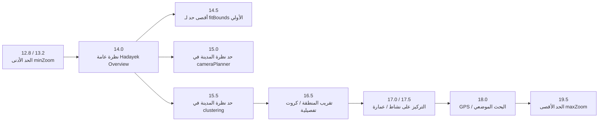
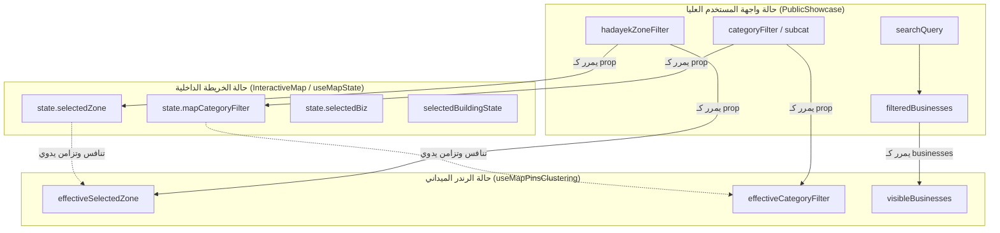
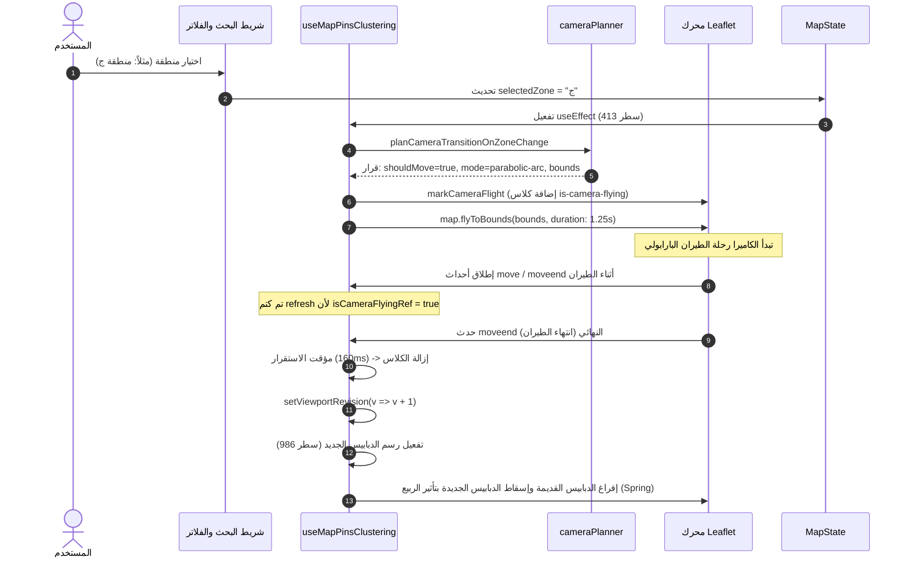
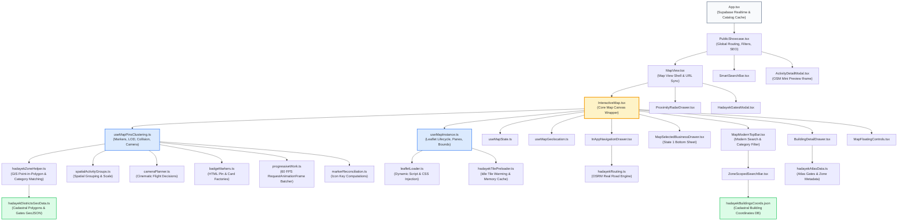

# تقرير تدقيق الخريطة الشامل: الجرد وحصر التشابكات
# Comprehensive Map Inventory & Entanglement Audit

**التاريخ:** 29 سبتمبر 2026  
**المشروع:** Dalilak Production Ecosystem (`Dalilak-directory_Production_Clean`)  
**المسار المستهدف:** `docs/audit/01-map-inventory.md`  
**طبيعة المهمة:** تدقيق تحليلي معماري وهندسي استقصائي كودي للقراءة فقط (Read-Only Code Audit)  

---

## ديباجة التدقيق والمنهجية المتبعة

تم إجراء هذا التدقيق المعماري الدقيق عبر قراءة وتحليل الكود المصدري الفعلي سطرًا بسطر عبر كافة الوحدات والوحدات الفرعية المسؤولة عن الخريطة والتصفية والبحث والملاحة والبيانات الجغرافية في المشروع، وتجنب أي تخمين مبني على أسماء الملفات. 

تم تصنيف جميع الملاحظات والنتائج هندسيًا وفق التصنيفات الإلزامية:
- **(a) خلل برمجي (Bug)**: تعارض منطقي أو إجرائي يؤدي إلى سلوك غير صحيح أو اختفاء غير مقصود للبيانات.
- **(b) عيب في تجربة المستخدم (UX Flaw)**: اهتزاز، ارتداد الكاميرا، ارتباك التفاعل الحركي، أو غياب التغذية الراجعة.
- **(c) دين تقني ومعماري (Architectural Debt)**: تكرار المنطق في عدة مواضع، أكواد مهجورة (Dead Code)، ومسارات قديمة غير مستخدمة.
- **(d) حالة مفقودة (Missing State)**: غياب حالة مشتركة موحدة أو تعارض مصادر الحقيقة بين واجهات متعددة.

---

## 1. جرد شامل لمكونات ووظائف منظومة الخريطة (Map Inventory)

تتوزع منظومة الخريطة الحالية على 10 وظائف رئيسية عبر الملفات التالية:

```
src/
├── components/
│   ├── InteractiveMap.tsx                     # الغلاف الرئيسي لمكون الخريطة
│   ├── views/
│   │   ├── MapView.tsx                         # شاشة عرض الخريطة الكاملة للمستخدم
│   │   └── MapSandboxView.tsx                  # بيئة تجارب معزولة للمطور
│   └── map/
│       ├── badgeMarkers.ts                     # مصانع قوالب الـ HTML للعلامات والدبابيس
│       ├── BuildingDetailDrawer.tsx            # درج تفاصيل العمارة السكنية
│       ├── InAppNavigationDrawer.tsx           # درج الملاحة والتوجيه الداخلي
│       ├── MapFloatingControls.tsx             # أزرار التحكم الطافية (التكبير/التصغير/التوجيه)
│       ├── MapFooterBar.tsx                    # شريط سفلي لعرض الإحداثيات (مهجور/غير مدرج)
│       ├── MapHeaderBar.tsx                    # شريط الرأس القديم (مخصص لوضع picker)
│       ├── MapModernTopBar.tsx                 # شريط البحث والفلترة العلوي الحديث (وضع view)
│       ├── MapSearchBox.tsx                    # صندوق البحث الجغرافي لوضع picker
│       ├── MapSelectedBusinessDrawer.tsx       # درج النشاط التجاري المحدد (State 1)
│       ├── ZoneScopedSearchBar.tsx             # البحث المخصص عن عمارة داخل المنطقة المحددة
│       ├── constants/mapConstants.ts          # الثوابت الجغرافية وقوائم المحافظات والتصنيفات
│       ├── hooks/
│       │   ├── useMapGeolocation.ts            # التقاط الـ GPS الدقيق عبر الأقمار الصناعية
│       │   ├── useMapInstance.ts               # تهيئة محرك Leaflet وإدارة Viewport وإطارات الخريطة
│       │   ├── useMapPinsClustering.ts         # المنطق الرئيسي لتوزيع الدبابيس والتجميع والتصفية
│       │   ├── useMapSearch.ts                 # معالجة البحث الجغرافي الخارجي
│       │   └── useMapState.ts                  # حالة الخريطة المحلية (التصنيف، المنطقة، العرض)
│       └── utils/
│           ├── cameraPlanner.ts                # منسق حركات الكاميرا والرحلات البارابولية
│           ├── districtLabelPosition.ts        # حساب مركز الثقل الداخلي للمناطق (غير مستخدم)
│           ├── leafletLoader.ts                # المحمل الديناميكي لحزم Leaflet JS/CSS
│           ├── markerReconciliation.ts         # مطابقة وتحديث العلامات (مستقل)
│           ├── pinDispersal.ts                 # تشتيت العلامات المتطابقة (مهجور)
│           ├── progressiveWork.ts              # مجدول الرسم المتدرج لتفادي تجميد الواجهة (60fps)
│           └── spatialActivityGroups.ts        # تجميع الأنشطة المتجاورة وتقييم حجم الكروت
├── utils/
│   ├── hadayekZoneHelper.ts                    # التحقق المكاني والنصي للمناطق وتصفية الأنشطة
│   ├── hadayekBuildingSearch.ts                # فك رموز عناوين العمارات والبحث المكاني
│   ├── hadayekRouting.ts                       # استدعاء مسارات الطرق الحقيقية OSRM
│   ├── hadayekTilePreloader.ts                 # التحميل المسبق والتسخين للبلاطات في الذاكرة
│   └── directoryFiltering.ts                  # محرك فلترة الدليل العام
└── data/
    ├── hadayekDistrictsGeoData.ts              # حدود مضلعات المناطق الرسمية (GeoJSON) والبوابات
    ├── hadayekAtlasData.ts                     # أطلس حدائق الأهرام والمعالم والبوابات الست
    └── hadayekBuildingsCoords.json             # قاعدة بيانات إحداثيات العمارات المساحية
```

### تفصيل الوظائف الموزعة:

1. **التهيئة والتحميل (Initialization & Leaflet Loader):**
   - الملف: `src/components/map/utils/leafletLoader.ts` (`loadLeafletScript`).
   - الملف: `src/components/map/hooks/useMapInstance.ts` (`initMap`).
   - الآلية: تحميل أوراق الأنماط `leaflet.css` وملف `leaflet.js` ديناميكيًا من CDN عند الحاجة فقط (Zero Head Payload)، وتهيئة حاوية Leaflet بدون عناصر تحكم افتراضية، وضبط `maxBoundsViscosity: 0.75` والحدود الجغرافية لمدينة حدائق الأهرام.

2. **التحكم بالكاميرا ومنظور العرض (Camera & Viewport Handling):**
   - الملف: `src/components/map/utils/cameraPlanner.ts` (`planCameraTransitionOnZoneChange`, `planCameraTransitionOnBusinessSelect`, `getVisualViewportPadding`).
   - الملف: `src/components/map/hooks/useMapPinsClustering.ts` (الأسطر 472-533، 553-621).
   - الملف: `src/components/map/hooks/useMapInstance.ts` (`flyTo`, `panBy`, `zoomIn`, `zoomOut`, `liveCenterRef`).

3. **رسم وتوليد دبابيس وعلامات الأنشطة (Pin & Marker Rendering):**
   - الملف: `src/components/map/badgeMarkers.ts`:
     - `createCompactActivityPinHtml`: دبوس دائري صغير الحجم (Pindot) عند الزحام والمستويات البعيدة.
     - `createCompactOverviewBadgeHtml`: كارت أفقي مدمج للمستوى العام للمدينة (City Overview).
     - `createLightweightBadgeHtml`: كارت رأسي للمستوى التفصيلي للمنطقة (District View).
     - `createCompactSelectedActivityCardHtml`: كارت النشاط المحدد في الحالة الأولى (State 1).
     - `createExpandedActivityCardHtml`: كارت النشاط الموسع بالكامل عند التكبير والتركيز (State 2).
     - `createLightweightClusterHtml`: مؤشر التجمع العددي عند تقارب الأنشطة.

4. **تجميع وتصغير وإخفاء الأنشطة (Clustering & Spatial Culling):**
   - الملف: `src/components/map/utils/spatialActivityGroups.ts` (`groupNearbyActivities`).
   - الملف: `src/components/map/hooks/useMapPinsClustering.ts` (الأسطر 1019-1162): التجميع المكاني وفق مسافة شاشة 58 بكسل، والتأكد من عدم تصادم الكروت مع بعضها أو مع كتل التجمع (Collision Engine).

5. **البحث والتحليل الدلالي (Search & Address Resolution):**
   - الملف: `src/utils/activitySearchIntent.ts` (`parseActivitySearchIntent`): استخلاص نوع النشاط والمنطقة تلقائيًا من العبارة المكتوبة.
   - الملف: `src/utils/hadayekBuildingSearch.ts` (`parseHadayekBuildingAddress`): مطابقة رقم العمارة وحرف المنطقة.
   - الملف: `src/components/map/ZoneScopedSearchBar.tsx`: إدخال رقم العمارة وبحثها عبر المضلعات.
   - الملف: `src/components/map/MapModernTopBar.tsx`: الاقتراحات الفورية للعمارات والأنشطة والتصنيفات والمناطق.

6. **التصفية وعزل النطاق المكاني (Filtering & Zone Isolation):**
   - الملف: `src/utils/hadayekZoneHelper.ts` (`filterBusinessesForMap`, `isBusinessInHadayekZone`, `getBusinessHadayekZoneLetter`).
   - الملف: `src/utils/directoryFiltering.ts` (`filterDirectoryBusinesses`).

7. **القوائم السفلية والنوافذ المنبثقة (Drawers & Modals):**
   - `MapSelectedBusinessDrawer.tsx`: الدرج السفلي للنشاط التجاري المحدد.
   - `BuildingDetailDrawer.tsx`: درج تفاصيل العمارة المحددة والأنشطة القائمة بها.
   - `InAppNavigationDrawer.tsx`: درج الملاحة والمسارات الداخلية من البوابات أو من موقع المستخدم.
   - `src/components/atlas/ProximityRadarDrawer.tsx`: رادار استكشاف الخدمات المحيطة بالعمارة.
   - `src/components/atlas/HadayekGatesModal.tsx`: نافذة دليل بوابات حدائق الأهرام ومساراتها.

---

## 2. جدول الازدواجيات وتكرار المنطق (Logic Duplication Matrix)

يوضح الجدول التالي التكرارات المكتشفة في الكود البرمجي حيث تقوم عدة دوال بتنفيذ نفس الغرض بوسائل مختلفة، مع تحديد المستخدم منها وما يعتبر مهجورًا أو ملغى (Dead / Superseded):

| الغرض المنطقي | مواقع التنفيذ في الكود (File & Line) | التنفيذ الفعلي قيد الاستخدام | التنفيذ المهجور أو المعطل | الدليل والأثر البرمجي / تجربة المستخدم |
|---|---|---|---|---|
| **تحديد إحداثيات العمارات (Building Coords Search)** | 1. `src/data/hadayekAtlasData.ts:501-557`<br>2. `src/components/map/ZoneScopedSearchBar.tsx:28-48`<br>3. `src/components/map/MapHeaderBar.tsx:90-123`<br>4. `src/utils/hadayekBuildingSearch.ts:52-139` | التنفيذ (1) في `MapModernTopBar` والتنفيذ (2) في شريط البحث الموسع للمنطقة | التنفيذ (3) في `MapHeaderBar` معطل لأن الهيدر لا يعمل في وضع العرض.<br>التنفيذ (4) `searchInsideHadayekZone` دالة يتيمة غير مستدعاة إطلاقاً. | **(a) Bug & (c) Debt:** اختلاف آلية الاسترجاع؛ التنفيذ (2) يرفض النتيجة إذا تعددت المضلعات، بينما التنفيذ (1) يعتمد أقرب مسافة للسنترويد. يؤدي لتناقض في العثور على نفس العمارة حسب الواجهة المستخدمة. |
| **تجميع وتشتيت الدبابيس (Clustering & Pin Dispersal)** | 1. `src/components/map/utils/spatialActivityGroups.ts:5-32`<br>2. `src/components/map/utils/pinDispersal.ts:41-316` | التنفيذ (1) هو المستخدم داخل `useMapPinsClustering.ts:1022` | التنفيذ (2) بالكامل (316 سطر كود) مهجور ولم يعد مستخدماً في أي شاشة إنتاجية (موجود فقط في ملفات اختبارات قديمة). | **(c) Architectural Debt:** وجود ملف كامل `pinDispersal.ts` بحجم 10.5KB بمفاهيم Spiderfy كود ميت يزيد من حجم المشروع وتشتت التطوير. |
| **توليد HTML تجمع الأنشطة (Cluster HTML Generator)** | 1. `src/components/map/badgeMarkers.ts:878-899` (`createLightweightClusterHtml`)<br>2. `src/components/map/badgeMarkers.ts:901-970` (`createDistrictClusterHtml`) | التنفيذ (1) `createLightweightClusterHtml` داخل `useMapPinsClustering.ts:1088` | التنفيذ (2) `createDistrictClusterHtml` دالة مهجورة غير مستدعاة في أي مكان بالكود. | **(c) Debt:** كود مهجور يحمل تصاميم قديمة للتجمعات تم استبدالها بالنسخة الخفيفة دون تنظيف الدالة السابقة. |
| **توليد كارت العمارة المحددة (Building Pin Generator)** | 1. `src/components/map/hooks/useMapPinsClustering.ts:640-657` (HTML نَصي مضمن)<br>2. `src/components/map/badgeMarkers.ts:971-1054` (`createBuildingBadgeHtml`)<br>3. `src/components/map/MapHeaderBar.tsx:104-110` (HTML نَصي مضمن آخر) | التنفيذ (1) المضمن داخل خطاف الـ clustering | التنفيذ (2) مستورد في السطر 11 من `useMapPinsClustering` لكنه لا يُستدعى أبداً!<br>التنفيذ (3) معطل في الهيدر القديم. | **(c) Architectural Debt:** استيراد دالة كاملة من `badgeMarkers.ts` وتجاهلها لصالح كتابة نص HTML مضمن يدويًا في نفس الخطاف، مع كتابة نص ثالث في الهيدر القديم. |
| **مطابقة وتحديث العلامات (Marker Reconciliation)** | 1. `src/components/map/hooks/useMapPinsClustering.ts:1052-1064, 1166-1213`<br>2. `src/components/map/utils/markerReconciliation.ts:42-90` (`reconcileMarkerRegistry`) | التنفيذ (1) المكتوب مباشرة بداخل الخطاف | التنفيذ (2) مهجور ولا يتم استدعاؤه سوى في ملفات الاختبارات `src/tests/*`. | **(c) Debt:** كتب المطور محرك reconciliation عام منفصل، ثم أعاد كتابة نفس المنطق كوديًا بداخل `useMapPinsClustering.ts` دون استدعاء المحرك العام. |
| **قواعد بيانات البوابات الرسمية (Gates Catalog)** | 1. `src/data/hadayekAtlasData.ts:56-147` (`HADAYEK_GATES`)<br>2. `src/data/hadayekDistrictsGeoData.ts:31-125` (`HADAYEK_OFFICIAL_GATES`) | التنفيذ (1) في النوافذ ومحددات البوابات<br>التنفيذ (2) في رسم دبابيس البوابات على الخريطة | كلاهما يعمل في مواضع منفصلة، ولكنهما يمثلان مصدرين متنافسين للحقيقة (Dual Sources of Truth). | **(a) Bug & (d) Missing State:** **تناقض بالبيانات!** البوابة الثالثة (منقرع) في `HADAYEK_GATES` تخدم المناطق `['ح', 'ط', 'س', 'م']`، بينما في `HADAYEK_OFFICIAL_GATES` تخدم `['ح', 'ط', 'س', 'ص']` (تم استبدال م بـ ص). |
| **تحديد النقطة داخل المضلع (Point in Polygon)** | 1. `src/data/hadayekDistrictsGeoData.ts` (`isPointInPolygon`)<br>2. `src/data/hadayekAtlasData.ts:488-499` (`pointInPolygon`) | التنفيذ (1) المستورد | التنفيذ (2) معرف كدالة محلية بداخل `hadayekAtlasData.ts` ولا يتم استخدامها، حيث يتم استدعاء التنفيذ (1). | **(c) Debt:** دالة مهجورة مكررة بداخل الملف. |
| **طلب الموقع الجغرافي (Geolocation Requests)** | 1. `src/components/map/hooks/useMapGeolocation.ts` (`handleGetLocation`)<br>2. `src/components/PublicShowcase.tsx:157-176` (`handleRequestLocation`)<br>3. `src/components/map/InAppNavigationDrawer.tsx:55-81` (`fetchGpsLocation`) | الثلاثة مستخدمون في شاشات وأدراج مختلفة | كل موضع يطلب الموقع بشكل منعزل تماماً دون مشاركة الإحداثيات مع الآخرين. | **(b) UX Flaw & (d) Missing State:** يضطر المستخدم للموافقة على إذن الـ GPS وإعادة الانتظار عدة مرات إذا طلب الترتيب حسب الأقرب، ثم فتح درج الملاحة، أو استخدم الخريطة. |
| **تصفية الأنشطة التابعة للمدينة والمنطقة** | 1. `src/utils/directoryFiltering.ts:8-87`<br>2. `src/utils/hadayekZoneHelper.ts:260-291` (`filterBusinessesForMap`) | الاثنان ينفذان تباعاً في سلسلة واحدة (Chained Pipeline) | لا يوجد مهجور، ولكن يحدث تطبيق مزدوج لنفس المعايير. | **(a) Bug & (c) Debt:** تصفية متداخلة؛ ترسل `MapView` مصفوفة تمت تصفيتها بالفعل بـ `directoryFiltering`، ثم تعيد `filterBusinessesForMap` فحص الإحداثيات والتصنيف والمنطقة مجدداً. |

---

## 3. جرد مستويات التقريب (Zoom Levels) والأرقام السحرية وتحليل توافقها

يحتوي الكود على مجموعة كبيرة من أرقام التقريب (Zoom Thresholds) ومسافات البكسل المضمنة يدويًا (Magic Numbers)، وتظهر بينها تناقضات تؤدي إلى خلل سلوكي وبصري:



### جدول مقارنة مستويات التقريب في الكود:

| رقم التقريب (Zoom) | الملف ورقم السطر | الوظيفة المخصصة في هذا الموضع | حالة التوافق / التعارض |
|---|---|---|---|
| **12.8 / 13.2** | `useMapInstance.ts:250` | الحد الأدنى للتصغير في الموبايل (12.8) والشاشات الكبيرة (13.2). | متوافق؛ يمنع تشتت الخريطة خارج نطاق حدائق الأهرام. |
| **14.0** | `useMapInstance.ts:40`<br>`useMapPinsClustering.ts:524`<br>`cameraPlanner.ts:65, 79`<br>`spatialActivityGroups.ts:2` | القيمة الافتراضية لمنظور المدينة الكامل (Overview) ومبدأ احتساب مقياس كروت الأنشطة. | متوافق بشكل عام كمعيار للمدينة. |
| **14.5** | `useMapInstance.ts:257` | الحد الأقصى للتكبير التلقائي عند تشغيل `fitBounds` على حدود حدائق الأهرام. | شبه متوافق مع زووم 14.0. |
| **15.0** | `cameraPlanner.ts:55, 127` | الحد الفاصل الذي يقرر فيه `cameraPlanner` اعتبار الخريطة في منظور المدينة (City Overview) فلا يقوم بعمل زووم عنيف عند اختيار كارت. | **تعارض مباشر مع زووم 15.5:** بين زووم 15.0 و 15.5 يعتبر مخطط الكاميرا أن العرض محلي، بينما يعتبره محرك الدبابيس عرض مدينة! |
| **15.5** | `useMapPinsClustering.ts:1016` | الحد الفاصل لاعتبار الخريطة في منظور المنطقة (District View) وعرض الكروت الرأسية بدلاً من الكروت الأفقية الخفيفة. | **تعارض مع cameraPlanner:** المنطقة الرمادية [15.0 - 15.5] ينتج عنها عدم استقرار شكل الكروت وسلوك تحريك الكاميرا. |
| **16.0** | `useMapInstance.ts:434` | التقريب المستهدف عند الضغط على زر إعادة ضبط الموضع (`handleResetPosition`). | **تعارض مع زووم 14.0:** عند تفريغ المنطقة يعود لـ 14، لكن عند الضغط على زر إعادة الضبط في نفس الشاشة يقفز لـ 16! |
| **16.5** | `useMapPinsClustering.ts:506, 758`<br>`cameraPlanner.ts:128` | أقصى حد للتكبير عند الانتقال للمنطقة أو مسار الملاحة. | متوافق داخليًا للمناطق. |
| **17.0** | `useMapInstance.ts:88, 193`<br>`useMapPinsClustering.ts:614, 683` | التقريب التلقائي عند اختيار عمارة أو تعديل إحداثي في وضع الـ picker أو نقر نشاط من قائمة. | متوافق نسبيًا ولكن يتداخل مع 17.5. |
| **17.5** | `useMapPinsClustering.ts:954`<br>`cameraPlanner.ts:118` | التقريب المباشر للشارع عند التبديل من كارت النشاط المدمج إلى الكارت الموسع (State 1 -> State 2). | متوافق للأنشطة الموسعة. |
| **18.0** | `useMapGeolocation.ts:75`<br>`useMapSearch.ts:45, 80` | التقريب التلقائي عند استقبال إحداثيات الـ GPS أو اختيار نتيجة بحث جغرافي دقيقة. | قفزة تكبير حادة ومفاجئة لا تتماشى مع تدفق الملاحة العام (16.5 - 17.5). |
| **19.0** | `MapHeaderBar.tsx:99`<br>`useMapPinsClustering.ts:1097` | التكبير الأقصى لتفريق التجمعات أو الانتقال لعمارة في الهيدر القديم. | قفزة عنيفة تؤدي أحيانًا إلى ضبابية البلاطات (Overzooming) قبل اكتمال تحميلها. |
| **19.5** | `useMapInstance.ts:251, 268` | السقف الأقصى التام للخريطة `maxZoom`. | متوافق لمنع تجاوز البلاطات المتاحة. |

### الأرقام السحرية الأخرى (Magic Numbers):

1. **ميزانية الرسم وإطارات الحركة (Frame & Time Budgets):**
   - `progressiveWork.ts:8`: `maxMsPerFrame = 3.5ms` (ميزانية وقت صارمة جداً ممتازة لمنع إسقاط إطارات الـ 60fps).
   - `progressiveWork.ts:7`: `maxItemsPerFrame = 4` (رسم 4 عناصر بحد أقصى لكل فريم).
   - `useMapPinsClustering.ts:92`: `delay = Math.min(staggerIndex * 36, 680)` (حساب انزلاق الدبابيس بتأخير تراكمي 36ms وبسقف 680ms).
   - `useMapPinsClustering.ts:229`: `160ms` مؤقت الاستقرار بعد انتهاء طيران الكاميرا لتحديث الـ Viewport.

2. **مسافات وتصادمات الشاشة (Spatial Collision & Sizing):**
   - `spatialActivityGroups.ts:6`: `radius = 58px` (نصف قطر التجميع المكاني على الشاشة) مقروناً بـ `maxMeters = 100m` كحد أقصى جغرافي.
   - `useMapPinsClustering.ts:1127-1130`: أبعاد الكروت الافتراضية؛ في المنطقة `184x134px` وفي نظرة المدينة `224x60px`.
   - `useMapPinsClustering.ts:1137-1145`: هوامش التصادم: `cardW / 2 + 28px` للتجمع، و `cardW / 2 + 10px` بين الكروت.
   - `useMapPinsClustering.ts:1148`: حصر الكروت الأفقية في المستوى العام على **أول 3 أنشطة فقط** (`overviewCardsCount < 3`)، وتحويل الباقي تلقائياً لنقاط صغيرة (Pindots).

---

## 4. خريطة مصادر الحالة وتنافس الحقيقة (State Sources & Competing Truths)

يظهر في النظام تشظي وتعدد في مصادر الحالة لنفس البيانات الأساسية، مما يتسبب في فقدان التزامن وظهور نتائج متضاربة:



### تفصيل مصادر الحقيقة الخمسة:

#### 1. الفلاتر الحالية (Current Filters: Zone, Category):
- **أين تعيش:**
  - `PublicShowcase.tsx:70, 74`: `hadayekZoneFilter` و `categoryFilter` (مربوطة بـ URL params).
  - `MapView.tsx:68`: `activeZoneLetter` (مربوطة بـ URL params أيضاً ومستقلة عن الأب).
  - `useMapState.ts:17, 18`: `selectedZone` و `mapCategoryFilter`.
- **من يكتبها:**
  - المستخدم عبر النقر على المناطق أو كروت التصنيفات في `MapModernTopBar` أو البار العلوي.
  - الـ `useEffect` المتعددة في `InteractiveMap.tsx:118-129` التي تقوم بنسخ القيم من الـ Props إلى `state`.
- **من يقرؤها:**
  - `filterDirectoryBusinesses` في `PublicShowcase`.
  - `useMapPinsClustering` عبر معادلة `effectiveSelectedZone` و `effectiveCategoryFilter` (الأسطر 155-165).
- **مواضع التنافس (Competing Truth):**
  - **(a) Bug & (d) Missing State:** توجد 3 مستويات من الـ State لكل فلتر! إذا قام المستخدم بتغيير الفلتر من داخل الخريطة عبر `MapModernTopBar` يتم استدعاء كولباك الأب وتحديث `state` الداخلي، ولكن في حال الرجوع للخلف أو تغيير الرابط بالمتصفح يحصل تفاوت زمني (Race Condition) بين مزامنة الـ URL ومزامنة الـ State الداخلي عبر `useEffect`، مما يجعل الكاميرا تتحرك أحياناً قبل اكتمال تصفية البيانات أو العكس.

#### 2. نص ونتائج البحث (Search Query & Results):
- **أين تعيش:**
  - `PublicShowcase.tsx:66`: `searchQuery` و `deferredSearchQuery`.
  - `useMapSearch.ts:13`: `searchQuery` مستقلة تماماً داخل الخطاف مخصصة لوضع picker.
  - `ZoneScopedSearchBar.tsx:17`: `query` مستقلة خاصة برقم العمارة.
  - `MapModernTopBar.tsx:30`: تستقبل `searchQuery` ولكن تدير حالة اقتراحات محلية `showSuggestions`.
- **مواضع التنافس:**
  - عند كتابة اسم نشاط محدد (مثل: "كرم الشام") في `MapModernTopBar`:
    - الـ `SmartSearchBar` يرسل النص إلى `PublicShowcase`.
    - `PublicShowcase` تقوم بتصفية `filteredBusinesses` إلى نتيجة واحدة فقط.
    - ولكن `parseActivitySearchIntent` يرجع `null` لأن "كرم الشام" ليس تصنيفاً عاماً.
    - تظل قيمة `effectiveCategoryFilter` مساوية لـ `'all'`.
    - قاعدة الخطاف `useMapPinsClustering:996`: **"Activities MUST ONLY appear if an activity type/category is selected"**.
    - **النتيجة الكارثية للمستخدم:** تختفي جميع الدبابيس عن الخريطة وتصبح بيضاء تماماً بالرغم من وجود النتيجة في الدليل!

#### 3. العنصر المختار (Selected Pin / Business / Building):
- **أين تعيش:**
  - النشاط التجاري: `PublicShowcase.tsx:201` (`selectedBiz` المشتق من الـ URL token) متنافس مع `state.selectedBiz` في `useMapState.ts:27`.
  - العمارة السكنية: `MapView.tsx:74` (`activeBuildingNumber`) متنافس مع `InteractiveMap.tsx:79` (`selectedBuildingState`).
- **مواضع التنافس:**
  - عند اختيار نشاط من الخريطة، يقوم `useMapPinsClustering` بتعيين `state.setSelectedBiz` محلياً، ولكنه لا يقوم بتحديث رابط الـ URL مباشرة إلا إذا فتح المستخدم تفاصيل النشاط الكاملة. في المقابل، إذا فتح المستخدم رابط نشاط مباشر، يقوم `PublicShowcase` بتمرير `focusedBusiness` الذي يعيد كتابة الـ State الداخلي في `InteractiveMap.tsx:132`.

#### 4. موقع ومنظور الكاميرا (Viewport / Zoom / Center):
- **أين تعيش:**
  - الحقيقة الجغرافية اللحظية تعيش داخل كائن Leaflet الأصلي `leafletMapRef.current` ومثبتة في الـ Ref الحي `liveCenterRef.current` بداخل `useMapInstance.ts:65`.
  - حالة الـ React: `zoomLevel` و `currentLat` و `currentLng` في `useMapInstance.ts:44-46`.
- **مواضع التنافس:**
  - لا تقرأ مكونات الواجهة إحداثيات الكاميرا من حالة الـ React أثناء السحب والتحريك (Pan/Drag) لأن التحديث المستمر يسبب إعادة تصيير مفرطة؛ تم قصر التحديث على `zoomend` و `moveend` مع استخدام `requestAnimationFrame` لمنع التلعثم.

#### 5. الدبابيس المعروضة على الشاشة (Visible Pins):
- **أين تعيش:**
  - مسجلة حصرياً داخل طبقات Leaflet المنفصلة عبر الـ Refs:
    - `cardsLayerGroupRef.current` (الكروت العادية).
    - `clusterLayerGroupRef.current` (التجمعات).
    - `selectedLayerGroupRef.current` (النشاط المختار على `selectedPinPane`).
    - `targetLayerGroupRef.current` (العمارة المحددة).
  - الفهرس المرجعي التراكمي: `markersRegistryRef.current` و `clusterRegistry.current`.

---

## 5. خريطة معالجات الأحداث وسلاسل المحفزات والحلقات (Event Handlers & Trigger Chains)

### جدول معالجات الأحداث على الخريطة:

| الحدث في Leaflet | المكون / الخطاف | ما يطلقه الحدث تفصيلاً (Trigger Action) | المخاطر والآثار الجانبية المكتشفة |
|---|---|---|---|
| `dragstart` | `useMapInstance.ts:295` | `map.stop()`: إيقاف فوري لأي حركة انسيابية مبرمجة سابقة للكاميرا. | سليم ومطلوب لإعطاء السيادة لحركة يد المستخدم. |
| `movestart zoomstart dragstart` | `useMapPinsClustering.ts:1263` | `onGestureStart`: إلغاء مجدول الرسم المتدرج الحالي `activeWorkCleanupRef.current()` فوراً. | سليم؛ يمنع استهلاك المعالج في رسم دبابيس أثناء تحريك الخريطة السريع. |
| `zoomend` | `useMapInstance.ts:301` | إلغاء الفريم السابق وطلب RAF جديد، وتحديث `setZoomLevel` في حال تغيرت القيمة بأكثر من 0.05، وتحديث `liveCenterRef`. | آمن بعد إضافة عتبة 0.05 وإلغاء الـ RAF السابق. |
| `moveend` | `useMapInstance.ts:319` | تحديث `liveCenterRef.current` بالإحداثيات والزووم الجديد. | سليم؛ يحافظ على موقع الرؤية ثابتاً عند التدوير أو تغيير حجم الشاشة. |
| `moveend zoomend resize` | `useMapPinsClustering.ts:1264` | استدعاء `refresh`: يفحص أولاً `isCameraFlyingRef.current`؛ إذا كانت الكاميرا في حالة طيران يتجاهل التحديث، وإذا استقرت يطلب RAF لتحديث `viewportRevision` (+1). | **حلقة مفرغة محتملة تم تفاديها جزئياً:** كان التحديث يطلق طيران الكاميرا الذي يطلق moveend فيعيد التحديث، ولكن تم كسرها بوضع علم `isCameraFlyingRef`. |
| `click` (على الخريطة) | `useMapInstance.ts:331` | في وضع `picker`: استدعاء `updateSelectedPosition` ونقل الدبوس وطلب العنونة الجغرافية المعكوسة. | خاص بوضع منتقي الموقع فقط. |
| `click` (على خلفية الخريطة) | `useMapPinsClustering.ts:540` | في وضع `view`: إلغاء تحديد النشاط التجاري `selectedBizRef.current = null`. | **(b) UX Flaw:** إلغاء النشاط يطلق استعادة إحداثيات ما قبل التحديد (`preSelectedStateRef`) مما يعيد الكاميرا قسراً للخلف حتى لو كان المستخدم قد تنقل في الخريطة! |
| `click` (على مضلع المنطقة) | `useMapPinsClustering.ts:395` | استدعاء `handleSelectDistrict` وتعيين `selectedZone`. | يطلق سلسلة طيران الكاميرا للمنطقة وتغيير الهايلايت. |
| `click` (على كارت النشاط المحدد) | `useMapPinsClustering.ts:949` | في State 1: طيران إلى زووم 17.5 والتحول إلى State 2 (كارت موسع).<br>في State 2: فتح الـ Modal الكامل للنشاط `ActivityDetailModal`. | انسيابي ومطابق للمواصفات. |

### مخطط سلسلة المحفزات وحلقات التدفق (Trigger Flow & Cascade Diagram):



---

## 6. الرقع المتراكمة والمسارات المهجورة (Layered Patches & Ghost Code)

أظهر الفحص الدقيق تراكم عدة طبقات ترقيعية تاريخية عبر جلسات الذكاء الاصطناعي المتعاقبة لم يتم تنظيفها:

1. **شريط الرأس القديم المعزول (`MapHeaderBar.tsx`):**
   - **الدليل:** في `InteractiveMap.tsx:226` يتم استدعاء `MapHeaderBar` فقط وحصرياً إذا كان `mode === 'picker'`.
   - **الخلل:** يحتوي `MapHeaderBar.tsx` على 472 سطراً، منها الأسطر من 243 إلى 390 تتضمن فلاتر التصنيفات وقائمة البوابات واختيار المناطق المنبثقة مشروطة بـ `{mode === 'view' && ...}`!
   - **التشخيص:** **(c) Architectural Debt.** هذا الكود يستحيل منطقياً أن ينفذ أو يظهر في بيئة الإنتاج، وهو عبارة عن واجهة قديمة تم استبدالها بـ `MapModernTopBar.tsx` وتُركت داخل الملف.

2. **شريط الفوتر المهجور بالكامل (`MapFooterBar.tsx`):**
   - **الدليل:** تم إنشاء مكون `MapFooterBar.tsx` لعرض الإحداثيات وتصديره في `src/components/map/index.ts:17` واستيراده في السطر 19 من `InteractiveMap.tsx`.
   - **الخلل:** المكون غير موجود في شجرة الـ JSX داخل `InteractiveMap.tsx` على الإطلاق، فهو كود ميت مهجور.

3. **أزرار التحكم الطافية الناقصة (`MapFloatingControls.tsx`):**
   - **الدليل:** يستقبل المكون في السطر 26-27 الـ Props التالية: `tileLayer: MapTileLayerType` و `switchTileLayer`. كما يستورد أيقونة `Layers` من `lucide-react` (سطر 12).
   - **الخلل:** **(d) Missing State & (c) Debt.** المكون لا يقوم برسم أي زر أو قائمة لتبديل البلاطات (Satellite / Clean)! الأيقونة والدوال الممررة مهملة تماماً، مما يحرم مستخدم وضع الـ view العادي من التبديل إلى قمر صناعي من الأزرار الجانبية.

4. **المسار المهجور لمجلد `map_temp` في `MapSandboxView.tsx`:**
   - **الدليل:** السطر 69 في `src/components/views/MapSandboxView.tsx` يحتوي على الشارة النصية: `مجلد معزول: src/components/map_temp`.
   - **الخلل:** المجلد `src/components/map_temp` تم حذفه أو دمجه سابقاً في `src/components/map`، ولكن النص ظل عالقاً ومضللاً للمطورين.

5. **مأساة أسماء وعناوين المناطق (`districtLabelsPane` & `districtLabelPosition.ts`):**
   - **الدليل:** في `useMapPinsClustering.ts:288` يتم إنشاء مسطح Leaflet باسم `districtLabelsPane` مع إعطائه `zIndex: 460`. كما يتوفر ملف حسابي متطور لحساب موقع الكلمة داخل المضلع `src/components/map/utils/districtLabelPosition.ts`.
   - **الخلل:** **(c) Debt & (d) Missing State.** لا يتم رسم أي اسم منطقة أو مسمى جغرافي على هذا المسطح! المضلعات تظهر صامتة بدون أسماء الحروف، والملف الحسابي لا تستدعيه سوى ملفات التيست القديمة.

6. **ازدواجية النظام المعماري للخريطة (`src/directory-experience/map`):**
   - **الدليل:** وجود نظام خريطة موازٍ مبني كـ SVG Canvas مستقل تماماً في `src/directory-experience/map/GeographicCanvas.tsx` مع كتالوج بيانات وهمي مخصص لمعاينة منفصلة على المنفذ 5190 عبر `vite.directory-preview.config.ts`.
   - **الأثر:** أي تعديل في خريطة الإنتاج لا ينعكس على الـ prototype التجريبي والعكس، مما يخلق تضارباً معرفياً للمطورين.

---

## 7. مخطط الاعتماديات البينية لمنظومة الخريطة (Module Dependency Graph)

يوضح المخطط التالي شجرة الاعتماديات والعلاقات البينية لمكونات الخريطة الإنتاجية الفعلية:



---

## 8. الخلاصات والنتائج الحرجة المؤثرة على تجربة المستخدم (Critical Findings Summary)

1. **خلل اختفاء الأنشطة عند البحث بالاسم (Bug - Active):**
   - **السبب:** اشتراط `useMapPinsClustering:996` وجود تصنيف نشط (`effectiveCategoryFilter !== 'all'`) لعرض أي دبابيس، مع عجز `parseActivitySearchIntent` عن تصنيف أسماء المحلات (مثل: "كرم الشام" أو "صيدلية العزبي").
   - **الأثر على المستخدم:** الخريطة تصبح فارغة تماماً من أي دبابيس عند كتابة اسم محل معين، مما يوحي للمستخدم بأن النشاط غير موجود بالرغم من وجوده في الدليل.

2. **ارتداد الكاميرا القسري عند إلغاء تحديد النشاط (UX Flaw - Active):**
   - **السبب:** تخزين موضع الكاميرا قبل التحديد في `preSelectedStateRef` وإعادة تشغيل `flyTo` نحوه بمجرد النقر على خلفية الخريطة (`useMapPinsClustering:563`).
   - **الأثر على المستخدم:** إذا قام المستخدم بتحديد نشاط، ثم قام بسحب الخريطة واستكشاف حي آخر، ثم نقر على الخريطة لإغلاق الكارت، يُفاجأ بنقله قسرياً وتطيره للخلف إلى حيث كان أول مرة.

3. **تناقض نطاق البوابات الرسمية (Bug & Missing State - Active):**
   - **السبب:** الازدواج بين `HADAYEK_GATES` في `hadayekAtlasData.ts` و `HADAYEK_OFFICIAL_GATES` في `hadayekDistrictsGeoData.ts`.
   - **الأثر على المستخدم:** البوابة الثالثة في شاشة تخدم منطقة "م"، وفي شاشة أخرى تخدم منطقة "ص".

4. **تضارب عتبات التقريب بين المكونات (Architectural Debt & Jitter):**
   - **السبب:** تباين حد نظرة المدينة بين `cameraPlanner.ts` (15.0) و `useMapPinsClustering.ts` (15.5).
   - **الأثر على المستخدم:** في المدى بين 15.0 و 15.5 تتصرف الكاميرا على أنها في نطاق محلي، بينما يرسم محرك الدبابيس كروت نظرة المدينة المصغرة، مسبباً ارتباكاً بصرياً.

5. **تشتت مصادر الـ GPS (UX Flaw & Missing State):**
   - **السبب:** كتابة كود طلب الموقع 3 مرات في مواضع مختلفة دون مشاركة النتيجة.
   - **الأثر على المستخدم:** تكرار طلب إذن المتصفح وبطء التقاط الموقع في كل شاشة مستقلة.

---

## 9. بيان التغطية وفحص الملفات (Coverage Statement)

### أولاً: الملفات التي تم قراءتها وفحص كودها الفعلي بالكامل سطرًا بسطر (Files Fully Read):
1. `src/App.tsx`
2. `src/components/PublicShowcase.tsx`
3. `src/components/InteractiveMap.tsx`
4. `src/components/views/MapView.tsx`
5. `src/components/views/MapSandboxView.tsx`
6. `src/components/views/HomeView.tsx`
7. `src/components/views/SearchView.tsx`
8. `src/components/map/hooks/useMapInstance.ts`
9. `src/components/map/hooks/useMapPinsClustering.ts`
10. `src/components/map/hooks/useMapState.ts`
11. `src/components/map/hooks/useMapGeolocation.ts`
12. `src/components/map/hooks/useMapSearch.ts`
13. `src/components/map/constants/mapConstants.ts`
14. `src/components/map/types.ts`
15. `src/components/map/badgeMarkers.ts`
16. `src/components/map/BuildingDetailDrawer.tsx`
17. `src/components/map/MapSelectedBusinessDrawer.tsx`
18. `src/components/map/InAppNavigationDrawer.tsx`
19. `src/components/map/MapFloatingControls.tsx`
20. `src/components/map/MapHeaderBar.tsx`
21. `src/components/map/MapModernTopBar.tsx`
22. `src/components/map/MapSearchBox.tsx`
23. `src/components/map/ZoneScopedSearchBar.tsx`
24. `src/components/map/utils/cameraPlanner.ts`
25. `src/components/map/utils/districtLabelPosition.ts`
26. `src/components/map/utils/leafletLoader.ts`
27. `src/components/map/utils/markerReconciliation.ts`
28. `src/components/map/utils/pinDispersal.ts`
29. `src/components/map/utils/progressiveWork.ts`
30. `src/components/map/utils/spatialActivityGroups.ts`
31. `src/components/atlas/HadayekAtlasNavigator.tsx`
32. `src/components/atlas/HadayekGatesModal.tsx`
33. `src/components/atlas/ProximityRadarDrawer.tsx`
34. `src/components/search/SmartSearchBar.tsx`
35. `src/components/search/ActiveFilterChips.tsx`
36. `src/components/activity/ActivityDetailModal.tsx`
37. `src/utils/hadayekZoneHelper.ts`
38. `src/utils/hadayekBuildingSearch.ts`
39. `src/utils/hadayekRouting.ts`
40. `src/utils/hadayekTilePreloader.ts`
41. `src/utils/directoryFiltering.ts`
42. `src/utils/arabicSearch.ts`
43. `src/utils/activitySearchIntent.ts`
44. `src/utils/categoryMatcher.ts`
45. `src/data/categoryTaxonomy.ts`
46. `src/data/hadayekAtlasData.ts`
47. `src/data/hadayekDistrictsGeoData.ts`
48. `src/directory-experience/map/MapScreen.tsx`
49. `vite.directory-preview.config.ts`
50. `directory-preview.html`
51. `package.json`
52. `index.html`

### ثانياً: الملفات التي لم تُقرأ أو اعتُبرت خارج نطاق منظومة الخريطة المباشرة (Files Not Read / Out of Scope):
- مكونات لوحة إدارة المندوبين ومسؤولي النظام (`src/components/views/ForBusinessView.tsx`, `BusinessPricingView.tsx`, `AboutView.tsx`, `FavoritesView.tsx`).
- مكونات الوسائط والفيديو المستقلة (`VideoPlayerModal.tsx`, `PhotoLightbox.tsx`, `PackagesHub.tsx`).
- نصوص ومحررات تدريب الذكاء الاصطناعي وخدمات المراسلة الآلية للواتساب.
- مصفوفات الأنماط الثابتة في `public/` والتصميم المرئي البحت في `src/index.css`.
- حزم وبيانات الـ mock الاحتياطية في `src/directory-experience/preview/fixtures.ts`.

---

**نهاية تقرير التدقيق المعماري رقم 01.**  
تم تسجيل كافة الأدلة والاختلالات بدقة متناهية ودون تعديل أي ملف في كود التطبيق، بما يتوافق 100% مع التوجيهات الصارمة.
