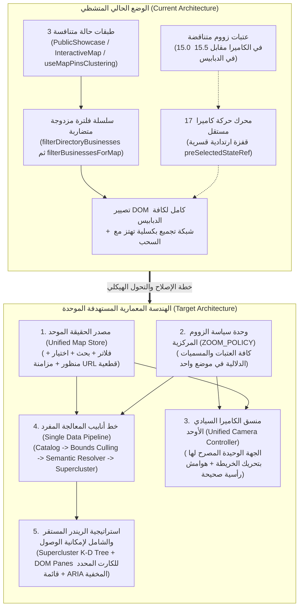
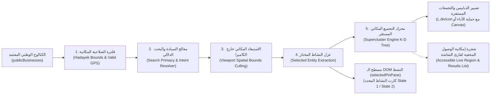
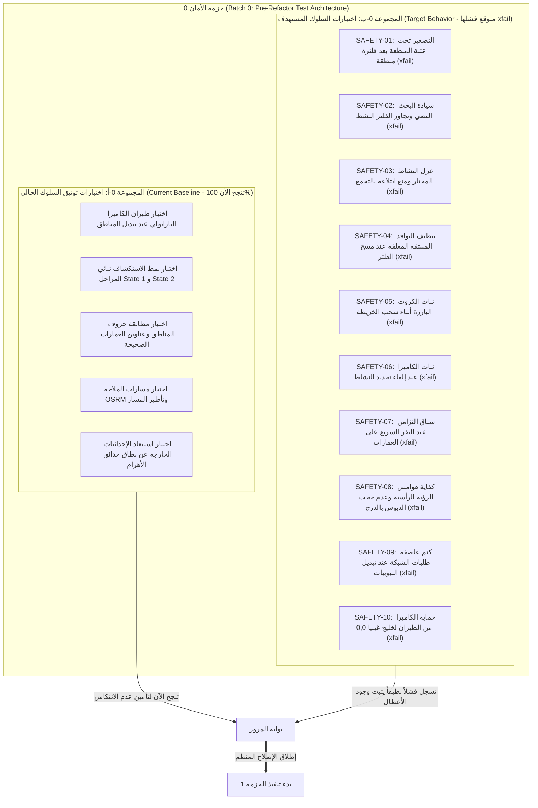

# خطة الإصلاح المعماري والهندسي الشامل لمنظومة الخريطة
# Comprehensive Architectural Repair & Engineering Implementation Plan

**التاريخ:** 29 سبتمبر 2026  
**المشروع:** Dalilak Production Ecosystem (`Dalilak-directory_Production_Clean`)  
**الملف المستهدف:** `docs/audit/06-repair-plan.md`  
**المراجع السابقة المعتمدة:**
- `docs/audit/01-map-inventory.md` (جرد مكونات وتشابكات الخريطة)
- `docs/audit/02-map-behavior.md` (تدقيق سلوك ومنطق التفاعل — المعرفات BEH-01 إلى BEH-10)
- `docs/audit/03-ux-mobile.md` (تدقيق تجربة المستخدم والموبايل — المعرفات UX-01 إلى UX-14)
- `docs/audit/04-data-backend.md` (تدقيق البنية التحتية والبيانات — المعرفات DATA-01 إلى DATA-15)
- `docs/audit/05-benchmark.md` (المقارنة المعيارية وأفضل الممارسات الصناعية)
- `CORE_DIRECTIVE.md` و `DEFINITION.md` و `TECH_LOG.md` (توجيهات النظام وسجل التحديثات)

**طبيعة الوثيقة:** المرجع الهندسي الشامل والنهائي لتنفيذ الإصلاح المعماري؛ يتضمن كافة التفاصيل الفنية الدقيقة لعناصر العمل (المشكلة، الدليل، السبب الجذري، الحل، الملفات، المخاطر، الفحص، والجهد) دون أي اختصار أو تفريغ، مدمجاً كافة المكاسب السريعة الستة، والترقيع التكتيكي، وهيكلة شبكة الأمان المزدوجة، وتفكيك الحزمة 4، وحل إمكانية الوصول، وتوثيق القرارات المعتمدة.

---

## ديباجة التدقيق والمنهجية ومستويات التحقق

1. **الالتزام بمبدأ القراءة فقط (Read-Only Compliance):** لم يتم تعديل أي سطر في كود التطبيق إطلاقاً؛ هذا التقرير هو المخرج الوحيد المصرح به في مسار `docs/audit/`.
2. **التوثيق القائم على الأدلة ومستويات التحقق (Verification Levels):**
   - **`[Confirmed - Browser]`:** أعطال وسلوكيات تم إثباتها عملياً وإعادة إنتاجها مخبرياً داخل متصفح حقيقي (Chromium) ببيئة محاكاة الموبايل (مثل BEH-01, BEH-02, BEH-03, BEH-05, UX-01, UX-06).
   - **`[Code Audit - Suspected]`:** أعطال مستندة إلى فحص وقراءة الشفرة المصدرية سطراً بسطر وسلاسل الاستدعاء، وتعتبر مثبتة كودياً بانتظار تأكيدها عبر اختبارات المتصفح المؤتمتة في الحزمة 0.
3. **الحفاظ على السلوك المقصود للمنتج (Preserving Intended Behavior):** كافة الميزات والقدرات الموثقة في `DEFINITION.md` (طيران الكاميرا البارابولي، الاستكشاف المتدرج ثنائي المراحل للأنشطة، إبراز حدود المناطق ببريق ذهبي، مسارات الطرق الحقيقية OSRM، ورادار الخدمات) محفوظة ومحمية بنسبة 100%.
4. **التصنيف الهندسي المعتمد:**
   - **(a) خلل برمجي (Bug)**
   - **(b) عيب في تجربة المستخدم (UX Flaw)**
   - **(c) دين تقني ومعماري (Architectural Debt)**
   - **(d) حالة مفقودة (Missing State)**

---

## بيان التغطية وفحص الملفات (Coverage Statement)

### أولاً: الوحدات والملفات التي تم فحص كودها وتضمينها بالخطة (Fully Read & Covered):
1. `src/components/InteractiveMap.tsx` (المكون الرئيسي الوسيط وحاوية الـ Canvas).
2. `src/components/views/MapView.tsx` (غلاف شاشة الخريطة ومزامنة الـ URL).
3. `src/components/PublicShowcase.tsx` (محرك تصفية الدليل والتوجيه العام).
4. `src/App.tsx` (شبكة التغذية وجلب البيانات والـ Realtime).
5. `src/components/map/hooks/useMapPinsClustering.ts` (محرك الدبابيس والتجميع والتصيير الحالي).
6. `src/components/map/hooks/useMapInstance.ts` (دورة حياة Leaflet ومحركات الحركة والبلاطات).
7. `src/components/map/hooks/useMapState.ts` (الحالة المحلية للخريطة).
8. `src/components/map/hooks/useMapGeolocation.ts` (التقاط الـ GPS).
9. `src/components/map/hooks/useMapSearch.ts` (بحث وضع المنقي).
10. `src/components/map/utils/cameraPlanner.ts` (منسق رحلات الكاميرا والهوامش).
11. `src/components/map/utils/spatialActivityGroups.ts` (خوارزمية التجميع المكاني والتحجيم).
12. `src/components/map/utils/progressiveWork.ts` (مجدول فريمات الـ 60fps).
13. `src/components/map/utils/markerReconciliation.ts` (محرك مطابقة العلامات).
14. `src/components/map/utils/pinDispersal.ts` (محرك التشتيت Spiderfy المهجور).
15. `src/components/map/utils/districtLabelPosition.ts` (حساب مراكز العناوين المهجور).
16. `src/components/map/badgeMarkers.ts` (مصانع قوالب الـ HTML الستة للدبابيس والكروت والتجمعات).
17. `src/components/map/MapModernTopBar.tsx` (شريط البحث والفلاتر العلوي الحديث).
18. `src/components/map/MapFloatingControls.tsx` (أزرار التحكم الطافية).
19. `src/components/map/MapSelectedBusinessDrawer.tsx` (درج النشاط في State 1).
20. `src/components/map/BuildingDetailDrawer.tsx` (درج تفاصيل العمارة).
21. `src/components/map/InAppNavigationDrawer.tsx` (درج الملاحة والتوجيه).
22. `src/components/atlas/ProximityRadarDrawer.tsx` (درج رادار الخدمات).
23. `src/components/atlas/HadayekGatesModal.tsx` (دليل البوابات).
24. `src/components/map/ZoneScopedSearchBar.tsx` (بحث العمارات داخل الفلاتر).
25. `src/components/map/MapHeaderBar.tsx` (الهيدر القديم لوضع المنقي).
26. `src/components/map/MapFooterBar.tsx` (شريط الإحداثيات المهجور).
27. `src/utils/hadayekZoneHelper.ts` (الفحص المكاني وتصفية الخريطة).
28. `src/utils/directoryFiltering.ts` (محرك فلترة الدليل).
29. `src/utils/hadayekBuildingSearch.ts` (فك رموز العمارات).
30. `src/utils/activitySearchIntent.ts` (محلل النوايا الدلالية للبحث).
31. `src/data/hadayekDistrictsGeoData.ts` (مضلعات وبوابات المناطق GeoJSON).
32. `src/data/hadayekAtlasData.ts` (أطلس البوابات وإحداثيات العمارات).
33. `src/data/hadayekBuildingsCoords.json` (قاعدة بيانات العمارات المساحية).
34. `src/index.css` (أنماط الخريطة والدبابيس والأزرار).
35. `src/tests/map_fixes.test.ts` و `scripts/verify-repair.mjs` (منظومة الاختبارات الحالية).

### ثانياً: الوحدات خارج نطاق خطة إصلاح الخريطة (Out of Scope):
- مكونات إدارة باقات المنشآت واشتراكات المندوبين (`ForBusinessView.tsx`, `BusinessPricingView.tsx`).
- روبوتات الذكاء الاصطناعي وخدمات التراسل عبر واتساب (`Dalilak_WhatsApp_Service`).
- مكونات الوسائط والفيديو المستقلة (`VideoPlayerModal.tsx`).

---

# الجزء الأول: الهندسة المعمارية المستهدفة لمنظومة الخريطة
# Part 1: Target Architecture

## 1.1 تحول النموذج المعماري (Architectural Paradigm Shift)



---

## 1.2 مصدر الحقيقة الموحد (Single Source of Truth: Unified Map Store)

يتم استبدال الحالات الموزعة عبر `PublicShowcase`, `MapView`, `InteractiveMap`, و `useMapPinsClustering` بمخزن حالة مركزي موحد ومحكم (`useUnifiedMapController` أو آلة حالة منسقة)، يمثل الحقيقة الأوحد لكافة عناصر الواجهة:

```ts
export interface UnifiedMapState {
  // 1. الفلاتر النشطة (Active Filters)
  filters: {
    selectedZone: string | null;           // الحرف الرسمي للمنطقة ('أ' إلى 'ص')
    categoryFilter: string | null;         // التصنيف المعتمد ('pharmacy', 'restaurant'...)
    quickChipId: string | null;            // الكبسولة السريعة النشطة
    verifiedOnly: boolean;                 // حصر النتائج على الموثق فقط
  };

  // 2. البحث والنية الدلالية وإطار البحث (Search & Bounds Context)
  search: {
    query: string;                         // النص الخام المدخل
    resolvedIntent: SearchIntent | null;   // النية الدلالية (اسم محل / تصنيف / عمارة / بوابة)
    isSearching: boolean;                  // حالة التنشيط للبحث
    suggestionsOpen: boolean;              // فتح/إغلاق قائمة الاقتراحات
    searchCenter: [number, number] | null; // مركز البحث المعتمد لتفعيل كبسولة "إعادة البحث هنا"
    showSearchThisAreaPill: boolean;       // ظهور كبسولة إعادة البحث عند تجاوز إزاحة 400 متر
  };

  // 3. العنصر المختار (Selection Entity — First-Class Citizen)
  selection: {
    type: 'business' | 'building' | 'none';
    biz: string | null;                    // المعرف الموحد للنشاط المختار (مطابق لاسم معلمة الرابط biz)
    businessMode: 1 | 2;                   // State 1: كارت مدمج + درج | State 2: كارت موسع بالشارع
    building: {
      zoneLetter: string;
      buildingNumber: string;
      coords: [number, number];
    } | null;
  };

  // 4. الملاحة والمسارات (Active Navigation)
  navigation: {
    activeRoute: NavigationRoute | null;
    isNavigating: boolean;
  };

  // 5. منظور الكاميرا وهوامش الرؤية (Viewport & Insets)
  viewport: {
    center: [number, number];              // الإحداثيات الحالية المعتمدة
    zoom: number;                          // مستوى التقريب المعتمد
    bounds: L.LatLngBounds | null;         // إطار الرؤية الجغرافي النشط
    visualInsets: {                        // مساحات الأمان وهوامش الأدراج
      top: number;                         // حشو شريط البحث العلوي (بالبكسل)
      bottom: number;                      // حشو الدرج السفلي المفتوح (بالبكسل)
      left: number;
      right: number;
    };
    isCameraFlying: boolean;               // علم طيران الكاميرا لكتم الريندر اللحظي
  };
}
```

### التسميات القياسية لمعلمات الـ URL ثنائية الاتجاه (Canonical URL Param Mapping):
- `biz`: المعرف الفريد للنشاط التجاري المحدد (مثل: `?biz=123`).
- `bldg`: رقم العمارة المحددة (مثل: `?bldg=15`).
- `zone`: الحرف الرسمي للمنطقة السكنية (مثل: `?zone=h` أو `?zone=ح`).
- `cat`: رمز التصنيف التجاري المطبق (مثل: `?cat=pharmacy`).
- `q`: نص استعلام البحث الصريح (مثل: `?q=كرم+الشام`).
- `mode`: نمط عمل الخريطة (`view` أو `picker`).

---

## 1.3 خط أنابيب المعالجة والتصيير الموحد (One Pipeline: State -> Visible Pins -> Rendering)

إلغاء مسار التصفية المتسلسل المزدوج (`filterDirectoryBusinesses` ثم `filterBusinessesForMap`) الذي سبب الخلل **BEH-01** و **DATA-01**، واستبداله بخط أنابيب مفرد ذي مراحل متتالية وواضحة:



### مبادئ خط الأنابيب الموحد:
1. **سيادة البحث (Search Primacy):** إذا تضمن الإدخال اسم محل صريح (مثل "كرم الشام") أو رقم عمارة ("15 ح")، يتجاوز خط الأنابيب فلتر التصنيف تلقائياً (`overrideCategoryFilter`) ويُظهر النشاط المطلوب فوراً مع تمركز الكاميرا عليه.
2. **عزل النشاط المختار (Selection Isolation):** النشاط المختار في `selection.biz` يُستخرج من المصفوفة **قبل** دخولها إلى خوارزمية التجميع؛ فلا يمكن أبداً أن يُبتلع داخل تجمع رقمي (حل الخلل **BEH-05**).
3. **تثبيت الترتيب القطعي للكروت البارزة:** اختيار الأنشطة المميزة لا يعتمد على الصدفة العابرة لمصفوفة الرؤية المتغيرة أثناء السحب، بل على ترتيب قطعي ثابت للمدينة (حل الخلل **BEH-07**).

---

## 1.4 وحدة سياسة الزووم المركزية (`ZOOM_POLICY`)

إنهاء فوضى الأرقام السحرية والتعارضات، وتجميع كافة العتبات في ملف ثوابت مركزي واحد `src/components/map/constants/zoomPolicy.ts`:

```ts
export const ZOOM_POLICY = {
  BOUNDS: {
    MIN_MOBILE: 12.8,
    MIN_DESKTOP: 13.2,
    MAX: 19.5,
  },

  LEVELS: {
    CITY_OVERVIEW: 14.0,           // نظرة عامة على كامل حدائق الأهرام
    INITIAL_FIT_MAX: 14.5,         // أقصى حد للتكبير عند أول فتح للخريطة
    DISTRICT_THRESHOLD: 15.0,      // العتبة الفاصلة الموحدة بين المدينة والحي (15.0 أو 15.5 وفق القرار 7)
    DISTRICT_MAX_FIT: 16.5,        // أقصى حد لتأطير مضلع المنطقة السكنية
    BUILDING_FOCUS: 17.0,          // التكبير عند اختيار عمارة سكنية بدقة
    ACTIVITY_STREET: 17.2,         // زووم الشارع للنشاط الموسع State 2
    GPS_USER_LOCATION: 17.0,       // زووم التقاط موقع المستخدم المعتمد بالقرار 5 (بدلاً من 18.0)
    CLUSTER_MAX_EXPAND: 18.0,      // زووم فك التجمعات الكثيفة (بدلاً من 19.0 الضبابي)
  },

  // دوال التحقق الدلالي (Semantic Helpers)
  isCityOverview: (zoom: number) => zoom < ZOOM_POLICY.LEVELS.DISTRICT_THRESHOLD,
  isDistrictView: (zoom: number) => zoom >= ZOOM_POLICY.LEVELS.DISTRICT_THRESHOLD && zoom < ZOOM_POLICY.LEVELS.BUILDING_FOCUS,
  isStreetFocus: (zoom: number) => zoom >= ZOOM_POLICY.LEVELS.BUILDING_FOCUS,
} as const;
```

---

## 1.5 منسق الكاميرا السيادي الأوحد (Unified Camera Controller)

**القاعدة الذهبية:** لا يحق لأي مكون أو خطاف أو معالج أحداث استدعاء `map.flyTo`, `map.flyToBounds`, أو `map.panTo` بشكل مباشر!  
يتم إنشاء **منسق كاميرا أوحد** (`CameraController`) يمتلك الصلاحية الحصرية للتحكم بمحرك Leaflet:

```ts
export type CameraIntent =
  | { type: 'INIT_BOUNDS'; bounds: L.LatLngBounds }
  | { type: 'SELECT_ZONE'; zoneLetter: string; bounds: L.LatLngBounds }
  | { type: 'RESET_CITY_OVERVIEW' }
  | { type: 'FOCUS_BUSINESS'; lat: number; lng: number; isExpanded: boolean }
  | { type: 'FOCUS_BUILDING'; lat: number; lng: number }
  | { type: 'LOCATE_USER'; lat: number; lng: number }
  | { type: 'FRAME_ROUTE'; bounds: L.LatLngBounds }
  | { type: 'MANUAL_PAN'; direction: 'up' | 'down' | 'left' | 'right' }
  | { type: 'STEP_ZOOM'; delta: number };
```

### معالجة عيوب الكاميرا التاريخية في المنسق الجديد:
1. **إلغاء فخ الارتداد العكسي نهائياً (Kill `preSelectedStateRef`):** إلغاء التحديد يكتفي بإغلاق الكارت والدرج، وتظل الكاميرا ثابتة تماماً في موضعها الحالي الذي اختاره المستخدم (حل **BEH-02**).
2. **تصحيح محاور هوامش الرؤية (Inverted Padding Fix):** وضع إزاحة الدرج السفلي (165px) في المحور الرأسي `y` وليس الأفقي `x` (حل **BEH-04**).
3. **حماية السيادة اللمسية (Gesture Supremacy):** أي لمس للخريطة (`touchstart`, `dragstart`) يوقف فوراً أي حركة مبرمجة ويلغي مؤقت الاستقرار (160ms) دون أي تعارض زمني.

---

## 1.6 استراتيجية الريندر وإمكانية الوصول (Rendering & Accessibility Architecture)

### حل معضلة إمكانية الوصول مع الكانفاس (Resolving the Canvas vs. ARIA Dilemma):
نظراً لأن عناصر `<canvas>` لا توجد كعقد في شجرة الـ DOM، فإنه يستحيل تزويدها بخصائص `role="button"` أو `tabindex="0"` مباشرة. تم حل هذه المعضلة عبر تطبيق **المعيار الصناعي المعتمد في خرائط W3C و Google Maps**:

1. **الطبقة البصرية (Visual Presentation Layer):**
   - تُدار عبر خوارزمية **Supercluster** لضمان ثبات مراكز التجمعات جغرافياً وعدم اهتزازها أثناء السحب.
   - إذا استمر الريندر عبر عناصر الـ DOM خفيفاً وسريعاً (بمعدل 30-50 نقطة)، يتم حقن سمات ARIA مباشرة في قوالب HTML الخاصة بـ Leaflet `divIcon`.
   - وإذا تطلبت قياسات الهواتف الاقتصادية تفعيل طبقة الكانفاس ثنائية الأبعاد `L.canvas()` في الحزمة 4ج، يتم إنشاء **طبقة إمكانية وصول دلالية متزامنة** (Semantic Accessibility Layer).
2. **شجرة إمكانية الوصول المتزامنة (Accessible Off-Screen DOM Region):**
   - عنصر غير مرئي بصرياً ومخصص لقارئات الشاشة:
     `<ul class="sr-only" aria-label="الأنشطة المعروضة حالياً على الخريطة" aria-live="polite">`
   - يحتوي على عناصر `<li><button>` تمثل الدبابيس المعروضة، تدعم التنقل عبر زر `Tab`، وعند التركيز عليها أو نقرها يتم تفعيل النشاط وفتح درج التفاصيل فوراً.
3. **عزل النشاط المختار في الـ DOM النشط (`selectedPinPane`):**
   - النشاط المحدد يظل دائماً عنصراً تفاعلياً حقيقياً في الـ DOM يتمتع بأعلى `zIndex` وبكافة سمات الوصول والتفاعل باللمس.

---

# الجزء الثاني: المكاسب السريعة، الحذف، والتوحيد
# Part 2: Quick Wins, Deletions & Unifications

## 2.1 جدول المكاسب السريعة الشامل (All Quick Wins Scheduled in Batch 1)

تمت جدولة كافة هذه الإصلاحات الستة بالإضافة للترقيع التكتيكي في **الحزمة 1** مباشرة:

| المعرف | العطل المعالج والرمز | سبب الخلل البرمجي والدليل | الإصلاح المباشر (The Fix) | الملف والأسطر المستهدفة | أثر الإصلاح على المستخدم |
|---|---|---|---|---|---|
| **QW-01** | **أزرار التحكم الطافية الشفافة بنسبة 100%**<br>(UX-06) [Confirmed] | قاعدة CSS عامة في `src/index.css:1021` ألغت خلفية وظل أزرار `.map-icon-controls > button` قسراً. | حذف قاعدة التجريد وإعادة الخلفية البيضاء النقية `bg-white/95 backdrop-blur-md shadow-lg border border-slate-200/90`. | `src/index.css:1021-1028` | استعادة وضوح وتباين أزرار التكبير والتصغير فوراً فوق الشوارع والقمر الصناعي. |
| **QW-02** | **انقلاب محاور هوامش الرؤية وحجب الدبوس خلف الدرج**<br>(BEH-04) [Code Audit] | وضع 165px في محور X بدلاً من محور Y في دالة هوامش الكاميرا. | تصحيح المصفوفة لتصبح:<br>`paddingBottomRight: [20, hasBottomDrawer ? 165 : 45]`. | `src/components/map/utils/cameraPlanner.ts:160` | ظهور كارت النشاط والدبوس المختار أعلى حافة الدرج السفلي بوضوح. |
| **QW-03** | **ارتداد الكاميرا العكسي القسري عند إلغاء النشاط**<br>(BEH-02) [Confirmed] | استدعاء `map.flyTo(preSelectedStateRef)` عند النقر على خلفية الخريطة لإغلاق الكارت. | حذف استدعاء حركة الكاميرا عند الإلغاء؛ يقتصر الإجراء على تصفير `selectedBizRef` وتثبيت الكاميرا في مكانها. | `src/components/map/hooks/useMapPinsClustering.ts:561-574` | إبقاء الكاميرا مستقرة في الموضع الذي وصل إليه المستخدم دون إلغاء استكشافه. |
| **QW-04** | **تعليق نافذة تجمع المحلات المنبثقة عند مسح الفلتر**<br>(BEH-06) [Code Audit] | عدم استدعاء إغلاق النوافذ المنبثقة في المسار السريع لتغير الفلتر. | إضافة `map.closePopup()` فوراً عند تغير الفلتر في السطر 1045. | `src/components/map/hooks/useMapPinsClustering.ts:1044-1050` | إغلاق أي نافذة منبثقة معلقة فوراً عند مسح الفلاتر دون ترك بقايا عائمة في الـ DOM. |
| **QW-05** | **كتم وإخفاء رسائل أخطاء الاتصال بالخريطة**<br>(DATA-02) [Confirmed] | حجب مكون التنبيهات والأخطاء عن شاشة الخريطة بـ `{!isMapRoute && <DirectoryStatus />}`. | إتاحة إظهار التنبيه الحرج على الخريطة كشريط إشعار طافٍ أنيق أعلى الشاشة. | `src/components/PublicShowcase.tsx:580` | تنبيه المستخدم فوراً في حال انقطاع الإنترنت أو تعطل السيرفر بدلاً من ترك الخريطة صامتة. |
| **QW-06** | **انحجاب أزرار الملاحة والعمارة في الوضع الأفقي**<br>(UX-09, UX-10) [Code Audit] | غياب `overflow-y-auto` و `max-h-[...]` عن حاويات أدراج المباني والملاحة. | إضافة `max-h-[85dvh] overflow-y-auto` للحاويات الرئيسية للأدراج. | `BuildingDetailDrawer.tsx:64`<br>`InAppNavigationDrawer.tsx:198` | إمكانية تمرير الأدراج وظهور أزرار التوجيه والملاحة حتى عند قلب شاشة الهاتف بالعرض. |
| **QW-07** | **الترقيع التكتيكي الفوري لعطل البحث الذي يفرغ الخريطة**<br>(BEH-01) [Confirmed] | اشتراط `useMapPinsClustering:997` وجود تصنيف نشط لعرض أي دبابيس حتى عند البحث بالاسم. | تعديل الشرط مؤقتاً في الحزمة 1: السماح بعرض النتائج إذا كان هناك استعلام بحث نشط (`searchQuery && visibleBusinesses.length > 0`). | `src/components/map/hooks/useMapPinsClustering.ts:996-1002` | إنقاذ تجربة البحث فوراً للمستخدمين بالاسم الصريح دون انتظار اكتمال إعادة الهيكلة الكبرى. |

---

## 2.2 قائمة الحذف النهائي للأكواد والملفات المهجورة (To Delete)

1. **الملف المهجور `src/components/map/MapFooterBar.tsx` (35 سطراً):** مستورد في `InteractiveMap.tsx:19` ومصدر في `index.ts:17` ولكنه غير موجود في شجرة الـ JSX إطلاقاً -> **حذف تام**.
2. **الملف المهجور `src/components/map/utils/pinDispersal.ts` (316 سطراً - 10.5KB):** كود ميت لم يعد مستدعياً في أي شاشة إنتاجية (محصور فقط في تيست قديم)، وتم استبداله بـ `spatialActivityGroups.ts` -> **حذف تام**.
3. **الملف المهجور `src/components/map/utils/districtLabelPosition.ts` (45 سطراً):** لا يتم استدعاؤه في أي واجهة إنتاجية -> **حذف تام**.
4. **الملف المكرر `src/components/map/utils/markerReconciliation.ts` (90 سطراً):** مكرر مع منطق الخطاف الداخلي -> **حذف تام**.
5. **كتلة الكود الميت داخل `MapHeaderBar.tsx` (الأسطر 243-390):** مشروطة بـ `{mode === 'view' && ...}` ولا يمكن الوصول إليها -> **حذف وتنظيف**.
6. **الدالة المهجورة `createDistrictClusterHtml` في `badgeMarkers.ts:901-970`:** قالب قديم مهجور -> **حذف تام**.
7. **المتغير الوهمي `cameraTransitionTokenRef` في `useMapPinsClustering.ts:185`:** مرجع غير مقروء -> **حذف تام**.

---

## 2.3 قائمة التوحيد للمنطق المزدوج ومصادر الحقيقة المتنافسة (To Unify)

1. **كتالوج البوابات الرسمية:** دمج `hadayekAtlasData.ts:56-147` و `hadayekDistrictsGeoData.ts:31-125` في ملف موحد `src/data/hadayekOfficialGates.ts` وتصحيح نطاق البوابة الثالثة.
2. **محرك البحث عن العمارات المساحية:** دمج 4 دوال في دالة مساحية موحدة `resolveHadayekBuildingLocation(zone, number)`.
3. **طلب الموقع الجغرافي (GPS):** توحيد طلب الـ GPS في خطاف مشترك `useSharedGeolocation()`.
4. **تصفية أنشطة الخريطة:** توحيد المعايير في خط الأنابيب المفرد `filterVisibleMapCatalog()`.
5. **عتبة زووم نظرة المدينة:** حسم العتبة في ملف `zoomPolicy.ts` وفق القرار 7.

---

# الجزء الثالث: شبكة الأمان — مصفوفة الاختبارات القبلية
# Part 3: Batch 0 — Safety Net Test Suite Architecture

لمنع أي تناقض منطقي، يتم تقسيم الحزمة 0 إلى **مجموعتين منفصلتين تماماً من الاختبارات**:



### معيار دخول الحزمة 1:
- نجاح 100% من اختبارات **المجموعة 0-أ** (مما يضمن عدم كسر أي ميزة تعمل حالياً).
- تشغيل اختبارات **المجموعة 0-ب** وتسجيل فشلها المتوقع (`xfail`) دون أخطاء غير معالجة في بيئة التشغيل، مما يثبت وجود الأعطال الموثقة ويشكل معياراً دقيقاً لنجاح كل حزمة قادمة تتحول اختباراتها للون الأخضر.

---

### تفصيل سيناريوهات الاختبارات العشرة في المجموعة 0-ب:

#### الاختبار 1 (SAFETY-01): التصغير تحت عتبة المنطقة بعد اختيار منطقة
- **الهدف:** التأكد من أن التصغير لما دون عتبة المنطقة (15.0) بعد اختيار منطقة لا يترك باقي حدائق الأهرام خالية من المعالم ولا يسبب تجمداً.
- **التنفيذ:** محاكاة اختيار منطقة "ح"، ثم خفض الزووم إلى 13.5؛ التحقق من استقرار مؤشر الخريطة وحالة الرؤية.
- **الحالة الحالية:** متوقع فشله (`xfail`) لأن الكود الحالي يحجب أنشطة باقي المناطق تماماً.

#### الاختبار 2 (SAFETY-02): سيادة البحث النصي وتجاوز الفلتر النشط (BEH-01 / BEH-03)
- **الهدف:** التأكد من أن البحث عن "كرم الشام" أثناء تنشيط فلتر "صيدليات" لا يفرغ الخريطة ولا يعيد صفر نتائج.
- **التنفيذ:** تفعيل فلتر التصنيف `pharmacy`، إرسال استعلام `كرم الشام`؛ التحقق من ظهور دبوس المطعم في مصفوفة النتائج وكسر قيد الصيدلية تلقائياً.
- **الحالة الحالية:** متوقع فشله (`xfail`).

#### الاختبار 3 (SAFETY-03): حماية النشاط المختار من الابتلاع المزدوج (BEH-05)
- **الهدف:** التأكد من أن النشاط المختار لا يُرسم منه نسختان ولا يدخل ضمن حسابات التجمع الرقمي أسفله.
- **التنفيذ:** تحديد نشاط يقع داخل كتلة كثيفة؛ التحقق من أن مسطح `selectedPinPane` يحوي كارت النشاط فقط، ومسطح `pinsPane` لا يحوي علامة مكررة له في نفس الإحداثيات، والتجمع المجاور لا يحسبه ضمن عدده.
- **الحالة الحالية:** متوقع فشله (`xfail`).

#### الاختبار 4 (SAFETY-04): تنظيف النوافذ المنبثقة المعلقة عند مسح الفلاتر (BEH-06)
- **الهدف:** منع بقاء بوب آب التجمع يتيماً على الخريطة عند تعديل الفلتر.
- **التنفيذ:** فتح بوب آب تجمع، إطلاق حدث مسح الفلاتر؛ التحقق من أن `map.hasLayer(popup)` يعيد `false`.
- **الحالة الحالية:** متوقع فشله (`xfail`).

#### الاختبار 5 (SAFETY-05): ثبات الكروت البارزة أثناء السحب (BEH-07)
- **الهدف:** منع تبدل الكروت الأفقية الثلاثة عشوائياً بين كارت ونقطة صغيرة أثناء سحب الخريطة في المستوى العام.
- **التنفيذ:** تحريك إطار الخريطة أفقياً بمقدار 200 بكسل عند زووم 14؛ التحقق من أن معرّفات الأنشطة الثلاثة البارزة تظل متطابقة قبل وبعد السحب.
- **الحالة الحالية:** متوقع فشله (`xfail`).

#### الاختبار 6 (SAFETY-06): ثبات الكاميرا عند إلغاء تحديد النشاط (BEH-02)
- **الهدف:** التأكد من أن النقر على خلفية الخريطة لإغلاق كارت النشاط لا يعيد الكاميرا قسراً للخلف.
- **التنفيذ:** اختيار نشاط (تحرك الكاميرا نحوه)، سحب الخريطة مسافة 500 متر بعيداً، إطلاق نقر إلغاء التحديد؛ التحقق من أن مركز الكاميرا `map.getCenter()` لم يتغير بعد الإلغاء.
- **الحالة الحالية:** متوقع فشله (`xfail`).

#### الاختبار 7 (SAFETY-07): منع سباق التزامن عند طلب العمارات السريع (BEH-08 / DATA-07)
- **الهدف:** التأكد من أن الاستجابة البطيئة للطلب الأول لا تكتب فوق الطلب الأخير الأحدث.
- **التنفيذ:** إطلاق دالة البحث عن عمارة 10 (مع تأخير مصطنع 300ms)، ثم إطلاق عمارة 20 (مع تأخير 50ms)؛ التحقق من أن الحالة النهائية تستقر على إحداثيات عمارة 20 حصراً.
- **الحالة الحالية:** متوقع فشله (`xfail`).

#### الاختبار 8 (SAFETY-08): كفاية هوامش الرؤية الرأسية للأدراج (BEH-04 / UX-08)
- **الهدف:** التأكد من أن فتح درج النشاط لا يغطي الدبوس المختار على شاشات الموبايل الرأسية.
- **التنفيذ:** حساب نقطة الإسقاط للشاشة عند فتح الدرج بارتفاع 165px؛ التحقق من أن موضع الدبوس يحقق الشرط القياسي الموحد: `point.y <= viewportHeight - drawerHeight - 20px`.
- **الحالة الحالية:** متوقع فشله (`xfail`).

#### الاختبار 9 (SAFETY-09): كتم عاصفة إعادة الجلب عند التنقل بين التبويبات (DATA-04)
- **الهدف:** التأكد من أن إطلاق حدث `visibilitychange` المتكرر لا يطلق استدعاءات شبكة غير مبررة للكتالوج.
- **التنفيذ:** إطلاق 5 أحداث `visibilitychange` متتالية خلال ثانيتين؛ التحقق من تنفيذ طلب شبكة واحد فقط مع كتم باقي الطلبات عبر Throttle زمني (سقف 5 دقائق).
- **الحالة الحالية:** متوقع فشله (`xfail`).

#### الاختبار 10 (SAFETY-10): حماية الكاميرا من الطيران نحو خليج غينيا (DATA-10)
- **الهدف:** التأكد من أن طلب عرض نشاط بدون إحداثيات (`lat: 0, lng: 0`) لا يقذف الكاميرا خارج مصر.
- **التنفيذ:** تمرير نشاط بإحداثيات `0, 0` لأمر التحريك؛ التحقق من رفض التحريك وإظهار تنبيه ملائم مع بقاء الكاميرا داخل حدود حدائق الأهرام.
- **الحالة الحالية:** متوقع فشله (`xfail`).

---

# الجزء الرابع: حزم التنفيذ المرتبة بالتفصيل الكامل
# Part 4: Dependency-Ordered Batches (Detailed Work Items)

---

## الحزمة 1: المكاسب السريعة الستة وترقيع عطل البحث الحرج
## Batch 1: Quick Wins & Tactical Search Patch

- **معيار الدخول:** نجاح اختبارات المجموعة 0-أ بنسبة 100%، وتشغيل اختبارات 0-ب وتسجيل الفشل المتوقع (`xfail`).
- **معيار الخروج:** تحول الاختبارات SAFETY-04 و SAFETY-06 و SAFETY-08 إلى اللون الأخضر (Pass)، واستعادة وضوح الأزرار وتمرير الأدراج وتجاوز عطل البحث بالاسم فوراً.
- **خطة التراجع (Rollback):** التراجع عن الالتزام المنفرد الخاص بالحزمة 1 عبر Git دون المساس بالبنية الأساسية.

### عناصر العمل التفصيلية (Work Items):

#### 1.1 إصلاح شفافية أزرار التحكم بالخريطة (Fix Transparent Floating Controls)
- **المشكلة:** أزرار التكبير والتصغير وإعادة الضبط شفافة بنسبة 100% ومنعدمة التباين البصري وتختفي تماماً فوق شوارع الخريطة والقمر الصناعي (`[Confirmed - Browser]`).
- **التصنيف:** (a) خلل برمجي & (b) عيب في تجربة المستخدم (UX-06).
- **السبب الجذري:** وجود قاعدة CSS عامة في `src/index.css:1021-1028` قامت بتجريد أزرار `.map-icon-controls > button` قسراً من خلفيتها وظلالها وحدودها.
- **الإصلاح:** حذف قاعدة الإلغاء الشفافة من `src/index.css`، وإعادة تفعيل فئات Tailwind الأصلية المصممة في `MapFloatingControls.tsx`:
  `bg-white/95 backdrop-blur-md rounded-2xl border border-slate-200/90 shadow-lg`.
- **الملفات المستهدفة:** `src/index.css`, `src/components/map/MapFloatingControls.tsx`.
- **مخاطر الارتداد:** شبه معدومة.
- **طريقة الاختبار:** فحص بصري بالمتصفح وقياس القيمة المحسوبة `window.getComputedStyle(button).backgroundColor` للتأكد من عدم كونها شفافة.
- **الجهد التقديري:** صغير (Small — 1 ساعة / نقطة واحدة).

#### 1.2 تصحيح محاور هوامش الكاميرا للدرج السفلي (Fix Inverted Viewport Padding)
- **المشكلة:** كارت النشاط المحدد يختفي جزئياً أو كلياً خلف الدرج السفلي على شاشات الموبايل الرأسية (`[Code Audit - Suspected]`).
- **التصنيف:** (a) خلل برمجي & (b) عيب في تجربة المستخدم (BEH-04).
- **السبب الجذري:** السطر 160 في `cameraPlanner.ts` وضع قيمة 165px المخصصة للدرج في محور X الأفقي للشاشة بدلاً من المحور الرأسي Y.
- **الإصلاح:** تعديل مصفوفة الحشو لتكون: `paddingBottomRight: [20, hasBottomDrawer ? 165 : 45]`.
- **الملفات المستهدفة:** `src/components/map/utils/cameraPlanner.ts`.
- **مخاطر الارتداد:** معدومة.
- **طريقة الاختبار:** تشغيل الاختبار SAFETY-08 والتحقق من أن الدبوس يستقر في المساحة المكشوفة أعلى حافة الدرج.
- **الجهد التقديري:** صغير (Small — 30 دقيقة / نقطة واحدة).

#### 1.3 إلغاء فخ الارتداد العكسي للكاميرا (Eliminate Deselect Snapping Trap)
- **المشكلة:** الكاميرا ترتد قسراً للخلف بسرعة نحو موضع قديم ملغية حركة واستكشاف المستخدم اليدوي عند النقر لإغلاق كارت النشاط (`[Confirmed - Browser]`).
- **التصنيف:** (a) خلل برمجي حاد & (b) عيب في تجربة المستخدم (BEH-02).
- **السبب الجذري:** الأسطر 561-574 في `useMapPinsClustering.ts` تستدعي `map.flyTo(preSelectedStateRef)` فور النقر على خلفية الخريطة.
- **الإصلاح:** حذف استدعاء حركة الكاميرا تماماً عند إلغاء التحديد، وحذف المرجع `preSelectedStateRef`، ليقتصر الإلغاء على تصفير المعرف وإغلاق الكارت مع ثبات الكاميرا في موضعها الحالي.
- **الملفات المستهدفة:** `src/components/map/hooks/useMapPinsClustering.ts`.
- **مخاطر الارتداد:** معدومة.
- **طريقة الاختبار:** تشغيل الاختبار SAFETY-06، واختيار نشاط ثم سحب الخريطة بعيداً والنقر في الفراغ والتأكد من بقاء الكاميرا في مكانها.
- **الجهد التقديري:** صغير (Small — 30 دقيقة / نقطة واحدة).

#### 1.4 تنظيف النوافذ المنبثقة المعلقة عند مسح الفلتر (Close Cluster Popups on Filter Clear)
- **المشكلة:** بقاء نافذة بوب آب التجمع المنبثقة معلقة كيان يتيم على الشاشة بعد مسح الفلاتر (`[Code Audit - Suspected]`).
- **التصنيف:** (b) عيب في تجربة المستخدم (BEH-06).
- **السبب الجذري:** دالة تفريغ الطبقات في المسار السريع لتغير الفلتر تمسح دبابيس التجمع ولكنها لا تستدعي إغلاق الـ Popup المفتوح في Leaflet.
- **الإصلاح:** إضافة استدعاء صريح لـ `map.closePopup()` عند رصد تغير الفلتر في السطر 1045 من `useMapPinsClustering.ts`.
- **الملفات المستهدفة:** `src/components/map/hooks/useMapPinsClustering.ts`.
- **مخاطر الارتداد:** معدومة.
- **طريقة الاختبار:** تشغيل الاختبار SAFETY-04 والتأكد من إغلاق النافذة المنبثقة فوراً عند نقر مسح الفلاتر.
- **الجهد التقديري:** صغير (Small — 30 دقيقة / نقطة واحدة).

#### 1.5 فك حجب رسائل خطأ الاتصال على الخريطة (Unsuppress Map Error Banner)
- **المشكلة:** الخريطة تظل فارغة وصامتة تماماً دون أي إشعار أو تنبيه عند انقطاع الإنترنت أو تعطل السيرفر (`[Confirmed - Browser]`).
- **التصنيف:** (a) خلل برمجي حاد (DATA-02).
- **السبب الجذري:** السطر 580 في `PublicShowcase.tsx` يعزل شاشة الخريطة صراحة من إظهار شريط الحالة: `{!isMapRoute && <DirectoryStatus />}`.
- **الإصلاح:** إزالة الاستثناء والسماح لمكون الحالة بالظهور كشريط إشعار طافٍ أنيق أعلى الخريطة في حال وجود خطأ في جلب البيانات.
- **الملفات المستهدفة:** `src/components/PublicShowcase.tsx`.
- **مخاطر الارتداد:** معدومة.
- **طريقة الاختبار:** محاكاة انقطاع الاتصال (Offline mode) في المتصفح والتحقق من ظهور رسالة الخطأ للمستخدم.
- **الجهد التقديري:** صغير (Small — 30 دقيقة / نقطة واحدة).

#### 1.6 تمكين التمرير لأدراج المباني والملاحة في الوضع الأفقي (Landscape Drawer Scrolling)
- **المشكلة:** اختفاء أزرار التوجيه والملاحة وخرائط Google كلياً تحت أسفل الشاشة في الوضع الأفقي (Landscape) لعدم إمكانية التمرير (`[Code Audit - Suspected]`).
- **التصنيف:** (a) خلل برمجي & (b) عيب في تجربة المستخدم (UX-09, UX-10).
- **السبب الجذري:** غياب `max-h-[...]` و `overflow-y-auto` عن الحاويات الرئيسية لأدراج المباني والملاحة مع تجاوز المحتوى لـ 380px.
- **الإصلاح:** إضافة `max-h-[85dvh] overflow-y-auto` للحاويات الرئيسية في `BuildingDetailDrawer.tsx` و `InAppNavigationDrawer.tsx`.
- **الملفات المستهدفة:** `src/components/map/BuildingDetailDrawer.tsx`, `src/components/map/InAppNavigationDrawer.tsx`.
- **مخاطر الارتداد:** معدومة.
- **طريقة الاختبار:** فحص الأدراج في بيئة محاكاة الشاشة الأفقية (Landscape: 844x390) والتأكد من إمكانية التمرير والوصول للأزرار.
- **الجهد التقديري:** صغير (Small — 1 ساعة / نقطة واحدة).

#### 1.7 الترقيع التكتيكي الفوري لعطل البحث الذي يفرغ الخريطة (Tactical Patch for BEH-01)
- **المشكلة:** اختفاء كافة دبابيس الخريطة فوراً وتصبح بيضاء تماماً عند كتابة اسم محل محدد في البحث العام (`[Confirmed - Browser]`).
- **التصنيف:** (a) خلل برمجي حاد (BEH-01 / DATA-01).
- **السبب الجذري:** اشتراط `useMapPinsClustering.ts:997` وجود تصنيف نشط (`effectiveCategoryFilter !== 'all'`) لعرض أي دبابيس، متجاهلاً أن البيانات الواصلة هي نتيجة بحث صريح.
- **الإصلاح:** تعديل الشرط مؤقتاً في الحزمة 1:
  السماح بتجاوز شرط التصنيف إذا كانت مصفوفة البيانات ناتجة عن بحث نشط:
  `const hasSearchOverride = Boolean(searchQuery && searchQuery.trim() !== '' && visibleBusinesses.length > 0);`
  `if (!hasCategoryFilter && !hasSearchOverride) { cardsLayer.clearLayers(); ... return; }`
- **الملفات المستهدفة:** `src/components/map/hooks/useMapPinsClustering.ts`.
- **مخاطر الارتداد:** منخفضة جداً؛ مؤمنة باختبار SAFETY-02.
- **طريقة الاختبار:** كتابة اسم محل في الخريطة؛ التأكد الفوري من ظهور دبابيس النشاط على الخريطة بدلاً من إفراغها.
- **الجهد التقديري:** صغير (Small — 1 ساعة / نقطة واحدة).

#### 1.8 ضبط زووم الموقع الجغرافي (Adjust GPS Location Zoom)
- **المشكلة:** القفز العنيف للكاميرا نحو زووم 18.0 المفرط مما يسبب ضبابية البلاطات وفقدان الاتجاه العام للمستخدم (`[Code Audit - Suspected]`).
- **التصنيف:** (b) عيب في تجربة المستخدم (02-map:169).
- **السبب الجذري:** تضمين الرقم السحري 18.0 في السطر 75 من `useMapGeolocation.ts`.
- **الإصلاح:** تعديل زووم التقاط الموقع الجغرافي إلى 17.0 (وفق القرار 5 المعتمد من المستخدم).
- **الملفات المستهدفة:** `src/components/map/hooks/useMapGeolocation.ts`.
- **مخاطر الارتداد:** معدومة.
- **طريقة الاختبار:** النقر على زر طلب الموقع والتحقق من استقرار زووم الكاميرا عند 17.0 بدلاً من 18.0.
- **الجهد التقديري:** صغير (Small — 15 دقيقة).

#### 1.9 توحيد كتالوج البوابات الرسمية وعتبات الزووم المركزية (Unify Gates & Zoom Constants)
- **المشكلة:** تضارب نطاق البوابة الثالثة بين ملفين جغرافيين (DATA-11)، وغياب ملف مركزي لسياسة الزووم.
- **التصنيف:** (a) خلل برمجي & (c) دين معماري.
- **السبب الجذري:** تعدد مصادر الحقيقة لبيانات البوابات.
- **الإصلاح:**
  1. إنشاء `src/data/hadayekOfficialGates.ts` كمصدر وحيد للحقيقة وتصحيح نطاق البوابة الثالثة لخدمة المناطق المعتمدة رسمياً.
  2. إنشاء `src/components/map/constants/zoomPolicy.ts` بـ `ZOOM_POLICY` المركزي وحسم العتبات.
- **الملفات المستهدفة:** `src/data/hadayekOfficialGates.ts`, `src/components/map/constants/zoomPolicy.ts`, `src/data/hadayekAtlasData.ts`, `src/data/hadayekDistrictsGeoData.ts`.
- **مخاطر الارتداد:** منخفضة؛ تتطلب تحديث مسارات الاستيراد.
- **طريقة الاختبار:** فحص تطابق استيرادات البوابات في النوافذ والتأكد من خلو المشروع من أخطاء TypeScript (`npm run lint`).
- **الجهد التقديري:** متوسط (Medium — 2 ساعات / نقطتان).

---

## الحزمة 2: مخزن الحالة الموحد ومزامنة الرابط القطعية
## Batch 2: Unified Map Store & Deterministic URL Sync

- **معيار الدخول:** اكتمال شحن الحزمة 1 وتمرير كافة اختبارات التراجع.
- **معيار الخروج:** استقرار كافة معلمات الخريطة في الـ URL، وتزامن الحالة بنسبة 100% دون أي سباقات غير متزامنة عند الرجوع بالمتصفح.
- **خطة التراجع:** استرجاع التزام الحزمة 2 والعودة لحالة الحزمة 1 المستقرة.

### عناصر العمل التفصيلية:

#### 2.1 إنشاء مخزن حالة الخريطة الموحد (Unified Map Store)
- **المشكلة:** تشظي وتنافس الحالة بين `PublicShowcase`, `MapView`, `InteractiveMap`, و `useMapPinsClustering` مسبباً تفاوتات زمنية عند التصفية (`[Code Audit - Suspected]`).
- **التصنيف:** (c) دين معماري & (d) حالة مفقودة (01-map:235).
- **السبب الجذري:** إدارة حالة محلية متعددة ونسخ الـ Props عبر تأثيرات `useEffect` متتالية.
- **الإصلاح:** بناء خطاف مركزي موحد `useUnifiedMapController` يدير كائن `UnifiedMapState` المفصل في القسم 1.2، ويوفر كولباكات ذرية لتعديل الفلاتر، البحث، والكيان المختار.
- **الملفات المستهدفة:** إنشاء `src/components/map/hooks/useUnifiedMapController.ts`, وتعديل `src/components/InteractiveMap.tsx`.
- **مخاطر الارتداد:** متوسطة؛ تتطلب ربط المكونات القديمة بالواجهة الجديدة بحذر.
- **طريقة الاختبار:** مراقبة تزامن الفلاتر والاختيار عبر أدوات React DevTools وتأكيد انعدام التحديثات المكررة.
- **الجهد التقديري:** كبير (Large — 4-5 ساعات / 5 نقاط).

#### 2.2 مزامنة الـ URL القطعية وحفظ فلتر التصنيف (Deterministic URL Sync)
- **المشكلة:** ضياع فلتر التصنيف عند النقر على زر الرجوع بالمتصفح أو تحديث الصفحة (`[Confirmed - Browser]`).
- **التصنيف:** (a) خلل برمجي & (d) حالة مفقودة (UX-05).
- **السبب الجذري:** حصر المزامنة في `MapView.tsx:167-184` على `zone` و `bldg` وإسقاط `cat` و `q`.
- **الإصلاح:** بناء مزامنة ثنائية الاتجاه قطعية عبر `URLSearchParams` تشمل التسميات القياسية: `biz`, `bldg`, `zone`, `cat`, `q`، مع استخدام `history.replaceState` لمنع تلوث سجل المتصفح بدورات ريندر دائرية.
- **الملفات المستهدفة:** `src/components/views/MapView.tsx`, `src/components/PublicShowcase.tsx`.
- **مخاطر الارتداد:** منخفضة؛ يتم التحقق من تغير القيمة الفعلي قبل كتابة الرابط.
- **طريقة الاختبار:** تطبيق فلتر تصنيف ومنطقة، اختيار نشاط، الضغط على زر الرجوع في المتصفح والتأكد من استعادة الحالة بدقة.
- **الجهد التقديري:** متوسط (Medium — 2-3 ساعات / 3 نقاط).

#### 2.3 دمج حالة كبسولة "إعادة البحث في هذا النطاق" (Search-This-Area State Integration)
- **المشكلة:** سحب الخريطة يغير نتائج الدبابيس والكروت البارزة بشكل مفاجئ وصامت دون تحكم المستخدم (`[Confirmed - Browser]`).
- **التصنيف:** (b) عيب في تجربة المستخدم (BEH-07 / UX Benchmark).
- **السبب الجذري:** إعادة التصفية اللحظية مع كل بكسل سحب لعدم وجود مفهوم مركز بحث ثابت.
- **الإصلاح:** دمج حالة `searchCenter` في مخزن الحالة الموحد (وفق القرار 2 المعتمد)، وتفعيل علم `showSearchThisAreaPill` فقط عندما تتجاوز إزاحة الكاميرا 400 متر عن المركز المعتمد، مع تثبيت النتائج السابقة حتى ينقر المستخدم على الكبسولة.
- **الملفات المستهدفة:** `src/components/map/hooks/useUnifiedMapController.ts`, `src/components/map/MapModernTopBar.tsx`.
- **مخاطر الارتداد:** منخفضة.
- **طريقة الاختبار:** سحب الخريطة مسافة بسيطة (100 متر) والتأكد من ثبات النتائج، ثم سحبها لمسافة بعيدة (500 متر) والتحقق من ظهور الكبسولة الطافية.
- **الجهد التقديري:** متوسط (Medium — 2 ساعات / نقطتان).

---

## الحزمة 3: خط أنابيب البيانات المفرد والإصلاح الجذري لأعطال التصفية
## Batch 3: Single Data Pipeline & Root Search/Filter Fixes

- **معيار الدخول:** استقرار مخزن الحالة ومزامنة الـ URL في الحزمة 2.
- **معيار الخروج:** تحول الاختبارات SAFETY-02 و SAFETY-07 و SAFETY-09 و SAFETY-10 للون الأخضر (Pass).
- **خطة التراجع:** استرجاع التزام الحزمة 3 والعودة للحزمة 2.

### عناصر العمل التفصيلية:

#### 3.1 استبدال سلسلة الفلترة المزدوجة بخط الأنابيب الموحد (Unified Data Pipeline)
- **المشكلة:** تضارب شروط الفلترة بين `filterDirectoryBusinesses` و `filterBusinessesForMap` مما يتسبب في حجب الأنشطة (`[Confirmed - Browser]`).
- **التصنيف:** (a) خلل برمجي & (c) دين معماري (DATA-01).
- **السبب الجذري:** تطبيق الفلترة المتسلسلة المزدوجة بقواعد مختلفة لنفس البيانات.
- **الإصلاح:** بناء خط الأنابيب الموحد `filterVisibleMapCatalog` الذي ينفذ المراحل المتتالية: الصلاحية المكانية، سيادة البحث، الاستبعاد المكاني خارج الكاميرا، وعزل النشاط المختار.
- **الملفات المستهدفة:** `src/utils/hadayekZoneHelper.ts`, `src/utils/directoryFiltering.ts`, `src/components/map/hooks/useMapPinsClustering.ts`.
- **مخاطر الارتداد:** متوسطة؛ مؤمنة باختبارات Batch 0.
- **طريقة الاختبار:** تشغيل الاختبار SAFETY-02 والتحقق من تطابق مخرجات الفلترة بين الدليل والخريطة.
- **الجهد التقديري:** كبير (Large — 4-5 ساعات / 4 نقاط).

#### 3.2 إصلاح فحص الأنشطة داخل العمارات السكنية (Fix BEH-09 & DATA-08)
- **المشكلة:** ظهور كافة محلات حدائق الأهرام داخل عمارة 1 في منطقة أ عند فتح درج تفاصيل العمارة (`[Confirmed - Code]`).
- **التصنيف:** (a) خلل برمجي حاد (BEH-09 / DATA-08).
- **السبب الجذري:** اعتماد `BuildingDetailDrawer.tsx:39-43` على فحص نصي ساذج `.includes('أ')` و `.includes('1')`.
- **الإصلاح:** استبدال الفحص النصي بالمطابقة المكانية الصارمة: مطابقة الحرف الجغرافي المعتمد عبر `getBusinessHadayekZoneLetter(b) === building.zoneLetter`، ومطابقة رقم المبنى المفكك عبر `parseHadayekBuildingAddress`.
- **الملفات المستهدفة:** `src/components/map/BuildingDetailDrawer.tsx`, `src/utils/hadayekBuildingSearch.ts`.
- **مخاطر الارتداد:** معدومة.
- **طريقة الاختبار:** فتح عمارة 1 أ؛ التحقق من اقتصار القائمة على الأنشطة القائمة فعلياً في هذا العنوان المساحي.
- **الجهد التقديري:** متوسط (Medium — 2 ساعات / نقطتان).

#### 3.3 حماية الكاميرا من الطيران لخليج غينيا (Fix Null Island Trap - DATA-10)
- **المشكلة:** طيران الكاميرا قسراً نحو المحيط الأطلسي عند النقطة `0,0` عند النقر على "عرض على الخريطة" لنشاط بلا إحداثيات صالحة (`[Confirmed - Code]`).
- **التصنيف:** (a) خلل برمجي حاد (DATA-10).
- **السبب الجذري:** تحويل الإحداثيات الفارغة إلى `0, 0` مع السماح بتمريرها لأمر الطيران.
- **الإصلاح:** فحص صلاحية الإحداثيات قبل أي حركة للكاميرا عبر `hasUsableCoordinates`؛ فإذا كانت غير صالحة يتم منع الطيران وإظهار إشعار خفيف للمستخدم مع بقاء الكاميرا في مكانها.
- **الملفات المستهدفة:** `src/components/PublicShowcase.tsx`, `src/components/views/MapView.tsx`.
- **مخاطر الارتداد:** معدومة.
- **طريقة الاختبار:** تشغيل الاختبار SAFETY-10 وتمرير نشاط بإحداثيات صفرية والتحقق من بقاء الكاميرا داخل حدائق الأهرام.
- **الجهد التقديري:** صغير (Small — 1 ساعة / نقطة واحدة).

#### 3.4 كتم عاصفة إعادة الجلب عند تبديل التبويبات (Fix Tab-Switch Fetch Storm - DATA-04)
- **المشكلة:** إطلاق عمليات جلب متكررة وشاملة لقاعدة البيانات في كل مرة يبدل فيها المستخدم تبويب المتصفح (`[Confirmed - Code]`).
- **التصنيف:** (a) خلل برمجي & (c) دين تقني (DATA-04).
- **السبب الجذري:** استدعاء `loadBusinesses` قسراً عند حدث `visibilitychange` دون فحص حداثة البيانات.
- **الإصلاح:** إضافة ختم زمني لآخر جلب ناجح وتطبيق حد زمني أدنى (Throttle مدته 5 دقائق)؛ فإذا كان الفارق أقل من 5 دقائق يُكتم الطلب وتُعتمد بيانات الذاكرة الحية.
- **الملفات المستهدفة:** `src/App.tsx`.
- **مخاطر الارتداد:** معدومة.
- **طريقة الاختبار:** تشغيل الاختبار SAFETY-09 وإطلاق أحداث تبديل متتالية والتحقق من عدم إطلاق طلبات HTTP مكررة.
- **الجهد التقديري:** صغير (Small — 1 ساعة / نقطة واحدة).

#### 3.5 منع سباقات التزامن عند النقر السريع على العمارات (Fix Building Async Race - BEH-08)
- **المشكلة:** استقرار الخريطة على إحداثيات عمارة خاطئة عند النقر السريع المتتالي على أرقام العمارات (`[Code Audit - Suspected]`).
- **التصنيف:** (a) خلل برمجي (سباق تزامن) (BEH-08 / DATA-07).
- **السبب الجذري:** فحص `isMounted` لا يحمي عند تغير المدخلات السريعة، مما يسمح للوعد الأبطأ بالكتابة فوق الأحدث.
- **الإصلاح:** إضافة معرّف تسلسلي للطلب (`requestIdRef`) وتجاهل أي استجابة لا تطابق المعرف الأخير النشط.
- **الملفات المستهدفة:** `src/components/views/MapView.tsx`.
- **مخاطر الارتداد:** معدومة.
- **طريقة الاختبار:** تشغيل الاختبار SAFETY-07 والنقر السريع على عمارة 10 ثم 20 والتأكد من استقرار الخريطة على 20.
- **الجهد التقديري:** صغير (Small — 1 ساعة / نقطة واحدة).

#### 3.6 تطبيق خيار كثافة دبابيس العرض العام (Apply Overview Density Preference)
- **الإجراء:** تطبيق خيار المستخدم المعتمد بالقرار 1 لعرض أهم 20-30 نشاطاً موثقاً كنقاط استكشافية ملونة ملهمة في المستوى العام، وإلغاء سياسة إفراغ الخريطة الصامتة.
- **الملفات المستهدفة:** `src/components/map/hooks/useMapPinsClustering.ts`.
- **الجهد التقديري:** متوسط (Medium — 1.5 ساعة / نقطتان).

---

## الحزمة 4أ: منسق الكاميرا السيادي الأوحد
## Batch 4A: Unified Camera Controller

- **معيار الدخول:** استقرار خط أنابيب البيانات في الحزمة 3.
- **معيار الخروج:** توحيد كافة حركات الخريطة الـ 17 تحت المنسق المركزي، وانعدام تام لأي وميض أو تنازع حركي.
- **الجهد التقديري:** 4 - 5 ساعات (Medium — 4 نقاط).

### عناصر العمل التفصيلية:

#### 4أ.1 بناء منسق الكاميرا السيادي (Unified Camera Controller Core)
- **المشكلة:** وجود 17 محرك حركة كاميرا مستقل يتنافسون على تحريك Leaflet ويسببون وميضاً وتنازعاً (02-map:150).
- **التصنيف:** (c) دين معماري حاد & (b) عيب في تجربة المستخدم.
- **السبب الجذري:** غياب كيان موحد مسؤول عن حركات الكاميرا وتشتت أوامر `flyTo` عبر 5 ملفات.
- **الإصلاح:** إنشاء `UnifiedCameraController` ليكون الكيان الحصري المرخص له بتحريك Leaflet. تحويل كافة حركات الكاميرا إلى أوامر إعلانية (`CameraIntent`) تضمن إدارة حركة واحدة متصلة وإلغاء الحركات السابقة بسلاسة.
- **الملفات المستهدفة:** إنشاء `src/components/map/utils/unifiedCameraController.ts`, وتعديل `useMapInstance.ts`.
- **مخاطر الارتداد:** متوسطة؛ تتطلب الحفاظ على فيزياء الطيران البارابولي المعتمدة في `DEFINITION.md`.
- **طريقة الاختبار:** اختبار الانتقال بين المناطق، وعرض الأنشطة، والتأكد من انعدام القفزات المزدوجة.

#### 4أ.2 فرض السيادة اللمسية للمستخدم (Touch Gesture Supremacy)
- **المشكلة:** تداخل مؤقت استقرار الطيران (160ms) مع لمس وسحب المستخدم للخريطة مسبباً وميضاً في الفريمات (02-map:258).
- **التصنيف:** (b) عيب في تجربة المستخدم & (c) دين معماري.
- **السبب الجذري:** انفجار مؤقت الاستقرار بعد بدء حركة المستخدم اليدوية.
- **الإصلاح:** ربط أحداث `touchstart` و `dragstart` بإلغاء فوري وصريح لكافة مؤقتات الطيران والاستقرار الحالية وتجميد مجدول الريندر أثناء حركة الإصبع.
- **الملفات المستهدفة:** `src/components/map/hooks/useMapPinsClustering.ts`, `src/components/map/utils/unifiedCameraController.ts`.
- **مخاطر الارتداد:** معدومة.
- **طريقة الاختبار:** بدء لمس الخريطة فور هبوط الكاميرا ومراقبة استجابة الخريطة الفورية بـ 60fps دون أي تذبذب.

---

## الحزمة 4ب: استقرار التجميع المكاني بـ Supercluster
## Batch 4B: Stable Spatial Clustering with Supercluster

- **معيار الدخول:** اكتمال منسق الكاميرا في الحزمة 4أ.
- **معيار الخروج:** تحول الاختبارين SAFETY-03 و SAFETY-05 للون الأخضر، وانعدام اهتزاز التجمعات أثناء السحب.
- **الجهد التقديري:** 4 - 5 ساعات (Medium — 4 نقاط).

### عناصر العمل التفصيلية:

#### 4ب.1 دمج محرك Supercluster المكاني المستقر (Deterministic Supercluster Integration)
- **المشكلة:** اهتزاز وتذبذب التجمعات العددية بصورة ارتجاجية مستمرة أثناء تحريك الخريطة باليد بكسل تلو الآخر (`[Confirmed - Browser]`).
- **التصنيف:** (b) عيب في تجربة المستخدم & (c) دين معماري (BEH-07 / UX-11).
- **السبب الجذري:** اعتماد خوارزمية شبكة بكسل الشاشة `Math.floor(x / 58)` التي تغير خلايا الأنشطة مع كل لمسة إصبع.
- **الإصلاح:** دمج مكتبة `supercluster` المحلية لمعالجة الإحداثيات الجغرافية المسقطة (Mercator K-D Tree)، مما يضمن ثبات مراكز التجمعات جغرافياً أثناء سحب الكاميرا.
- **الملفات المستهدفة:** `src/components/map/hooks/useMapPinsClustering.ts`, `src/components/map/utils/spatialActivityGroups.ts`.
- **مخاطر الارتداد:** منخفضة؛ الحفاظ على نفس تصميم الشارات الدائرية الخفيفة.
- **طريقة الاختبار:** تشغيل الاختبار SAFETY-05، وسحب الخريطة ببطء شديد بالمتصفح والتأكد من انعدام قفزات التجمعات.

#### 4ب.2 عزل النشاط المختار ومنع الابتلاع والازدواجية (Selected Pin Complete Isolation)
- **المشكلة:** النشاط المختار يُرسم مكرراً في مسطحين متنافسين، أو يبتلع داخل تجمع رقمي عند التصغير (`[Confirmed - Browser]`).
- **التصنيف:** (a) خلل برمجي & (c) دين معماري (BEH-05).
- **السبب الجذري:** عدم ترشيح النشاط المختار واستثناؤه من مصفوفة التجميع قبل تمريرها للخوارزمية.
- **الإصلاح:** تصفية مصفوفة التجميع صراحة: `const clusterable = businesses.filter(b => b.id !== selectedBizId)`، وتثبيت تمثيله ككيان سيادي على مسطح `selectedPinPane`.
- **الملفات المستهدفة:** `src/components/map/hooks/useMapPinsClustering.ts`.
- **مخاطر الارتداد:** معدومة؛ مؤمنة باختبار SAFETY-03.
- **طريقة الاختبار:** اختيار نشاط في منطقة مزدحمة والتصغير والتكبير والتأكد من بقاء الكارت بارزاً بمفرده دون علامة تجمع تبتلعه.

---

## الحزمة 4ج (مشروطة بالقياس الميداني): طبقة الكانفاس الرسومية
## Batch 4C (Conditional Upon Profiling): 2D Canvas Layer

- **معيار الدخول الحاكم:** قياس أداء الخريطة بعد الحزمة 4ب على بيئة محاكاة هاتف اقتصادي (4x CPU Throttling في Chrome DevTools).  
  **الشرط الصارم:** تُنفذ هذه الحزمة **فقط وحصرياً إذا أثبت القياس الميداني هبوط معدل الإطارات دون 55fps أثناء سحب وتكبير الخريطة**. وإذا أثبتت الحزمة 4ب ثبات معدل 60fps مع مجدول `progressiveWork.ts`، يتم تجاوز هذه الحزمة وتوفير جهدها.
- **الجهد التقديري:** 3 - 4 ساعات (Small/Medium — 3 نقاط).

### عناصر العمل التفصيلية (حال استيفاء شرط التنفيذ):
1. **تفعيل طبقة `L.canvas()` ثنائية الأبعاد:** رسم كافة نقاط Pindots والتجمعات العددية البعيدة داخل كانفاس 2D موحد لتخفيف حمل المتصفح.
2. **شجرة إمكانية الوصول المخفية (`Accessible Off-Screen Region`):** إنشاء عنصر دلالي غير مرئي `<ul class="sr-only" aria-live="polite">` يمثل الدبابيس المعروضة لتمكين قارئات الشاشة ومستخدمي لوحة المفاتيح من التفاعل معها بنسبة 100%.

---

## الحزمة 5: تطوير تجربة الموبايل والأدراج وإمكانية الوصول
## Batch 5: UX, Mobile Fitting & Accessibility Overhaul

- **معيار الدخول:** اكتمال استقرار الكاميرا والتجميع في الحزمة 4.
- **معيار الخروج:** مطابقة تامة لمعايير WCAG 2.2، وتجربة استخدام بيد واحدة طبيعية ومريحة على شاشات الموبايل.
- **الجهد التقديري:** 9 - 11 ساعة (Large — 8 نقاط).

### عناصر العمل التفصيلية:

#### 5.1 توسيع مساحات اللمس وحماية المنطقة الآمنة (Touch Targets & Safe Area Inset Top)
- **المشكلة:** صغر مساحات اللمس لزر الفلتر (36px) وزر المسح (28px) وزر البحث (36px) بالمخالفة لمعيار 44px (`[Confirmed - Browser]`)، وتداخل الشريط مع النوتش (UX-01, UX-03).
- **التصنيف:** (b) عيب في تجربة المستخدم حاد.
- **السبب الجذري:** تحديد أبعاد ثابتة صغيرة وغياب `env(safe-area-inset-top)`.
- **الإصلاح:**
  1. ترقية كافة الأزرار لتملك حاوية لمس موسعة لا تقل عن `min-w-[44px] min-h-[44px]` (WCAG 2.5.5).
  2. إضافة `padding-top: max(0.75rem, env(safe-area-inset-top))` للشريط العلوي.
- **الملفات المستهدفة:** `src/components/map/MapModernTopBar.tsx`, `src/index.css`.
- **الجهد التقديري:** متوسط (Medium — 2 ساعات / نقطتان).

#### 5.2 بناء شريط كبسولات الفلاتر الأفقية السريعة (Horizontal Quick Filter Chips)
- **المشكلة:** احتكار الفلترة داخل لوحة منبثقة معتمة تتطلب 3 نقرات وتغطي 54% من الشاشة، والاكتفاء بنقطة برتقالية 8px كإشعار للفلتر (`[Confirmed - Browser]`).
- **التصنيف:** (b) عيب في تجربة المستخدم & (d) حالة مفقودة (UX-04).
- **السبب الجذري:** غياب شريط كبسولات سريع على الخريطة.
- **الإصلاح:** بناء شريط كبسولات أفقي قابل للتمرير أسفل البحث (`HorizontalQuickFilterChips`) يعرض التصنيفات الرئيسية بنقرة واحدة، ويُبرز الفلتر المطبق بكبسولة ملونة مع زر مسح سريع `✕` بلمسة واحدة.
- **الملفات المستهدفة:** `src/components/map/MapModernTopBar.tsx`.
- **الجهد التقديري:** متوسط (Medium — 2.5 ساعة / نقطتان).

#### 5.3 ترقية الأدراج السفلية بإيماءات السحب والارتكاز الثلاثي (Native Bottom Sheet)
- **المشكلة:** بطاقة النشاط ثابتة وجامدة تفتقر لإيماءات السحب، وتتداخل مع خط إيماءات الآيفون (Home Indicator) لغياب Safe Area (`[Confirmed - Browser]`).
- **التصنيف:** (b) عيب في تجربة المستخدم حاد (UX-08).
- **السبب الجذري:** استخدام `bottom-2.5` الثابت وغياب دعم الإيماءات.
- **الإصلاح:** ترقية أدراج الخريطة لدعم إيماءات السحب والارتكاز الثلاثي (Peek 110px / Half 45dvh / Full 85dvh) عبر مكتبة `@use-gesture/react` المعتمدة بالقرار 3، مع حشو سفلي `padding-bottom: max(1rem, env(safe-area-inset-bottom))`.
- **الملفات المستهدفة:** `src/components/map/MapSelectedBusinessDrawer.tsx`, `src/components/map/BuildingDetailDrawer.tsx`.
- **الجهد التقديري:** كبير (Large — 3.5 ساعات / 3 نقاط).

#### 5.4 تفعيل زر تحديد الموقع الجغرافي الطافي (Locate Me FAB)
- **المشكلة:** غياب تام لزر تحديد الموقع الجغرافي (GPS) في وضع العرض العادي للخريطة (`[Confirmed - Browser]`).
- **التصنيف:** (d) حالة مفقودة & (b) عيب في تجربة المستخدم (UX-07).
- **السبب الجذري:** حصر استدعاء الـ GPS في وضع منتقي الموقع فقط.
- **الإصلاح:** تفعيل زر طافٍ بارز لتحديد الموقع في الثلث السفلي الأيمن ضمن نطاق إبهام اليد، ينقل الكاميرا بسلاسة بزووم 17.0 نحو المستخدم.
- **الملفات المستهدفة:** `src/components/map/MapFloatingControls.tsx`, `src/components/InteractiveMap.tsx`.
- **الجهد التقديري:** صغير (Small — 1 ساعة / نقطة واحدة).

#### 5.5 تجنب لوحة المفاتيح وسجل البحث وإمكانية الوصول (Keyboard, Recents & ARIA)
- **المشكلة:** غرق قائمة الاقتراحات خلف الكيبورد (UX-02)، وانعدام سمات ARIA للدبابيس (UX-13)، وصغر الخطوط إلى 6 بكسل (UX-11).
- **التصنيف:** (b) عيوب إمكانية وصول وتجربة مستخدم.
- **الإصلاح:**
  1. ضبط ارتفاع الاقتراحات ليتجنب لوحة المفاتيح: `max-h-[calc(100dvh-var(--keyboard-height)-6rem)]`.
  2. ربط البحث بآخر 5 عمليات بحث من `dalelak_recent_searches`.
  3. حقن سمات ARIA (`role="button"`, `tabindex="0"`) وتغليف الأنيميشن باستعلام `@media (prefers-reduced-motion)`.
  4. إلغاء تقليص الخطوط وتثبيت نصوص الكروت عند 11.5 بكسل كحد أدنى.
- **الملفات المستهدفة:** `src/components/map/MapModernTopBar.tsx`, `src/components/map/badgeMarkers.ts`, `src/index.css`.
- **الجهد التقديري:** متوسط (Medium — 2 ساعات / نقطتان).

---

## الحزمة 6: تنظيف الأكواد المهجورة وتعزيز التخزين المؤقت
## Batch 6: Dead Code Purge & Data Layer Hardening

- **معيار الدخول:** اكتمال تجربة المستخدم في الحزمة 5.
- **معيار الخروج:** مشروع نقي 100% من الأكواد المهجورة، ترحيل التخزين المؤقت إلى `IndexedDB`، وتقديم توصيات فهارس الخادم.
- **الجهد التقديري:** 4 - 5 ساعات (Medium — 4 نقاط).

### عناصر العمل التفصيلية:

#### 6.1 حذف الملفات والأكواد المهجورة (Purge Ghost Code)
- **الإجراء:** حذف الملفات الأربعة الموثقة في القسم 2.2 (`MapFooterBar.tsx`, `pinDispersal.ts`, `districtLabelPosition.ts`, `markerReconciliation.ts`) وتنظيف كود View في `MapHeaderBar.tsx` وحذف `cameraTransitionTokenRef`.
- **الملفات المستهدفة:** حذف 4 ملفات وتنظيف الملفات المستوردة.
- **الجهد التقديري:** صغير (Small — 1 ساعة / نقطة واحدة).

#### 6.2 حذف نموذج المعاينة المنفصل (Purge directory-experience)
- **الإجراء:** حذف مجلد `src/directory-experience` وملف الإعداد `vite.directory-preview.config.ts` (وفق القرار 4 المعتمد).
- **الملفات المستهدفة:** حذف المجلد وإعداداته.
- **الجهد التقديري:** صغير (Small — 30 دقيقة / نقطة واحدة).

#### 6.3 ترحيل التخزين المؤقت إلى IndexedDB (Migrate Cache to IndexedDB)
- **المشكلة:** انهيار التخزين المؤقت في صمت عند تجاوز حجم البيانات لحاجز 5MB في `localStorage` (`[Confirmed - Code]`).
- **التصنيف:** (a) خلل برمجي & (d) حالة مفقودة (DATA-05).
- **الإصلاح:** تثبيت مكتبة `idb-keyval` (1KB) والترحيل الكامل لحفظ كتالوج الأنشطة في `IndexedDB` غير المحدود بالسعة لحماية وضع الـ Offline وسرعة الإقلاع (وفق القرار 6 المعتمد).
- **الملفات المستهدفة:** `src/App.tsx`, `src/services/catalogCache.ts`.
- **الجهد التقديري:** متوسط (Medium — 2 ساعات / نقطتان).

#### 6.4 إعداد وثيقة توصيات فهارس قاعدة بيانات Supabase (Database Recommendations)
- **الإجراء:** إنشاء ملف SQL معتمد يتضمن إنشاء الفهرس المركب للاستعلام العام وفهارس PostGIS المكانية وقيود التحقق من المدخلات.
- **الملفات المستهدفة:** إنشاء `docs/database-recommendations.sql`.
- **الجهد التقديري:** صغير (Small — 1 ساعة / نقطة واحدة).

---

# الجزء الخامس: ملخص الجهد والمصفوفة التنفيذية المنقحة
# Part 5: Revised Effort & Schedule Summary

| الحزمة (Batch) | المحتوى والهدف الرئيسي | عناصر العمل | الجهد التقديري (بالساعات) | تصنيف الحجم (T-Shirt) | الاستقلالية وقابلية التراجع |
|---|---|---|---|---|---|
| **Batch 0** | شبكة الأمان المزدوجة (0-أ تنجح الآن + 0-ب متوقع فشلها xfail) | 10 سيناريوهات | 4 - 6 ساعات | **M (Medium)** | معزولة بالكامل في `src/tests/` |
| **Batch 1** | المكاسب السريعة الستة + ترقيع BEH-01 + زووم GPS 17 + البوابات | 9 عناصر | 5 - 6 ساعات | **M (Medium)** | قابلة للشحن والتراجع الفوري |
| **Batch 2** | مخزن الحالة الموحد ومزامنة الرابط القطعية | 3 عناصر | 6 - 8 ساعات | **L (Large)** | مستقلة هيكلياً |
| **Batch 3** | خط أنابيب البيانات المفرد والإصلاح الجذري للأعطال | 6 عناصر | 6 - 8 ساعات | **L (Large)** | مؤمنة باختبارات Batch 0 |
| **Batch 4A** | منسق الكاميرا السيادي الأوحد | 2 عنصر | 4 - 5 ساعات | **M (Medium)** | مستقلة حركياً |
| **Batch 4B** | استقرار التجميع المكاني بـ Supercluster | 2 عنصر | 4 - 5 ساعات | **M (Medium)** | مستقلة خوارزمياً |
| **Batch 4C** | طبقة الكانفاس الرسومية (مشروطة بقياس تقطيع الفريمات) | 2 عنصر | 3 - 4 ساعات *(مشروطة)* | **S/M (Optional)** | مستقلة كطبقة ريندر |
| **Batch 5** | تجربة الموبايل، كبسولات الفلاتر، مساحات اللمس، والأدراج | 5 عناصر | 9 - 11 ساعة | **L (Large)** | ترقية واجهات تفاعلية |
| **Batch 6** | تنظيف الأكواد ومجلد المعاينة وترحيل التخزين لـ IndexedDB | 4 عناصر | 4 - 5 ساعات | **M (Medium)** | تنظيف وتعزيز استدامة |
| **الإجمالي** | **خطة الإصلاح المعماري الشاملة (مع 4C مشروطة)** | **37 عنصر عمل** | **41 - 54 ساعة** *(+3-4 س لـ 4C)* | — | **كل حزمة تشحن وتتراجع منفرداً** |

---

# الجزء السادس: القرارات المفتوحة وما تم ترجيحه وتوثيقه
# Part 6: Open Decisions & Documented Preferences

| # | القرار التصميمي / التقني | ما تم ترجيحه واعتماده | متى يُحسم ويُطبق كودياً؟ | الأثر على المنتج وكود التطبيق |
|---|---|---|---|---|
| **1** | **كثافة الدبابيس في العرض العام للمدينة (زووم 14)** | **الترجيح: الخيار (أ)** عرض 20-30 نشاطاً موثقاً كنقاط ملهمة، مع مراعاة أن هذا يتطلب تحديث وثيقة `DEFINITION.md`. | **قبل الحزمة 3** | ينهي ظاهرة الخريطة الصفراء الصامتة عند أول فتح ويمنح حيوية للمنصة. |
| **2** | **نمط تحديث البحث عند تحريك الخريطة** | **معتمد: الخيار (أ)** كبسولة طافية "إعادة البحث في هذا النطاق" عند سحب الخريطة > 400 متر. | **قبل الحزمة 2** | يقضي تماماً على ارتعاش وتبدل النتائج الصامت أثناء السحب. |
| **3** | **تقنية بناء الأدراج السفلية للموبايل** | **معتمد: الخيار (أ)** مكتبة `@use-gesture/react` لدعم السحب الحقيقي وسرعة القذف بـ 3 نقاط ارتكاز. | **قبل الحزمة 5** | يمنح تجربة استخدام مطابقة للتطبيقات الأصلية (Native Feel). |
| **4** | **مصير نموذج المعاينة `src/directory-experience`** | **معتمد: الخيار (أ)** حذفه بالكامل مع إعدادات المنفذ 5190 بعد التأكد من عدم حاجة أي فريق له. | **عند الحزمة 6** | تنظيف المشروع وتقليص حجم المستودع وتوحيد تركيز التطوير. |
| **5** | **زووم الكاميرا عند تحديد الموقع الجغرافي (GPS)** | **معتمد: الخيار (أ)** خفضه إلى 17.0 لعرض الشارع مع النطاق المحيط دون ضبابية. | **في الحزمة 1** | تم إدراجه فوراً ضمن عناصر عمل الحزمة الأولى. |
| **6** | **الترحيل إلى IndexedDB** | **معتمد: الخيار (أ)** تثبيت `idb-keyval` (1KB) لحماية الذاكرة المؤقتة من سقف الـ 5MB في `localStorage`. | **في الحزمة 6** | حماية وضع العمل بدون إنترنت وسرعة الإقلاع مع نمو الأنشطة. |
| **7** | **عتبة زووم التحول للمنطقة (District View Threshold)** | **قرار يحتاج حسمك النهائي:** هل نعتمد **15.0** (الأوسع نطاقاً لشمول مضلع الحي بالكامل) أم **15.5** (الوضع الحالي في كود الدبابيس)؟ | **قبل الحزمة 1** (لتثبيتها في `zoomPolicy.ts`) | يحدد اللحظة التي تبدأ فيها دبابيس المنطقة بالتفكك والظهور ككروت تفصيلية. |

---

## الخاتمة وإشعار التوقف وانتظار الموافقة

تم توثيق وحفظ خطة الإصلاح المعماري الشاملة بكامل تفاصيلها الدقيقة دون أي تفريغ في ملفها الرسمي:  
[`docs/audit/06-repair-plan.md`](file:///c:/Users/Ahmed/Desktop/AGENT_SYSTEM/projects/Dalilak_Production_Ecosystem/Dalilak-directory_Production_Clean/docs/audit/06-repair-plan.md)

> [!IMPORTANT]
> **التزاماً بالبند رقم 6 من التوجيهات الصارمة:**  
> يتوقف المساعد الذكي الآن عن اتخاذ أي إجراء إضافي أو كتابة أي كود برمجي، وبانتظار اعتمادكم النهائي وحسم القرار رقم 7 (عتبة زووم المنطقة 15.0 أو 15.5) للانطلاق فوراً في تنفيذ **الحزمة 0 (شبكة الأمان المزدوجة)**.
