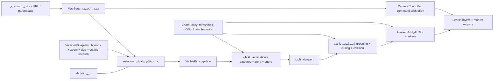

# 06 — خطة إصلاح معمارية الخريطة

**التاريخ:** 2026-10-02  
**النوع:** خطة مبنية على تقارير التدقيق 01–05 ومراجعة المصدر المحددة أدناه.  
**النطاق:** خريطة Leaflet العامة في `/` و`/map`؛ واجهة البحث والفلاتر والاختيار والكاميرا والرسم على الهاتف.  
**حالة التنفيذ:** لم يتغير أي كود تطبيق. هذا التقرير هو الملف الوحيد الجديد. لا تبدأ دفعات الإصلاح حتى اعتماد الخطة والقرارات المفتوحة.

## 1. خلاصة توجيهية

المشكلة الجذرية هي أن الحالة والسياسات موزعة بين `PublicShowcase` و`MapView` و`InteractiveMap` وhooks العرض، بينما حساب الأهلية والعدد والتجميع وتحريك الكاميرا لا تمر جميعها من عقد واحد. الإصلاح يبدأ بعقد سلوك واختبارات فعلية لمسارات الإنتاج، ثم يوحد الحالة والسياسات، وبعدها يعالج تفاصيل تجربة الهاتف. لا توصي الخطة باستبدال Leaflet أو حذف عرض البطاقات أو clustering.

## 2. المعمارية المستهدفة

### عقود الملكية

1. **MapState مصدر حقيقة واحد** في سياق/مخفض مركزي قرب `InteractiveMap`: `query` ونطاق البحث، `category` و`zone` وقيود التحقق، النشاط/المبنى/المجموعة المحددة، حالة السطح المختار، route/building target، و`ViewportSnapshot` المستقر. يظل URL مصدر تهيئة/مزامنة صريحًا لا مخزن حالة منافسًا. تزال مزامنة prop→local state ذات الإطار المتأخر بعد نقل الكتابات إلى actions واضحة.
2. **مسار بيانات واحد:** `MapState + directory + ViewportSnapshot → selectors → eligibleBusinesses → inViewport → groups/markerModels → Leaflet renderer`. العدد والحالة الفارغة والنتائج في واجهة الهاتف تُشتق من نفس selector؛ حدد بوضوح إن كان العدد «مطابقات مرشح» أم «داخل الشاشة».
3. **ZoomPolicy واحدة:** وحدة مركزية تحمل حدود overview/local/zone eligibility، مقياس البطاقة، تكبير cluster، أقصى zoom للتفجير، وحدود الخريطة. تحفظ السلوك الحالي المقصود مبدئيًا (منطقة overview عند أقل من 15، بداية local عند 15.5، max map 19.5، chooser عند أقصى cluster 19) إلى أن يحسم قرار النطاق؛ لا تبقى أرقام zoom موزعة في hook/helper/planner.
4. **CameraController مالك وحيد لتحريك Leaflet:** يقبل أوامر ذات مصدر وأولوية وإلغاء (`initial`, `zone`, `selection`, `cluster`, `building/route`, `locate`, `reset`, `user gesture`). فقط هذا المتحكم يستدعي `flyTo`, `panTo`, `flyToBounds`, `fitBounds`, `stop`. يحدد سياسة طلب GPS المتأخر وهل gesture المستخدم يلغي intent معلقًا.
5. **استراتيجية واحدة للتجميع والإقصاء:** تنفذ `viewport culling → deterministic screen grouping مع حد المسافة الحالي → selected/exception placement → collision handling`. مصدر إزاحة واحد ونموذج footprint واحد متوافقان مع موضع marker المرئي والمرساة الجغرافية. يحتفظ بعزل العنصر المختار، عدّاد المجموعات واختيار عضو المجموعة؛ يُقاس cache بعد تثبيت صحة المفاتيح.
6. **Renderer لا يقرر العمل:** يبني Leaflet layers/markers من marker models، يحدّث سجل العلامات عند تغير المفتاح فقط، ويستهلك سياسة LOD. يحتفظ بالتدرج الحالي: overview cards/dots، local cards، selected surface، gates/districts والـcluster chooser.
7. **واجهة الجوال مستهلك للحالة نفسها:** البحث والفلاتر والعدد والاقتراحات والسطح السفلي تقرأ/تكتب MapState عبر actions/selectors. إعادة التصميم لا تغير اختيار البحث أو إجراءات النشاط من دون عقد سلوك معتمد.

## 3. سجل الأدلة والجذور

كل مراجع `01`–`05` أدناه إلى تقارير ضمن المجلد نفسه؛ مراجع المصدر أولية لتسهيل تحقق التنفيذ. «مثبت بالمصدر» لا يعني أن كل عرض شوهد في تشغيل حي. السلوك الموسوم suspected يجب إثباته قبل تغيير سياسة المنتج.

| ID / التصنيف | الدليل: الملف والأسطر والدالة | العرض المرئي المحدد | قرار الإصلاح |
|---|---|---|---|
| BHV-01 (a) bug | `src/components/map/hooks/useMapPinsClustering.ts:869-883,1003-1013,1242-1243` (`visibleBusinesses` وrefresh effect)؛ `src/utils/hadayekZoneHelper.ts:260-294` (`filterBusinessesForMap`) | بعد اختيار منطقة والتكبير/التصغير عبر حد 15، قد تبقى دبابيس من مناطق أخرى أو تختفي دبابيس مؤهلة لأن zoom ليس ضمن memo بينما renderer يقرأ zoom الحي. | مرشح eligibility يأخذ viewport/zoom snapshot ويعاد تشغيله عند settle؛ حدوده من ZoomPolicy. |
| BHV-04 / DATA-03 (b,c) | `src/components/InteractiveMap.tsx:69-76` (`matchingBusinessesCount`) مقابل `useMapPinsClustering.ts:869-883`؛ zone helper أعلاه | عدد الشريط/رسالة الفراغ قد لا يصف مجموعة الدبابيس، لأن مسار العدد لا يمرر zoom. | selector واحد للنتائج والعدد، مع تسمية صريحة لمجال العدد. |
| state split (c,d) | `src/components/InteractiveMap.tsx:66-76,124-129,317-320`؛ `src/components/map/hooks/useMapState.ts:16-33` | category/zone قد يحملان قيمتين (prop وhook) ثم تنعكس مزامنة category بعد render؛ اختيار الفئة يكتب محليًا ثم عبر parent. | توحيد الحالة وactions، ثم إزالة mirror state والكتابة المزدوجة. |
| BHV-02 (a) / UXM-03 (b,d) | `src/components/map/MapModernTopBar.tsx:135-142` (`handleSelectBusinessItem`)؛ `src/components/InteractiveMap.tsx:330-333`؛ hook `991-1001,915-978` | اختيار اقتراح نشاط يمسح query؛ عند «الكل» تختفي دبابيس السياق المحيطة ويبقى النشاط المختار وحده على الخريطة مع سطح الاختيار. | فصل نص الاقتراح النشط عن submitted query/context؛ الحفاظ على السياق أو عرضه بوضوح حسب القرار المفتوح. |
| BHV-03 / DATA-04 (a,b,d) | `MapModernTopBar.tsx:81-94,135-142` (`matchingBusinesses`, handler)؛ `InteractiveMap.tsx:324,330-333`؛ `useMapPinsClustering.ts:259-273` | مع منطقة A، يمكن اقتراح نشاط من B ثم يمسح تحقق التحديد ذلك النشاط مباشرة؛ يبدو أن النتيجة لم تُقبل. | predicate بحث موحد وscope ظاهر: داخل المنطقة أو إجراء صريح للبحث في كل المناطق. |
| UXM-06 / BUG-VISUAL-01 (a,b,c) | `src/components/map/hooks/useMapState.ts:27-33` (`setSelectedBiz`)؛ `useMapPinsClustering.ts:931-978`؛ `src/components/InteractiveMap.tsx:423-445` | بعد اختيار اقتراح، يظهر marker card عائم وdrawer سفلي معًا؛ الاسم/الأفعال مكررة والمساحة تضيق على شاشة 360×640. مذكور أنه مثبت بالصور في 01 ومرصود في 03. | تعريف سطوح الاختيار كحالات mutually exclusive أو hierarchy واحدة مع الاحتفاظ بالmarker anchored وبالتفاصيل والإجراءات. |
| BHV-05/07 suspected (a,d) | `useMapPinsClustering.ts:991-1001,1036-1071,1111-1131` | قد يبقى chooser قديم بعد تصفية آخر نتيجة أو تضييق query، فوق خريطة تغيرت. | اختبار سلوك Leaflet؛ اربط صلاحية chooser بهوية المجموعة/أعضائها وأغلقه عبر controller عند invalidation إن ثبت. |
| BHV-06 / I14 suspected (b,d) | `src/components/map/hooks/useMapGeolocation.ts:46-99,132-145`؛ `useMapInstance.ts:183-199,299-302` | بعد ضغط تحديد موقعي ثم تحريك الخريطة قبل وصول GPS، قد يعيد callback الكاميرا لموقع GPS دون مراعاة gesture الأحدث. | intent cancellation/priority في CameraController؛ اختبار callback مؤخر قابل للتحكم. |
| BHV-08/10 / P6 (c، والأول قد يكون a) | `useMapPinsClustering.ts:474-535,555-613,651-750,1111-1115`؛ `cameraPlanner.ts:1-14`؛ `InteractiveMap.tsx:227-255` | عند تزامن تحديد منطقة/نشاط/مبنى/route/cluster قد يلغي flight لاحق سابقًا وتختلف الوجهة بحسب ترتيب effects. لم يثبت كعرض حي. | كل الحركة من controller واحد واختبارات أولوية/إلغاء؛ احتفظ بأفعال تحديد المبنى والمسار والـcluster. |
| BHV-11 suspected (a,d) | `src/components/map/MapModernTopBar.tsx:113-132,145-159` (`handleSelectBuildingItem`)؛ `MapView.tsx:101-120` | بحثا مبنى A ثم B مع استجابتين معكوستين قد ينتهيان بتحديد A القديم أو إخفاء مؤشر التحميل مبكرًا. | request generation واحدة لكل مسار البحث، واختبار out-of-order؛ حافظ على بحث رقم المبنى. |
| BHV-09 / UXM-01 (b) | `useMapPinsClustering.ts:487-519`؛ `cameraPlanner.ts:158-171`؛ `MapModernTopBar.tsx:256-274`؛ `PublicShowcase.tsx:566-588` | district flight لا يحجز مساحة drawer في الهاتف؛ كما تغطى أزرار الفلتر الأخيرة بالـbottom nav عند 360×640 (مرصود في 03). | camera padding من overlay geometry؛ أزرار/شريط ثابت آمن ضمن مرأى الشاشة. |
| UXM-05 / DATA-03 (b,d) | `MapModernTopBar.tsx:59,199-209,256-274`؛ `InteractiveMap.tsx:308-323` | dot صغير فقط يدل على وجود filter؛ لا يرى المستخدم اسم الفئة/المنطقة أو العدد بشكل ثابت. | chips/summary/count من selectors، مع إزالة واضحة؛ persistence عبر reload ليست مفترضة قبل قرار. |
| UXM-07 / P4 (a,b,c) | `src/components/map/badgeMarkers.ts:188-205,279-309,451-454,686-701,818-821,880-895`؛ `useMapPinsClustering.ts:1003-1025,1142-1199` | أبعاد الأهداف تختلف بين LOD وبعضها أقل من 44px؛ قد تتداخل البطاقات؛ P4 يحدد اختلاف CSS scale وiconAnchor ما قد يجعل سن الدبوس لا يقع على الإحداثية في scale كسري. هذا الأخير يحتاج تحقق بصري. | footprint/hit area وعلاقة anchor/scale موحدة؛ لا نغير الشكل إلا بعد لقطة اختبار للـanchor وtouch. |
| UXM-13 / BHV-13 (b,c) | `useMapPinsClustering.ts:1036-1087,1235-1243`؛ `src/components/map/utils/progressiveWork.ts:1-27` | تغيير الفلتر يمسح طبقات النتائج ثم يضيف بحد أقصى أربع علامات/إطار؛ قد يرى المستخدم خريطة فارغة/ناقصة مؤقتًا (الأثر لم يقس). | بعد صحة pipeline، اعتماد staging/double buffer أو تحسين الإضافة بحسب trace؛ لا نضحي بإلغاء عمل gesture. |
| P2/P3/P5/P10/P12 (c) | `useMapPinsClustering.ts:57-65`؛ `src/components/map/utils/pinDispersal.ts`؛ `useMapInstance.ts:226-228,293`؛ `cameraPlanner.ts:78`؛ `InteractiveMap.tsx` import `MapFooterBar` بلا render | تكرار escapeHtml وcentroid وحقن خصائص Leaflet خاصة غير مقروءة، وملف dispersal غير مستخدم في مسار الإنتاج، وFooterBar مستورد ولا يعرض. لا عرض عميل مثبت لهذه النقاط. | حذف التكرار/الخصائص أو dead code فقط بعد تحقق المراجع؛ لا حذف ميزة واجهة/قدرة محتملة بناء على اسم أو import فقط. |
| DATA-01/02/05/06/07 (c، وبعضها b/a محتمل) | `src/App.tsx:13-14,93-159,197-249,261-325`؛ `src/components/PublicShowcase.tsx:319-320,431-447`؛ `src/utils/directoryFiltering.ts:12-29` | الكتالوج العالمي يحمّل قبل التصفية المحلية، وبيانات map ليست projection خفيفة؛ السجل بإحداثيات مفقودة يختفي، وقد تبقى بيانات جزئية بعد فشل صفحة. زيادة زمن/تكلفة أو تكرار/فساد بيانات لم تقاس ولم تثبت. | تبقى في مسار مستقل/بعد نتائج profiling؛ لا تضف API أو تغيّر semantics قبل قرار نطاق backend. |
| UXM-15/BHV-14 (c) | `src/directory-experience/map/MapScreen.tsx:13-46,79-117`؛ `GeographicCanvas.tsx:20-47`؛ `useMapViewport.ts:7-18` | إذا أصبح مسار preview متاحًا للمستخدم، exact category/selection rules قد تختلف عن Leaflet. التعرض للمستخدم غير مثبت. | إما تحويله إلى consumer لنفس state/selectors أو تحديده preview فقط؛ تحقق من route activation قبل إدراجه في rollout. |

## 4. Batch 0 — شبكة الأمان قبل أي refactor

**بوابة البدء:** لا يبدأ Batch 1 حتى تنجح الاختبارات المرتبطة بمسارات الإنتاج أو تُسجل إخفاقاتها الحالية صراحة كـbaseline defects. الاختبارات الموجودة لا تكفي وحدها: `safety_net_batch0.test.ts` فيه نماذج سلوكية مكتوبة داخل الاختبار (مثل إغلاق popup وserialization) لا تنادي الكود الفعلي، واختبار grouping موجود، لكن لا توجد تغطية شاملة لتفاعل المتصفح في مصفوفة 02.

### 4.1 ما يُكتب/يستكمل قبل إعادة الهيكلة

1. **اختبار E2E/متصفح لعقد الخريطة (I01–I36):** استعمل fixture أنشطة موزعًا على منطقتين، متطابق الفئات، مواقع متقاربة/متطابقة وبعيدة، مع تأخير GPS وبحث المباني قابل للتحكم. نفّذ كل أزواج المصفوفة؛ ضع assertions مفصلة للتعارضات أدناه، وسجل الباقي كـsmoke contracts للـsettled state وعدم انهيار الواجهة.
2. **حدود zoom/pipeline (I02, I05, I09, I18, I20, I21, I32, I33):** منطقتان مختارتان وتغيير zoom إلى 14.99 ثم 15.0 ثم 15.49 ثم 15.5 ثم 19 ثم 19.5؛ بعد كل `moveend` قارن المرشحين والعدد والـzone والـLOD والـclusters. تأكد أن كل نشاط مؤهل مرة واحدة، وأن selection مستثنى من المجموعات.
3. **بحث/فلترة/تحديد (I03, I10, I16, I17, I22–I24, I26–I28):** category alias، query عربية مُطبّعة، اقتراح خارج zone، اختيار اقتراح مع category=all، مسح query/آخر filter، no-results؛ أثبت scope المرئي، pins المحيطة، استمرار selection وحدود إزالته. تحقق من count/empty state.
4. **popup/chooser (I06, I13, I19, I23, I31, I34):** افتح مجموعة متعددة، ثم zoom/pan/clear filter/narrow search/locate. تحقق من chooser أو إغلاقه إذا اختفى anchor/الأعضاء. هذه اختبارات إثبات للمشتبه BHV-05/07 قبل تقرير fix.
5. **حالات الاختيار والأسطح (I04, I11, I17, I27–I30):** اختيار marker/اقتراح/عضو chooser، اختيار نشاط ثان، فتح التفاصيل، إغلاق، pan بعيد، resize؛ assertions أن هناك تمثيلًا واحدًا واضحًا للسطح المختار، وmarker/ drawer لا يتكرران، مع حفظ الوظائف الحالية.
6. **تحكيم الكاميرا (I07, I14, I20, I25, I29, I32, I34, I36):** سجل مركز/zoom وأوامر الحركة؛ تأخير GPS ثم pan؛ locate مع selection/filter/popup؛ تداخل zone/business/building/route/cluster؛ تأكد من completion/gesture ومصدر الوجهة. للمشتبه، الاختبار الحالي يوثق السلوك قبل تثبيت قرار الأولوية.
7. **بحث المباني غير المتزامن (I16 جزئيًا، إضافة BHV-11):** ابحث رقمين، أعد الاستجابتين بترتيب عكسي، امسح/بدل المنطقة أثناء الطلب؛ الأخير المرسل وحده يحدد target ويظل loading صحيحًا.
8. **الهاتف/RTL (UXM-01/02/04/05/06/07/09/10/14؛ I08/15/21/26/30/35/36):** صور/assertions عند 360×640 و390×844 و1024×768؛ لوحة الفلاتر لا تغطي apply/reset، اقتراحات keyboard في محاكاة visual viewport مع وسم limitation عدم وجود جهاز حقيقي، أهداف اللمس، drawer/ safe area، rotate/resize، بقاء bounds/selection. يعاد سيناريو UXM-01 المرصود.
9. **الوصول (UXM-12):** keyboard-only وaccessibility tree للـordinary/selected/cluster markers؛ labels فريدة وEnter/Space وقابلية focus. تؤجل دعوى قارئ شاشة فعلي إلى تحقق يدوي مستقل إذا لم يتوفر في CI.
10. **الرسم والأداء الوصفي (I01, I12, I18, I21, I33؛ UXM-13؛ P4):** fixture كثيف، تسجيل filter switch/pan/zoom وإلغاء progressive job؛ عدد markers النهائي صحيح ولا تتراكم القديمة، وقياس مدة ظهور المجموعة من غير فرض حد أداء عشوائي؛ pixel check لموضع anchor مع card scales كسرية. لا ترقية Canvas/WebGL في هذه المرحلة.

### 4.2 الموجود الذي يجب الحفاظ عليه/تحويله إلى اختبار إنتاج

- `src/tests/safety_net_batch0.test.ts`: يغطي baseline و10 سلوكيات مستهدفة لكنه يعلن بعض العبارات أنها «verified» بينما assertion يحاكي منطقًا محليًا، لا يستدعي مسار التطبيق. احتفظ بعقود baseline المفيدة، واستبدل mocks الوهمية باختبارات وحدات للـpure functions أو E2E للـeffects.
- `src/tests/spatial_activity_groups.test.ts`: يحتفظ بعقود grouping الحالية: عدم تكوين مجموعة بعيدة، عدم transitive chain، الثبات مع ترتيب الإدخال، conservation، card scale. وسّع لاختبارات حدود radius وzoom/viewport وسياسة العقد الموحدة.
- `src/tests/map_fixes.test.ts`: اقرأ/شغّل بمرحلة التنفيذ لتحديد العقود الفعلية لـmarker reconciliation وcameraPlanner؛ لا تفترض أنها تغطي تكامل Leaflet.
- `src/tests/map_geolocation.test.ts`, `src/tests/progressive_work.test.ts`, `src/tests/activity_search_intent.test.ts`, `src/tests/map_leaflet_retry.playwright.cjs`: اختبارات مساندة تستبقي سلوك GPS، cancellation/debounce، intent، وLeaflet loading.
- أضف E2E إلى runner موجود/معتمد؛ المشروع يحتوي Playwright browser scripts في `src/tests/`، لكن لا يوجد ضمن `package.json` أمر E2E map عام. تحديد الاستراتيجية النهائية مدرج ضمن القرارات.

**تصنيف هذه الحزمة:** تحسين اختبار (d missing state في الحماية السلوكية)، لا يغير سلوك المنتج.  
**التراجع:** حذف ملفات الاختبار الجديدة/الـfixture فقط؛ لا تغيير تطبيق.  
**مخاطر:** تثبيت سلوك خاطئ أو غير مقصود. للتخفيف، اختبار النتيجة الحالية منفصل عن assertions «المطلوب بعد الإصلاح»؛ سجل الاستثناءات المرفوضة كـtests معلّمة TODO/known failure، وبعد قرار المنتج لا تجعل الفشل الحالي يمنع commit الاختبارات.  
**بوابة الاختبار:** كل السيناريوهات المؤكدة تحافظ على السلوك المقصود؛ السيناريوهات المشبوهة تملك إعادة إنتاج حاسمة؛ لا تبدأ refactor بتغطية قائمة على source-text assertions.

## 5. الدفعات بترتيب الاعتماد

كل دفعة commit مستقل، بميزة/مرحلة قابلة للإطلاق، وتملك rollback محدد. تنفذ بالتتابع بعد Batch 0. «مستقلة الشحن» تعني أن المنتج يبني ويعمل بعد كل دفعة، لا أن ترتيب الاعتماد يمكن تجاوزه.

### Batch 1 — ZoomPolicy ومدخلات viewport مستقرة + pipeline eligibility/count

- **المشكلة:** BHV-01/BHV-04 وP2: thresholds متضاربة، memo stale عبر zoom، count له predicate/zoom مختلف.
- **السبب:** ثلاثة مستهلكين لحساب الأهلية؛ `visibleBusinesses` لا يعتمد على zoom، والعدد لا يمرر zoom؛ renderer يقرأ `map.getZoom()` مباشرة مع حد `15.5` بينما helper حدّه `15`.
- **الإصلاح:** إنشاء `src/components/map/policies/zoomPolicy.ts` و`src/components/map/state/mapViewport.ts` أو equivalent typed `ViewportSnapshot`؛ pure selector واحد يستقبل zone/category/verification/query/viewport؛ اشتقاق count/empty state والدبابيس منه. settle snapshot واحد بعد `moveend/zoomend/resize`. في هذا الـcommit ثبّت semantics الموجودة ما عدا إعادة الحساب الصحيحة؛ أي تغيير للـ15–15.5 ينتظر قرارًا.
- **الملفات:** `src/components/map/hooks/useMapPinsClustering.ts`, `src/components/InteractiveMap.tsx`, `src/utils/hadayekZoneHelper.ts`, `src/components/map/utils/spatialActivityGroups.ts`، وحدات جديدة policy/selectors، واختبارات Batch 0.
- **Regression risk:** عالٍ؛ تغيير الأهلية قد يكشف/يخفي نشاطًا، ويؤثر المجموعة والـempty-state قرب الحد.
- **اختبار:** I02/I05/I09/I18/I20/I21/I32/I33، حدوده الخمس في 4.1، ومقارنة count/visible IDs على نفس fixture.
- **الجهد:** L (3–5 أيام هندسية).
- **قابلية الشحن/التراجع:** API داخلي جديد مع إبقاء helper adapter أثناء الانتقال؛ revert واحد يعيد selectors القديمة.
- **تصنيف:** (a) bug، (b) UX flaw، (c) architectural debt، (d) state dependency missing.

### Batch 2 — MapState موحد للبحث والمرشحات والتحديد + نتيجة بحث ذات scope

- **المشكلة:** BHV-02/03، DATA-04، state split category/zone، selected double display؛ UXM-05/06.
- **السبب:** query للاقتراحات وgate pins في آن، بحث topbar predicate مستقل بلا zone/Arabic normalization، category/zone في parent وlocal state، selection surface قائم على boolean setter يعيد حالة expanded.
- **الإصلاح:** MapState reducer/actions وselectors، واجهة `SearchState` تفصل `draftQuery`, `submittedQuery`, `searchScope`, و`selection`; توحيد predicate مع `matchesBusinessSearch`/`matchesCategoryFilter`، مع zone scope. لا تمسح السياق عند اختيار suggestion. اجعل selection presentation state واحدًا بعقد حالات بدل زر يعيد false تلقائيًا؛ أبق marker anchor، drawer/actions وفتح تفاصيل العمل. count/report مأخوذ من Batch 1.
- **الملفات:** `src/components/map/hooks/useMapState.ts`, `src/components/InteractiveMap.tsx`, `src/components/map/MapModernTopBar.tsx`, `src/components/views/MapView.tsx`, `src/components/PublicShowcase.tsx`, `src/utils/arabicSearch.ts`, `src/utils/directoryFiltering.ts`, `src/utils/categoryMatcher.ts`، selectors/state modules جديدة.
- **Regression risk:** عالٍ؛ قد يتغير ترتيب/نطاق نتائج البحث، إزالة selection مع الفلتر، وURL/category behavior. اعتمد قرارات §6 قبل ربط scope.
- **اختبار:** I03/I10/I16/I17/I22–I24/I26–I28، alias وعربي، query context، outside-zone affordance، استبعاد/احتفاظ selection، count.
- **الجهد:** L (4–6 أيام).
- **قابلية الشحن/التراجع:** feature flags داخلية أو compatibility adapter من props القديمة إلى reducer أولًا؛ revert مستقل لا يمس Batch 1.
- **تصنيف:** (a) bug، (b) UX flaw، (c) architectural debt، (d) missing state.

### Batch 3 — CameraController الوحيد لجميع أوامر الحركة

- **المشكلة:** BHV-08/10، BHV-06، I25 وP10؛ حشو mobile framing BHV-09.
- **السبب:** effects وhandlers متعددة تنادي Leaflet مباشرة؛ planner موجود لكنه ليس المنفذ الوحيد. callback GPS المؤخر لا يمثل intent قابلًا للإلغاء.
- **الإصلاح:** `src/components/map/controllers/CameraController.ts` كواجهة وحيدة؛ planner ينتج أوامر، controller ينفذ/يسجل/يلغي ويوفر settled event. مرر zone/business/building/route/cluster/locate/reset/initial كلها. أزل استدعاءات `map.flyTo*` من باقي الوحدات. استخدم overlay insets محسوبة للـdrawer/toolbar. خذ centroid من constants واحد. لا تغير أولوية gesture/GPS إلا وفق القرار.
- **الملفات:** `src/components/map/hooks/useMapPinsClustering.ts`, `useMapInstance.ts`, `useMapGeolocation.ts`, `src/components/map/utils/cameraPlanner.ts`, `src/components/InteractiveMap.tsx`, `src/components/map/constants/mapConstants.ts`، controller جديد.
- **Regression risk:** عالٍ؛ الإحساس بالحركة والتوقيت/المركز قد يتغير، خاصة zone animation والـmobile offsets.
- **اختبار:** I01/I04/I07/I08/I11/I14/I15/I20/I25/I29/I30/I32/I34/I35/I36، وأوامر متداخلة مع assertions نهائية للمركز والـzoom.
- **الجهد:** L (3–5 أيام).
- **قابلية الشحن/التراجع:** إدخال controller كadapter أولًا مع telemetry test؛ كل command source ينقل على حدة ضمن الدفعة، commit واحد يمكن التراجع عنه.
- **تصنيف:** (a) possible bug، (b) UX flaw، (c) architectural debt، (d) missing intent state.

### Batch 4 — استراتيجية grouping/culling/collision وسجل marker واحد

- **المشكلة:** قواعد clustering/culling/collision متشابكة؛ P4 anchor، grouping cache miss محتمل، utility reconciliation لا يطبق فعليًا بالكامل، chooser validity suspected؛ P2/P3 dead/duplicate.
- **السبب:** `useMapPinsClustering` ينفذ group ثم occupied collision slots ثم marker reconciliation inline؛ `pinDispersal.ts` dead؛ reconciliation utility موجود ومسار inline يستخدم جزءًا فقط.
- **الإصلاح:** pure `computeVisiblePinModels` تستهلك ناتج Batch 1 وZoomPolicy؛ grouping strategy واحدة مع viewport/camera projection، explicit `marker footprint` للـcard والدوت والـcluster والـselection؛ deterministic collision/displacement واحد؛ renderer/reconciler واحد. صلاحية popup مشتقة من cluster ID/member IDs. حافظ على حد 58px و100m/chooser/selected exclusion مبدئيًا حتى benchmark UX؛ أزل dead duplicate بعد بحث imports واختبارات.
- **الملفات:** `src/components/map/hooks/useMapPinsClustering.ts`, `src/components/map/utils/spatialActivityGroups.ts`, `markerReconciliation.ts`, `pinDispersal.ts`, `src/components/map/badgeMarkers.ts`، وحدات grouping/marker model جديدة.
- **Regression risk:** عالٍ؛ أعضاء المجموعة، touch ambiguity، الأسماء البارزة، anchor، وإعادة استخدام عناصر DOM قد تتغير.
- **اختبار:** I05/I06/I12/I18/I23/I27/I31/I32/I33/I34، spatial tests، P4 pixel anchor، marker identity/click أحدث data، عدم duplication/conservation.
- **الجهد:** L (4–6 أيام).
- **قابلية الشحن/التراجع:** واجهة marker models تبقى Leaflet divIcons، feature flag للاستراتيجية الجديدة خلال قياس المقارنة؛ rollback يعيد grouping القديم.
- **تصنيف:** (a) bug محتمل، (b) UX flaw، (c) architectural debt، (d) popup validity missing state.

### Batch 5 — علاج overlay/search/filter على الجوال وسهولة الوصول

- **المشكلة:** UXM-01/02/04/05/07/08/09/10/12/14؛ BHV-09 وBHV-12؛ UXM-13.
- **السبب:** dropdown وfilter absolute ضمن map canvas، footer/nav بلا inset كافٍ، selection surfaces منفصلة، search suggestions لا تراعي visualViewport، أحجام أهداف وlabels غير متسقة.
- **الإصلاح:** بعد توحيد MapState استخدم filter sheet أو لوحة ثابتة ذات footer مرئي، context chips/summary وعدد؛ أدخل `visualViewport` وsafe-area geometry؛ keyboard-reachable labels/targets؛ وحّد selected drawer/card hierarchy، drawer padding camera. أضف tray اختياريًا متزامنًا للنتائج فقط بعد قرار. لا تحذف bottom nav أو وظائف layer/GPS قبل اعتماد intent؛ اكشف capabilities الحالية بوضوح أو اترك decision مفتوحًا.
- **الملفات:** `src/components/map/MapModernTopBar.tsx`, `MapSelectedBusinessDrawer.tsx`, `MapFloatingControls.tsx`, `badgeMarkers.ts`, `src/components/InteractiveMap.tsx`, `src/components/PublicShowcase.tsx`, `src/index.css`، components/overlay tests جديدة عند الحاجة.
- **Regression risk:** متوسط/عالٍ؛ تغيير المساحة المرئية، gesture/tab order، وRTL layout قد يحجب الخريطة أو إجراء رئيسيًا.
- **اختبار:** I13/I26/I30/I35؛ 360×640 و390×844، keyboard/visual viewport، RTL، safe-area/rotate؛ UXM-01 screenshot مقارنة؛ keyboard-only/accessibility tree.
- **الجهد:** M–L (3–5 أيام).
- **قابلية الشحن/التراجع:** تغييرات UI component-scoped وقابلة للـrevert دون رجوع pipeline؛ احتفظ بالـactions القديمة.
- **تصنيف:** (b) UX flaw، (c) architectural debt، (d) missing visible/search/accessibility state؛ (a) للأزرار المحجوبة فعليًا.

### Batch 6 — حذف التكرار وقرار الخريطة الموازية والسرعة

- **المشكلة:** P1/P2/P3/P5/P6/P8/P10/P12 وUXM-15/BHV-14؛ DATA-01/02/05/06/07 وcache/grouping risks.
- **السبب:** duplicate helper/centroid/zone list، خصائص Leaflet خاصة، global onclick، dead import/file؛ مسار preview بمنطق مستقل؛ كتالوج عالمي بلا viewport API والبيانات غير projection-specific.
- **الإصلاح:** بعد انتقال الاستهلاك وتثبيت tests: احذف escapeHtml الخاص واستخدم المصدر المشترك؛ خذ centroid/zones من data source؛ أزل _leaflet_id/_leaflet_map عند إثبات عدم الحاجة عبر lifecycle test؛ استبدل global callback بevent handlers مدعومة ثم أزله؛ احذف `pinDispersal.ts` فقط بعد تأكيد عدم الاستيراد، و`MapFooterBar` import غير المستخدم فقط (لا تحذف footer feature دون product decision). حدد هل directory-experience preview سيبقى؛ إن بقي كممر مستخدم فليستهلك selectors وعقد الحالة. قِس catalog payload وrender frame أولًا؛ مشروع viewport backend/compact map projection قرار مستقل لا يتسلل لهذا الإصلاح.
- **الملفات:** `src/components/map/hooks/useMapPinsClustering.ts`, `src/components/map/hooks/useMapInstance.ts`, `src/components/map/constants/mapConstants.ts`, `src/data/hadayekAtlasData.ts`, `src/data/hadayekDistrictsGeoData.ts`, `src/components/map/MapFooterBar.tsx` (import/reference فقط), `src/directory-experience/map/MapScreen.tsx`, `src/components/InteractiveMap.tsx`, واختبارات lifecycle/performance/data.
- **Regression risk:** متوسط للـlifecycle/dead-code deletions، عالٍ لتوحيد parallel map أو تغيير catalog/endpoint. لا تخلط تغيير backend في نفس commit.
- **اختبار:** I08/15/21/26/30/35، Leaflet unmount/remount، route exposure smoke، build/typecheck، profiling/payload baseline. يتطلب إثبات import graph قبل حذف كل عنصر.
- **الجهد:** M (2–4 أيام) للتكرار، وXL منفصلة (تقدير discovery) لأي backend viewport API.
- **قابلية الشحن/التراجع:** مجموعة تنظيف مستقلة بعد كل نقل؛ endpoint/API يظل RFC/مرحلة منفصلة قابلة للإطلاق التدريجي.
- **تصنيف:** (c) architectural debt وdead code؛ (a) فقط إذا أثبت اختبار lifecycle عطلًا؛ (d) إذا قرر المنتج إتاحة الحالة الموازية.

## 6. Quick wins وترتيب الشحن

1. **أول ما يمكن شحنه بعد Batch 0، قبل تغيير architecture:** إصلاح mobile filter footer على 360×640، ورسائل/ملخص filter ظاهر، وhit targets الخاصة بشريط البحث؛ تغييرات محدودة في `MapModernTopBar.tsx` وstyles، لكن يفضل انتظار test fixture حتى لا تتعارض مع بناء sheet لاحقًا.
2. **Quick win بياناتي ضمن Batch 1:** تمرير viewport revision/zoom الصحيح إلى حساب الأهلية والعدد عبر selector مشترك؛ يمنع divergence بدون إعادة بناء Leaflet.
3. **Quick win عرض محدد ضمن Batch 2:** إيقاف ظهور drawer وcard معًا وفق state model مع اختبار UXM-06، مع إبقاء كل action متاحة.
4. **Quick win تنظيف بعد فصل المصدر المشترك:** حذف نسخة escapeHtml المحلية وcentroid المكرر. جهد S (أقل من يوم لكل منهما) ومخاطر منخفضة بعد الاختبار.
5. **لا يُشحن quick fix مستقلاً يغيّر حد 15 أو 15.5، query persistence، selection خارج filter، أولوية GPS، أو bottom navigation** قبل إقرار القرار ذي الصلة.

## 7. ما يُحذف، يوحّد، ويحافظ عليه

| الإجراء | العناصر | شرط التنفيذ |
|---|---|---|
| **يوحّد** | filter/category/search predicate بين parent/topbar/map/count؛ state category/zone/query/selection؛ zoom thresholds؛ viewport snapshot؛ camera calls؛ grouping/collision/marker registry؛ anchor geometry | بالدفعات 1–5 وباختبارات Batch 0؛ لا تغيّر UX semantics ضمن توحيد داخلي إلا بقرار واضح. |
| **يُحذف بعد إثبات** | local duplicate `escapeHtml` (`useMapPinsClustering.ts:57-65`)؛ centroid literal في camera planner؛ `pinDispersal.ts` إذا بقي غير مستورد؛ `_leaflet_id` hack و`_leaflet_map` property إذا نجح remount test؛ global district callback بعد توفير بديل؛ imports dead كـ`MapFooterBar` | بحث استيراد كامل + اختبار/بناء + review لكل حذف. الملف الميت/الخاص بالـimplementation ليس حجة لحذف سلوك المستخدم. |
| **يُحفظ ويُعاد تنظيمه** | overview/local card LOD، compact dots، cluster count/fly-to/member chooser، selected pin/details/drawer actions، gates/district overlays، zone/building/route navigation، geolocation accuracy/locate، verified filter، category/zone filtering، progressive cancellation، basemap capability | هذه ميزات قائمة؛ اختبرها قبل/بعد. تحسين hierarchy لا يحذف إجراءات. |
| **قرار قبل الإزالة/النقل** | FooterBar: import لا يظهر حاليًا؛ layer props في MapFloatingControls لكن لا زر ظاهر؛ locate في picker فقط؛ map-list tray/parallel SVG route؛ offline/partial-catalog status | تحقق من نية المنتج وتعريض route قبل إزالة أو إظهار capability؛ لا تُفترض ميزة غير ظاهرة requirement. |

## 8. القرارات المطلوبة من صاحب المنتج

1. **نطاق zone عبر zoom:** عند اختيار zone والـzoom أقل من 15، هل المقصود عرض أنشطة المدينة كلها (السلوك الحالي في helper) أم zone فقط؟ وهل تُوحّد عتبة local LOD مع 15 أم تبقى 15.5؟ اقتراحي تثبيت السلوك الحالي أولًا في Batch 1 وإزالة stale memo، وتأجيل تعديل المعنى.
2. **معنى البحث بعد اختيار اقتراح:** هل تبقى كل الدبابيس المطابقة للسياق حول المختار حتى إغلاقه، أم تعرض فقط النشاط المختار مع شارة query/scope محفوظة؟ وهل البحث النصي يعلو على category كما في اختبار safety-net الحالي أم يطبق الاثنان معًا؟
3. **اقتراح خارج zone:** هل تقيد الاقتراحات بالمنطقة، أم تظهر action صريحة «ابحث في كل المناطق» وتبدل scope عند الاختيار؟ التوصية: لا تعرض نتيجة ستُمحى بصمت.
4. **selection لا يطابق filter/zone:** هل يمسح فورًا، يبقى كـcontext card منفصل مع بيان أنه خارج الفلتر، أم ينتقل إلى سجل نشاط؟ يجب حسم count: هل يحسبه أم يستثنيه.
5. **سطح النشاط المختار:** نوصي بحالة compact واحدة على الخريطة مع drawer سفلي غير مكرر وفتح التفاصيل بفعل صريح؛ هل يطابق هذا مقصود State 1/State 2 القائم؟
6. **الكاميرا:** إذا تحرك المستخدم أثناء GPS pending، هل gesture يلغي locate؟ عند تداخل أوامر مختلفة، ما الأولوية بين اختيار المستخدم الصريح، zone، route/building وcluster؟ وهل إزالة zone تعيد centroid/zoom14 دائمًا حتى بعد pan، كما الآن؟
7. **النتائج على الهاتف:** هل تريد زرًا/لوحة نتائج list-map متزامنة ضمن نطاق الإصلاح، أم نحافظ على خريطة أساسية ونكتفي بتحسين drawer/search/filter؟
8. **ميزات التحكم:** هل layer switch وlocate مطلوبان في browse mode العامة؟ وهل الـbottom nav يبقى ظاهرًا أثناء filter/details sheet؟ لا نحذف أو نظهر capability دون تأكيد النية.
9. **directory-experience:** هل هو preview داخلي أم route سيصل للمستخدمين؟ إذا كان مستخدمًا، ينبغي أن يشارك state/selectors؛ إذا بقي preview، يمكن خطة مستقلة لتقاعده بعد التحقق من الروابط.
10. **اختبارات CI:** هل Playwright متاح/مقبول كـdev dependency وE2E في CI، أم نستخدم browser harness الموجود فقط؟ المطلوب في Batch 0 لا يتحقق بunit tests وحدها للحالات التي تعتمد على Leaflet/DOM/mobile geometry.
11. **catalog/backend:** هل يدخل تنزيل كل الكتالوج وإعداد map projection/viewport endpoint في مشروع إصلاح الخريطة الحالي، أم يبقى مشروع scale مستقلًا بعد profiling؟ تقارير 04 لم تقيس latency أو الحجم ولم تراجع DB indexes، فلا تقترح هذه الخطة endpoint عاجلًا.

## 9. نطاق ما تمت قراءته وما لم يُقرأ

### التقارير

- تمت قراءة الملفات الخمسة كاملة: `docs/audit/01-map-inventory.md`, `02-map-behavior.md`, `03-ux-mobile.md`, `04-data-backend.md`, `05-benchmark.md`. احتجت لقراءات مقسمة بسبب إخراج الطرفية المقتطع؛ راجعت الجداول والعناوين وcoverage والـrecommendations، ومصفوفة I01–I36 وسجلات BHV/UXM/DATA/P/BUG ذات الصلة.

### مصدر التطبيق الذي تمت قراءته في هذه الجولة

- قراءة موجهة لمسارات الحالة/العدد/الفلتر في `src/components/InteractiveMap.tsx`، setter selection في `src/components/map/hooks/useMapState.ts`، أجزاء البحث والتنفيذ في `src/components/map/MapModernTopBar.tsx`، helper eligibility في `src/utils/hadayekZoneHelper.ts`، وملفي `cameraPlanner.ts`, `spatialActivityGroups.ts`, `markerReconciliation.ts`.
- بحث مرجعي موجّه بالرموز/الأسطر ضمن `src/components/map/hooks/useMapPinsClustering.ts`, `useMapInstance.ts`, `src/components/views/MapView.tsx`, `src/components/PublicShowcase.tsx`, `src/components/map/badgeMarkers.ts`, `src/utils/categoryMatcher.ts`, `src/utils/arabicSearch.ts`, `src/utils/directoryFiltering.ts`, `src/components/map/utils/pinDispersal.ts`, والـparallel map. أُخذت بعض المقاطع المصدرية المذكورة مباشرة؛ لم أقرأ كل أسطر كل ملف طويل في هذه الجولة.
- تمت قراءة `package.json` للتحقق من scripts، وقراءة `src/tests/safety_net_batch0.test.ts` كاملًا، `src/tests/spatial_activity_groups.test.ts` كاملًا، بدايات/نطاق registry من `src/tests/map_fixes.test.ts`، وجزء من `scripts/verify-repair.mjs` وقائمة ملفات الاختبار.

### ما لم يُقرأ كاملًا/لم يُتحقق منه

- لم أعد قراءة `src/App.tsx` أو `PublicShowcase.tsx` أو `MapView.tsx` أو كامل `useMapPinsClustering.ts` سطرًا بسطر؛ اعتمدت على الأدلة الدقيقة في التقارير وفتشت المقاطع المتصلة بالخطة. لم أقرأ كامل الاختبارات `map_fixes.test.ts`, `map_geolocation.test.ts`, `progressive_work.test.ts`, ولا اختبارات Playwright.
- لم أعد قراءة كل marker factory/CSS/route registration أو modules `useMapSearch.ts`, `useMapGeolocation.ts`, `MapFloatingControls.tsx`, `MapSelectedBusinessDrawer.tsx`, loaders وبيانات التصنيف/المناطق. ربط الإصلاحات بها مستند إلى تقارير 01–05، لا إلى مراجعة كاملة جديدة.
- لم أشغل build/tests أو المتصفح في هذه الجولة؛ تقارير 03 تسجل ملاحظات runtime السابقة، وتقارير 01/02/04 تحدد حدودها. لا أدعي إثباتًا جديدًا لأي popup/camera timing أو أداء.
- لم أراجع قاعدة البيانات الحية أو schema/query plan أو أجهزة حقيقية، ولم أقم بفحص جودة catalog. DATA-01/02/05/06/07 تبقى حدودًا/مخاطر ما لم تقاس.

**النقطة التالية:** انتظار اعتماد الخطة وإجابات القرارات المناسبة قبل أي تغيير في التطبيق. يظل النطاق read-only؛ التقرير وحده أُنشئ.
